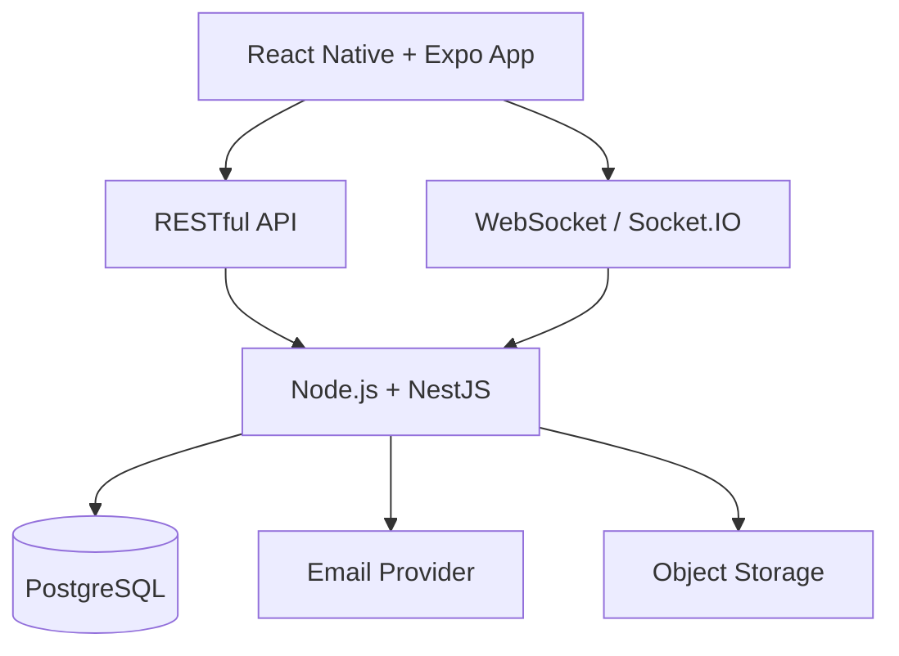
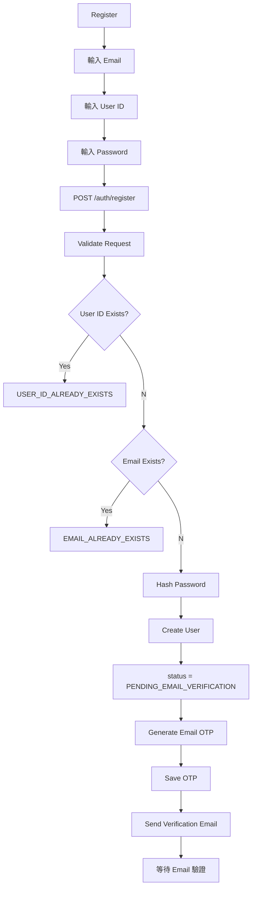
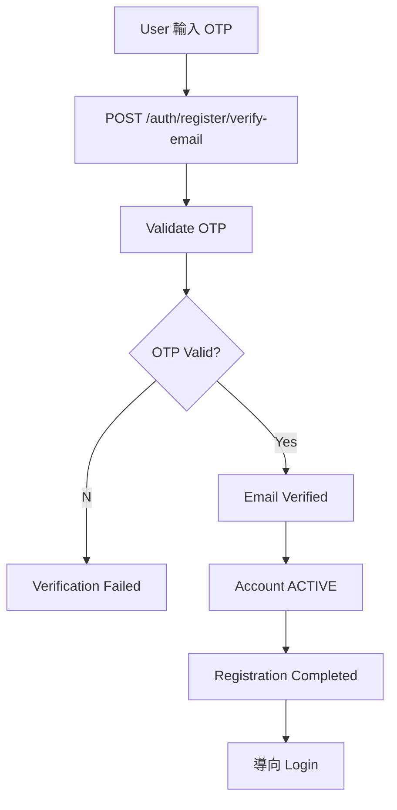
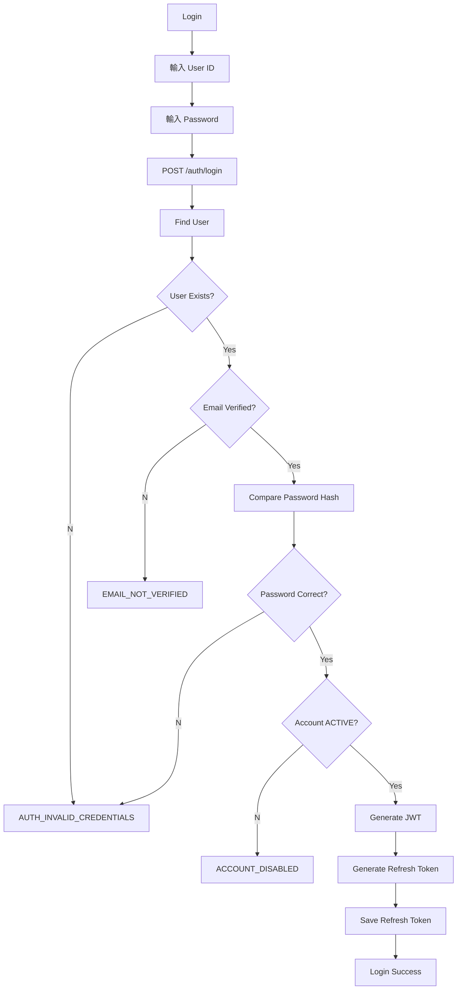
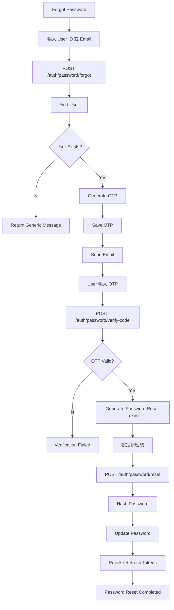
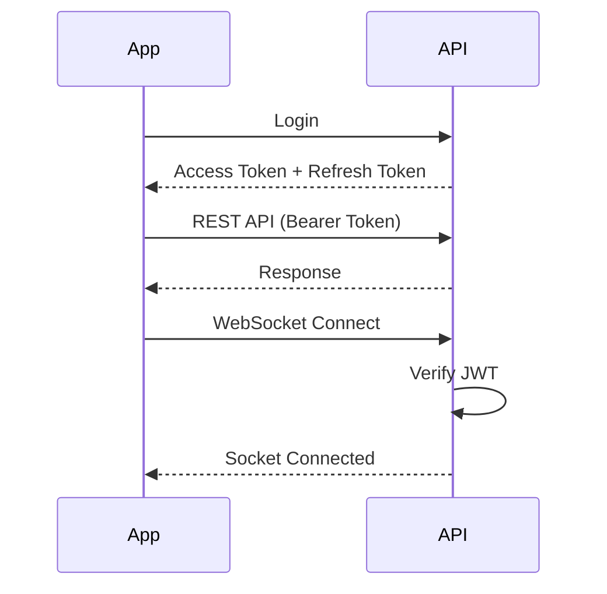
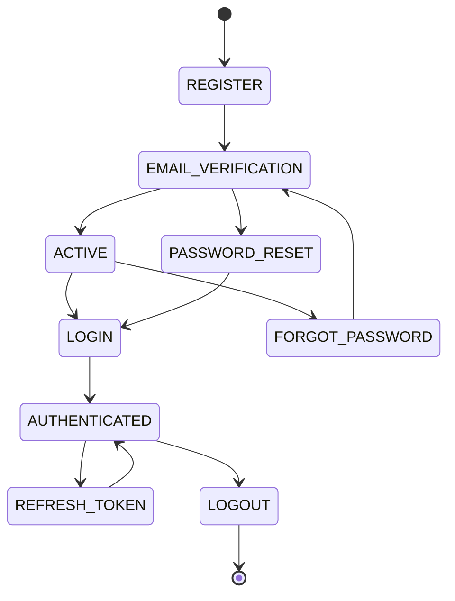
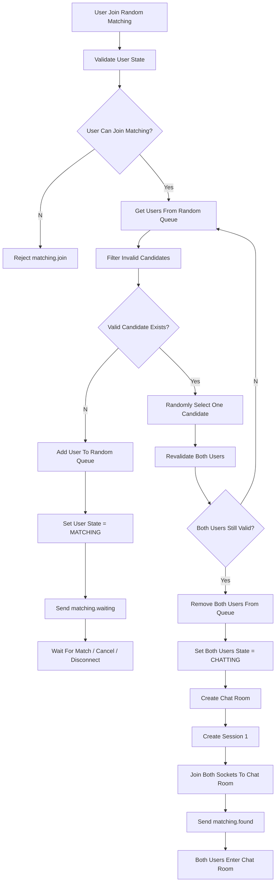

# FlashTalk v1 MVP 技術規格書

> **Version：v1.1.0**  
> **產品名稱：FlashTalk**  
> **文件類型：Technical Specification**  
> **對應需求文件：FlashTalk v1.0 MVP PRD v1.0.0**

---

# 一、系統架構

## 1.1 技術架構

| 項目 | 技術 |
|---|---|
| Mobile App | React Native |
| App Framework | Expo |
| Language | TypeScript |
| Navigation | Expo Router |
| HTTP Client | Axios |
| Client State | Zustand |
| Backend | Node.js |
| Backend Framework | Express |
| API | RESTful API |
| 即時通訊 | WebSocket / Socket.IO |
| ORM | Prisma |
| Database | PostgreSQL |
| Authentication | Email OTP + JWT |
| API Documentation | Swagger / OpenAPI |
| Avatar Storage | S3 Compatible Object Storage |
| Email | Email Provider / SMTP |
| Architecture | Modular Monolith |

Mobile
├── React Native + Expo
├── Expo Router
├── Axios
└── Zustand

Backend
├── Node.js + NestJS
└── Socket.IO

Database
├── PostgreSQL
└── Prisma

Auth
├── JWT
└── Email OTP

External
├── Email
└── Avatar Storage

## 1.2 整體架構



---

# 二、專案結構

```text
flashtalk/
│
├── apps/
│   ├── mobile/
│   └── api/
│
├── packages/
│   └── shared/
│
├── package.json
└── pnpm-workspace.yaml
```

## 2.1 Mobile

```text
apps/mobile
```

主要技術：

```text
React Native
Expo
TypeScript
Expo Router
Axios
Zustand
Socket.IO Client
```

## 2.2 API

```text
apps/api
```

主要技術：

```text
Node.js
Express
Prisma
PostgreSQL
Socket.IO
JWT
Swagger
```

## 2.3 Shared

```text
packages/shared
```

共用：

```text
TypeScript Types
Enums
Constants
API Models
WebSocket Event Types
```

---

# 三、Backend Module

```text
AppModule

AuthModule
UserModule
InterestModule

MatchingModule

ChatModule
ChatSessionModule

ConnectionModule

BlockModule
ReportModule

MailModule
StorageModule
```

---

# 四、Authentication

Authentication 採用 **Email 註冊 + 帳號密碼登入** 架構。

登入認證共分為四個流程：

1. 使用者註冊（Register）
2. 使用者登入（Login）
3. Email 驗證（Email Verification）
4. 忘記密碼（Forgot Password）

                Authentication

        ┌────────────┼─────────────┐
        │            │             │
        ▼            ▼             ▼

   Registration     Login      Password Recovery
        │            │             │
Email + Username  Username      Username / Email
+ Password        + Password          │
        │            │                ▼
        ▼            ▼            Email OTP
   Email OTP     Verify Password      │
        │            │                ▼
        ▼            ▼           Reset Token
     ACTIVE          JWT               │
                        	            ▼
                                 New Password

---

## 4.1 Register（使用者註冊）

使用者於註冊時需輸入：

```text
Email
User ID（帳號）
Password
```

註冊完成後建立未啟用帳號，並寄送 Email 驗證碼。

驗證成功後：

```text
Account Status
↓

ACTIVE
```

流程：



---

## 4.2 Email Verification（Email 驗證）

Email OTP 僅用於驗證 Email 是否為本人持有。

驗證成功後：

```text
status = ACTIVE

email_verified_at = now
```

流程：



重新寄送驗證碼：

```http
POST /api/v1/auth/register/resend-code
```

---

## 4.3 Login（使用者登入）

登入方式：

```text
User ID
+
Password
```

登入成功後發放：

```text
Access Token
Refresh Token
```

流程：



JWT：

```text
Access Token
Refresh Token
```

API：

```http
Authorization: Bearer <access_token>
```

WebSocket：

```text
JWT
↓

Socket Authentication

↓

User Identity
```

---

## 4.4 Forgot Password（忘記密碼）

忘記密碼流程使用 Email OTP 驗證。

流程：



---

## 4.5 JWT Authentication

Authentication 採用 JWT Bearer Token。

Token：

```text
Access Token
Refresh Token
```

用途：

| Token | 用途 |
|--------|------|
| Access Token | REST API、WebSocket Authentication |
| Refresh Token | 重新取得 Access Token |

流程：


Username + Password
        │
        ▼
      Login
        │
        ▼
       JWT
        │
   ┌────┴─────┐
   ▼          ▼
REST API   WebSocket
   │          │
   └────┬─────┘
        ▼
Server 知道「你是誰」
---

## 4.6 Authentication API

### Register

```http
POST /api/v1/auth/register
POST /api/v1/auth/register/verify-email
POST /api/v1/auth/register/resend-code
```

### Login

```http
POST /api/v1/auth/login
POST /api/v1/auth/refresh
POST /api/v1/auth/logout
```

### Forgot Password

```http
POST /api/v1/auth/password/forgot
POST /api/v1/auth/password/verify-code
POST /api/v1/auth/password/reset
```

---

## 4.7 User Authentication Fields

```text
id
user_id
email
password_hash
email_verified_at
status
created_at
updated_at
```

Account Status：

```text
PENDING_EMAIL_VERIFICATION
ACTIVE
SUSPENDED
DELETED
```

---

## 4.8 Authentication State Flow



# 五、User Profile

## 5.1 User

```text
users
```

欄位：

```text
id
username
email
password_hash
email_verified_at

nickname
avatar_url
status

created_at
updated_at
```

建議：

```text
id: UUID
username: UNIQUE
email: UNIQUE
```

Status：

```text
PENDING_VERIFICATION
ACTIVE
SUSPENDED
DELETED
```

---

# 六、Interest 興趣

```text
interests
```

欄位：

```text
id
name
enabled
sort
created_at
updated_at
```

User 與 Interest：

```text
user_interests
<!-- 建立中間table -->

user_id
interest_id

users
      \
       user_interests
      /
interests
```

使用者可選擇：

```text
1～3 個官方 Interest
```

流程：
```
flowchart TD

A[App 選擇 Interest]
-->B[送出 interestIds]

B-->C{數量是否 1～3?}

C--否-->D[Reject]

C--是-->E[查詢 Interests]

E-->F{全部存在且 enabled?}

F--否-->D

F--是-->G[更新 user_interests]

G-->H[完成]
```

---

# 七、Matching

配對模式：

```text
RANDOM
INTEREST
```

Matching Queue：

```text
Node.js Memory
```

Server Restart 後由 App WebSocket reconnect 並重新加入 Queue。

---

# 八、Random Matching

流程：



排除：

```text
Self
Blocked User
User Already Chatting
```

---