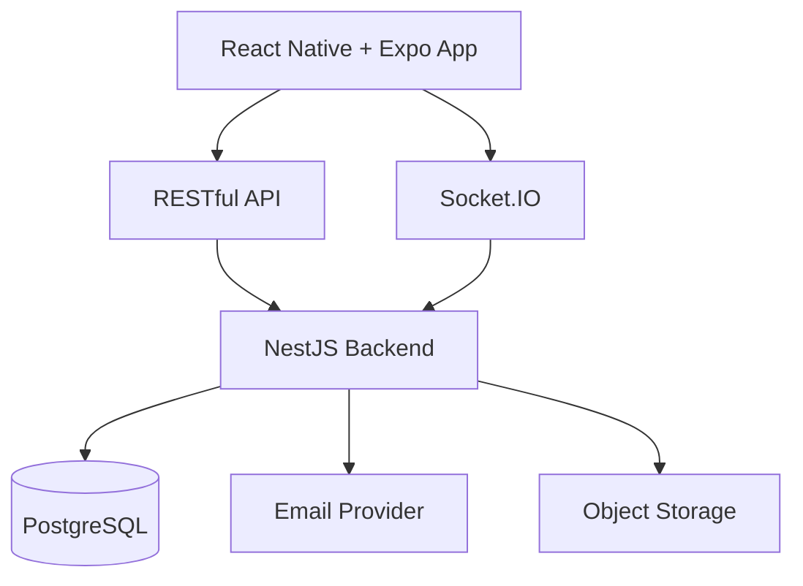
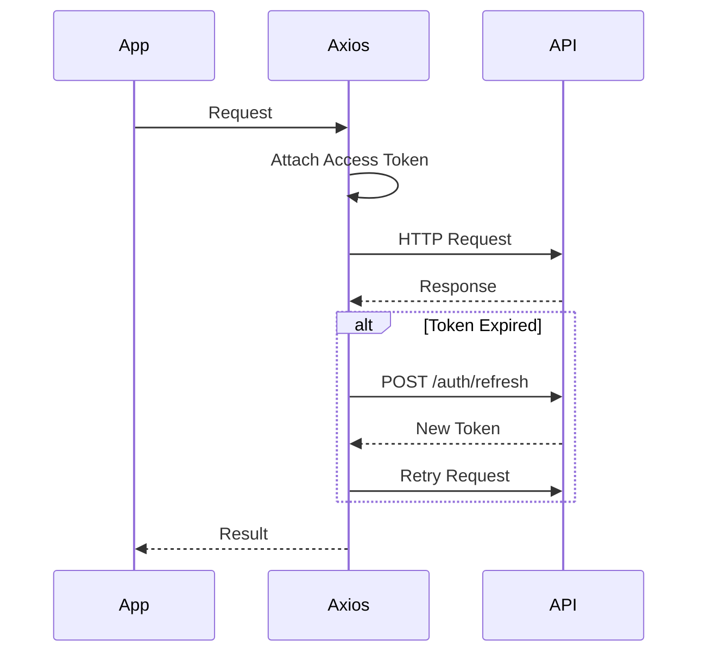
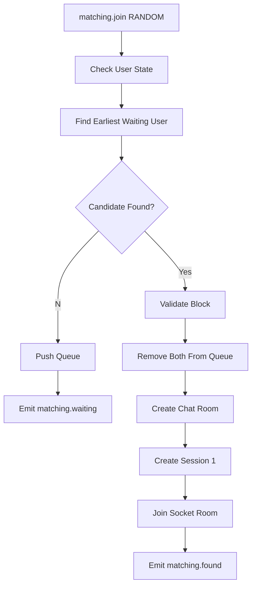
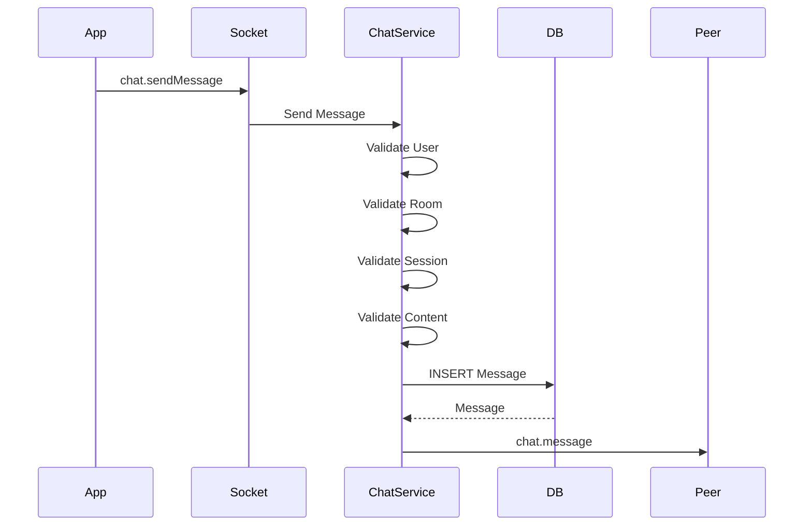
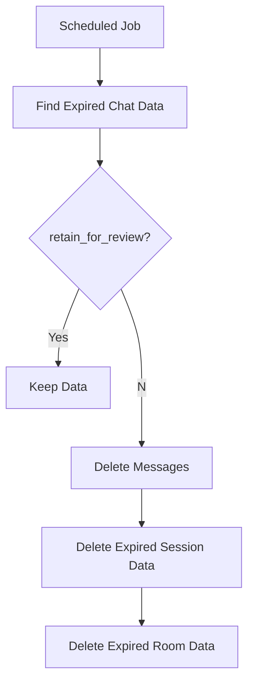
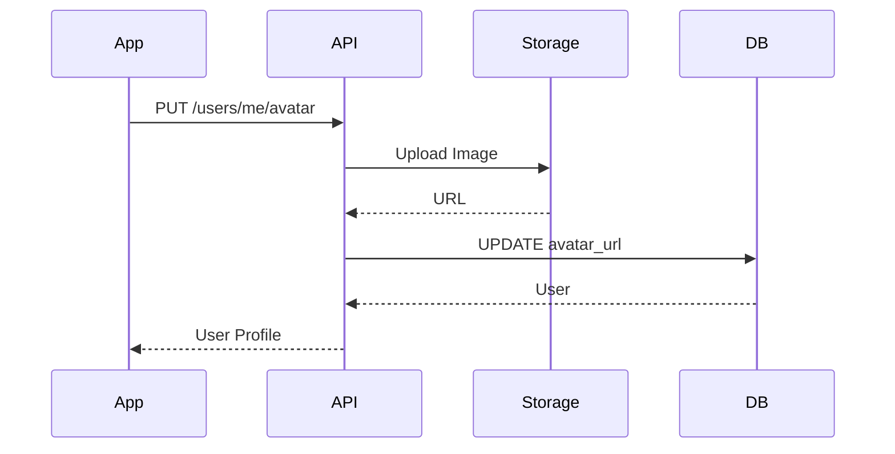
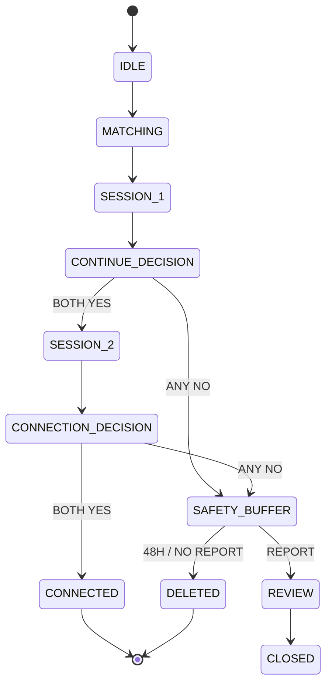
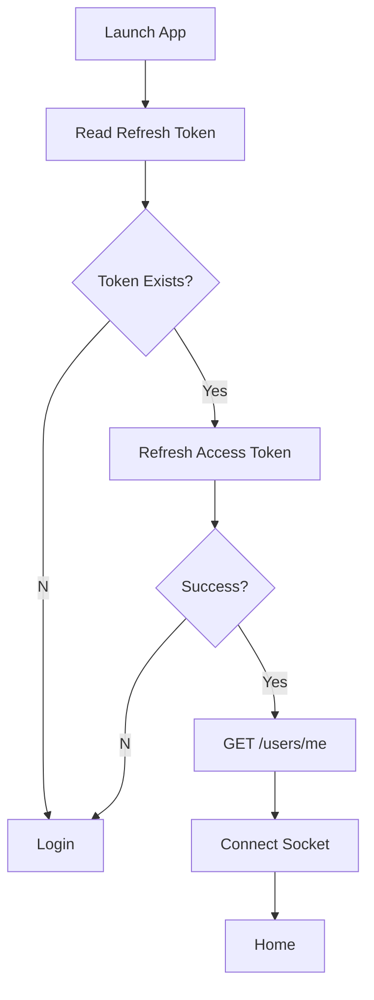
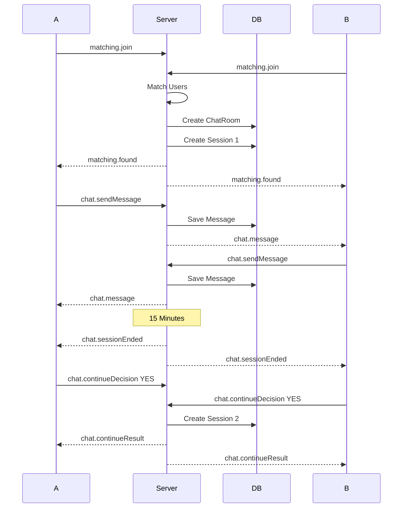
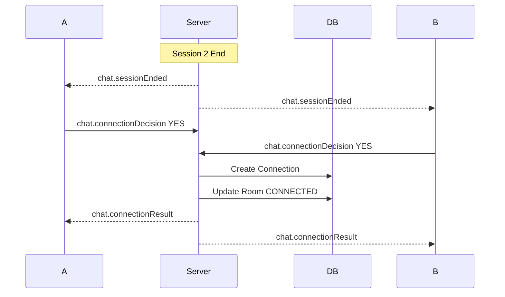

# FlashTalk v1.0 MVP 技術與實作說明書

> **Version：v1.0.0**  
> **產品名稱：FlashTalk**  
> **文件類型：Technical Implementation Guide**  
> **對應文件：FlashTalk v1.0 MVP 技術規格書 v1.0.0**

---

# 一、文件目的

本文件用於說明 FlashTalk v1.0 MVP 所使用的主要技術、各技術在系統中的責任，以及實際開發時的功能串接方式。

本文件涵蓋：

- React Native / Expo App
- TypeScript
- Expo Router
- Axios
- TanStack Query
- Zustand
- Node.js / NestJS
- RESTful API
- WebSocket / Socket.IO
- Prisma
- PostgreSQL
- Email OTP
- JWT
- Object Storage
- Swagger / OpenAPI
- Matching
- Chat Room
- Chat Session
- Connection
- Block / Report
- 48 小時安全緩衝區

---

# 二、整體系統概念

FlashTalk 分成三個主要核心：

```text
Mobile App
    │
    ├── RESTful API
    │
    └── WebSocket
            │
            ▼
      Node.js Backend
            │
            ▼
       PostgreSQL
```

另外串接：

```text
Email Provider
Object Storage
```

完整架構：



---

# 三、Monorepo 專案結構

建議專案：

```text
flashtalk/
│
├── apps/
│   ├── mobile/
│   └── api/
│
├── packages/
│   └── shared/
│
├── package.json
├── pnpm-workspace.yaml
└── .env.example
```

## 3.1 apps/mobile

負責：

```text
React Native App
畫面
Navigation
API 呼叫
WebSocket
App State
Token 保存
聊天室 UI
```

## 3.2 apps/api

負責：

```text
RESTful API
WebSocket Gateway
Authentication
Matching
Chat
Database
Email
Storage
Cleanup Job
```

## 3.3 packages/shared

放置 App 與 Backend 共用定義：

```text
Enums
Types
API Response Types
WebSocket Event Names
WebSocket Payload Types
Constants
```

例如：

```ts
export enum MatchingMode {
  RANDOM = 'RANDOM',
  INTEREST = 'INTEREST',
}

export enum ChatRoomStatus {
  ACTIVE = 'ACTIVE',
  WAITING_CONTINUE = 'WAITING_CONTINUE',
  WAITING_CONNECTION = 'WAITING_CONNECTION',
  SAFETY_BUFFER = 'SAFETY_BUFFER',
  CONNECTED = 'CONNECTED',
  CLOSED = 'CLOSED',
}
```

---

# 四、TypeScript

App 與 Backend 統一使用 TypeScript。

主要用途：

```text
API Payload 型別
Database Model 型別
WebSocket Payload 型別
Enum
Function Parameter
Response Type
```

建議共用：

```text
MatchingMode
ChatRoomStatus
ChatSessionStatus
DecisionType
UserStatus
ReportStatus
Socket Event
```

避免 App 與 Server 分別寫不同字串。

---

# 五、React Native

React Native 負責 FlashTalk Mobile App。

主要頁面：

```text
Splash
Login
Email Verification
Profile Setup
Interest Selection
Home
Match Mode Selection
Matching Waiting
Chat Room
Continue Decision
Connection Decision
Connection List
Connection Chat
Profile
Report
Block
```

基本畫面結構：

```text
Screen
↓
Hook
↓
API / Socket
↓
State
↓
UI
```

例如聊天室：

```text
ChatRoomScreen
↓
useChatRoom
↓
Socket.IO
↓
Zustand Chat State
↓
Message List
```

---

# 六、Expo

Expo 作為 React Native App Framework。

主要負責：

```text
App 啟動
Build
Environment
Secure Storage
Image Picker
Native Permission
iOS / Android Packaging
```

FlashTalk MVP 主要會用到：

```text
Expo Router
Expo SecureStore
Expo Image Picker
Expo Constants
```

Token：

```text
Expo SecureStore
```

Avatar：

```text
Expo Image Picker
```

---

# 七、Expo Router

Expo Router 負責 App Navigation。

建議：

```text
app/
│
├── _layout.tsx
│
├── index.tsx
│
├── auth/
│   ├── login.tsx
│   └── verify.tsx
│
├── onboarding/
│   ├── profile.tsx
│   └── interests.tsx
│
├── home/
│   └── index.tsx
│
├── matching/
│   └── waiting.tsx
│
├── chat/
│   └── [roomId].tsx
│
├── connections/
│   ├── index.tsx
│   └── [connectionId].tsx
│
└── profile/
    └── index.tsx
```

Navigation 判斷：

```text
未登入
→ /auth/login

已登入但 Profile 未完成
→ /onboarding/profile

已完成
→ /home
```

---

# 八、Axios

Axios 負責 RESTful API。

建立統一 Client：

```text
apiClient
```

功能：

```text
Base URL
Authorization Header
Timeout
Error Handling
Token Refresh
```

流程：



---

# 九、TanStack Query

TanStack Query 用於管理 Server State。

適合：

```text
User Profile
Interest List
Connection List
Chat Room Detail
Connection Message History
```

例如：

```text
GET /users/me
→ useQuery

PUT /users/me
→ useMutation
→ invalidate users/me
```

不建議用 TanStack Query 儲存：

```text
正在配對
Socket Connection
目前聊天室即時訊息
目前 Session 狀態
```

這些由 Zustand / Socket.IO 處理。

---

# 十、Zustand

Zustand 管理 App 即時 Client State。

建議 Store：

```text
authStore
matchingStore
chatStore
socketStore
```

## authStore

```text
user
accessToken
authenticated
```

## matchingStore

```text
mode
status
interestIds
```

## chatStore

```text
roomId
sessionId
messages
roomStatus
sessionStatus
```

## socketStore

```text
connected
socketId
```

---

# 十一、Node.js

Node.js 為 Backend Runtime。

主要負責：

```text
REST API
WebSocket
Matching Queue
Authentication
Business Logic
Database Access
Scheduled Cleanup
Email
Storage
```

FlashTalk MVP 使用單一 Backend Process：

```text
Node.js Process
│
├── HTTP Server
├── Socket.IO
├── Matching Queue
└── Scheduled Jobs
```

---

# 十二、NestJS

NestJS 作為 Backend Framework。

建議 Module：

```text
AppModule

AuthModule
UserModule
InterestModule

MatchingModule

ChatModule
ChatSessionModule

ConnectionModule

BlockModule
ReportModule

MailModule
StorageModule
```

標準結構：

```text
module/
│
├── module.controller.ts
├── module.service.ts
├── module.module.ts
├── dto/
├── entities/
└── enums/
```

WebSocket 模組可以增加：

```text
gateway/
```

---

# 十三、NestJS Controller

Controller 負責 RESTful API 入口。

例如：

```text
AuthController
UserController
InterestController
ConnectionController
BlockController
ReportController
```

Controller 流程：

```text
Request
↓
DTO Validation
↓
Authentication Guard
↓
Service
↓
Database
↓
Response
```

Controller 不放主要 Business Logic。

---

# 十四、NestJS Service

Service 負責 Domain Logic。

例如：

```text
AuthService
UserService
MatchingService
ChatService
ChatSessionService
ConnectionService
BlockService
ReportService
```

例如配對：

```text
MatchingGateway
↓
MatchingService.join()
↓
Validate User
↓
Find Candidate
↓
ChatService.createRoom()
↓
ChatSessionService.createSession()
↓
Emit matching.found
```

---

# 十五、RESTful API

RESTful API 處理非即時資料。

Base URL：

```text
/api/v1
```

主要 API：

```http
POST /api/v1/auth/send-code
POST /api/v1/auth/verify-code
POST /api/v1/auth/refresh
POST /api/v1/auth/logout

GET /api/v1/users/me
PUT /api/v1/users/me
PUT /api/v1/users/me/avatar
PUT /api/v1/users/me/interests

GET /api/v1/interests

GET /api/v1/chat-rooms/:id

GET /api/v1/connections
GET /api/v1/connections/:id
DELETE /api/v1/connections/:id

GET /api/v1/blocks
POST /api/v1/blocks
DELETE /api/v1/blocks/:id

POST /api/v1/reports
```

---

# 十六、REST API Response

成功：

```json
{
  "success": true,
  "data": {}
}
```

失敗：

```json
{
  "success": false,
  "error": {
    "code": "CHAT_SESSION_EXPIRED",
    "message": "Chat session has expired."
  }
}
```

App 主要判斷：

```text
error.code
```

---

# 十七、WebSocket / Socket.IO

Socket.IO 負責：

```text
Matching
Match Found
Chat Message
Session End
Continue Decision
Connection Decision
Connection Private Messaging
```

建立 Socket：

```text
App Login
↓
取得 JWT
↓
Socket Connect
↓
JWT Authentication
↓
建立 User ↔ Socket 關係
```

---

# 十八、Socket Authentication

Connection Handshake 帶入 Access Token。

Backend：

```text
Socket Handshake
↓
Read JWT
↓
Verify JWT
↓
Get User ID
↓
Bind User To Socket
```

所有後續事件：

```text
socket.user.id
```

作為身份。

不接受 Client 自行指定 senderId。

---

# 十九、Socket Events

Client → Server：

```text
matching.join
matching.cancel

chat.sendMessage
chat.continueDecision
chat.connectionDecision
```

Server → Client：

```text
matching.waiting
matching.found

chat.message
chat.sessionEnded

chat.continueResult
chat.connectionResult

chat.closed

system.error
```

建議將 Event Name 放在：

```text
packages/shared
```

---

# 二十、Prisma

Prisma 負責：

```text
PostgreSQL Schema
Database Migration
Database Query
Relation
Transaction
```

主要 Model：

```text
User
Interest
UserInterest

EmailVerification
RefreshToken

ChatRoom
ChatSession
Message
ChatDecision

Connection

Block
Report
```

Prisma 操作流程：

```text
NestJS Service
↓
PrismaService
↓
PostgreSQL
```

---

# 二十一、PostgreSQL

PostgreSQL 保存所有需要永久或暫時持久化的資料。

主要 Tables：

```text
users

interests
user_interests

email_verifications
refresh_tokens

chat_rooms
chat_sessions
messages
chat_decisions

connections

blocks

reports
```

Matching Queue MVP 不存 PostgreSQL：

```text
Node.js Memory
```

---

# 二十二、User Table

```text
users
```

主要欄位：

```text
id UUID PRIMARY KEY
email UNIQUE
nickname
avatar_url
status
created_at
updated_at
```

關聯：

```text
User
├── Interests
├── Chat Rooms
├── Messages
├── Connections
├── Blocks
└── Reports
```

---

# 二十三、Interest Tables

```text
interests
```

```text
id
name
enabled
sort
created_at
updated_at
```

關聯：

```text
user_interests
```

```text
user_id
interest_id
```

使用者更新 Interest：

```text
PUT /users/me/interests
↓
Validate 1～3
↓
Delete Existing Relations
↓
Create New Relations
```

---

# 二十四、Email OTP 實作

資料：

```text
email_verifications
```

建議欄位：

```text
id
email
code_hash
expires_at
verified_at
created_at
```

寄送流程：

```text
Email
↓
Generate 6-digit Code
↓
Hash Code
↓
Save PostgreSQL
↓
Send Email
```

驗證流程：

```text
Email + Code
↓
Find Latest Valid Verification
↓
Compare Hash
↓
Check expires_at
↓
Mark Verified
↓
Create / Find User
↓
Issue JWT
```

---

# 二十五、JWT 實作

Token：

```text
Access Token
Refresh Token
```

Access Token Payload：

```text
sub = userId
email
```

Refresh Token：

```text
refresh_tokens
```

建議保存：

```text
id
user_id
token_hash
expires_at
revoked_at
created_at
```

Refresh：

```text
Refresh Token
↓
Verify
↓
Check Database
↓
Issue New Access Token
```

Logout：

```text
Revoke Refresh Token
```

---

# 二十六、Matching Queue

MVP Matching Queue 使用 Node.js Memory。

概念：

```text
randomQueue

interestQueue
```

Queue Item：

```text
userId
socketId
mode
interestIds
joinedAt
```

使用者：

```text
matching.join
```

後加入 Queue。

---

# 二十七、Random Matching 實作

流程：



候選人排除：

```text
Self
Blocked User
Blocking User
Already Chatting User
Disconnected User
```

---

# 二十八、Interest Matching 實作

Queue Item 包含：

```text
interestIds
```

候選條件：

```text
intersection(userA.interestIds, userB.interestIds).length > 0
```

流程：

```text
Join Interest Queue
↓
Search Waiting Users
↓
Find Shared Interest
↓
Validate Block
↓
Create Room
↓
Create Session
↓
Match Found
```

沒有候選：

```text
Remain Waiting
```

不設 Timeout。

---

# 二十九、Chat Room

Chat Room 表示兩位使用者之間的一次配對關係。

```text
chat_rooms
```

欄位：

```text
id
user_a_id
user_b_id
room_type
status
current_session
created_at
closed_at
delete_at
retain_for_review
```

Room Type：

```text
MATCH
CONNECTION
```

---

# 三十、Chat Session

每一次 15 分鐘聊天都是獨立 Session。

```text
chat_sessions
```

欄位：

```text
id
chat_room_id
sequence
started_at
ended_at
status
created_at
```

Session 1：

```text
sequence = 1
```

續聊：

```text
sequence = 2
```

---

# 三十一、Chat Session Timer

建立：

```text
started_at = now
ended_at = now + 15 minutes
```

訊息發送前都檢查：

```text
now < ended_at
```

Session 結束：

```text
status = FINISHED
```

Room：

```text
Session 1
→ WAITING_CONTINUE

Session 2
→ WAITING_CONNECTION
```

再 Emit：

```text
chat.sessionEnded
```

---

# 三十二、Message

```text
messages
```

主要欄位：

```text
id
chat_room_id
chat_session_id
sender_id
content
created_at
delete_at
retain_for_review
```

陌生聊天室只允許：

```text
Text
Emoji
```

---

# 三十三、Message 發送流程



驗證：

```text
JWT
Room Participant
Active Session
Session Time
Message Length
External URL
Block
```

---

# 三十四、外部連結過濾

訊息送出前執行：

```text
URL Validation
```

偵測：

```text
http://
https://
www.
domain pattern
social link pattern
```

符合：

```text
Reject
```

錯誤：

```text
CHAT_EXTERNAL_LINK_NOT_ALLOWED
```

---

# 三十五、Continue Decision

Session 1 結束：

```text
Room Status
→ WAITING_CONTINUE
```

使用者送：

```text
chat.continueDecision
```

Payload：

```json
{
  "decision": true
}
```

Backend 保存：

```text
chat_decisions
```

兩位使用者都完成後：

```text
YES + YES
→ Create Session 2

YES + NO
→ SAFETY_BUFFER

NO + NO
→ SAFETY_BUFFER
```

---

# 三十六、Connection Decision

Session 2 結束：

```text
Room Status
→ WAITING_CONNECTION
```

使用者送：

```text
chat.connectionDecision
```

雙方：

```text
YES + YES
```

Backend：

```text
Create Connection
↓
Room Status = CONNECTED
↓
Emit chat.connectionResult
```

只要存在 NO：

```text
Room Status = SAFETY_BUFFER
```

---

# 三十七、Connection

```text
connections
```

欄位：

```text
id
user_a_id
user_b_id
created_at
```

建立後 App：

```text
GET /connections
```

顯示 Connection List。

---

# 三十八、Connection Private Messaging

Connection 建立後可以建立：

```text
room_type = CONNECTION
```

Connection Chat：

```text
WebSocket
+
messages
```

不套用：

```text
15 Minute Timeout
Continue Decision
Connection Decision
```

訊息流程沿用 ChatService。

---

# 三十九、Block

```text
blocks
```

欄位：

```text
id
blocker_id
blocked_user_id
created_at
```

建立 Block：

```text
POST /blocks
↓
Create Block
↓
Remove Matching Queue
↓
Stop Future Matching
↓
Disable Private Messaging
```

Matching 查詢候選時檢查：

```text
A blocks B
OR
B blocks A
```

任何成立即排除。

---

# 四十、Report

```text
reports
```

欄位：

```text
id
reporter_id
reported_user_id
chat_room_id
reason
description
status
created_at
reviewed_at
```

建立 Report：

```text
POST /reports
↓
Validate Reporter Is Room Participant
↓
Create Report
↓
Set Room retain_for_review = true
↓
Set Messages retain_for_review = true
```

---

# 四十一、安全緩衝區

沒有建立 Connection 的限時聊天室：

```text
status = SAFETY_BUFFER
```

設定：

```text
closed_at = now
delete_at = now + 48 hours
```

資料繼續保留：

```text
Chat Room
Chat Sessions
Messages
```

---

# 四十二、Cleanup Job

使用：

```text
@nestjs/schedule
```

每小時執行。

流程：



查詢條件：

```text
delete_at < NOW()
AND
retain_for_review = false
```

同時可清除：

```text
Expired Email OTP
Expired Refresh Token
```

---

# 四十三、Avatar Upload

App：

```text
Expo Image Picker
```

選取圖片。

流程：



PostgreSQL 只保存：

```text
avatar_url
```

---

# 四十四、Object Storage

可使用 S3 Compatible Storage。

Backend StorageModule 負責：

```text
Upload
Delete
Generate Object Key
Return Public / Signed URL
```

建議 Object Key：

```text
avatars/{userId}/{uuid}.jpg
```

---

# 四十五、Email Provider

MailModule 負責：

```text
Send Verification Code
Email Template
Provider Configuration
```

流程：

```text
AuthService
↓
MailService
↓
Email Provider
```

---

# 四十六、Swagger / OpenAPI

NestJS 啟動 Swagger。

例如：

```text
/api/docs
```

文件包含：

```text
Auth API
User API
Interest API
Chat API
Connection API
Block API
Report API

Request DTO
Response DTO
Error Code
Authentication
```

WebSocket Event 另外維護在技術文件與 shared types。

---

# 四十七、DTO Validation

REST API Request 使用 DTO。

主要驗證：

```text
Email Format
OTP Length
Nickname Length
Interest Count
UUID
Report Reason
Message Length
```

Socket Event Payload 同樣要做 Runtime Validation。

---

# 四十八、Authentication Guard

REST：

```text
JwtAuthGuard
```

流程：

```text
Authorization Header
↓
Verify JWT
↓
Attach req.user
↓
Controller
```

Socket：

```text
Socket Auth Middleware / Guard
```

流程：

```text
Handshake JWT
↓
Verify
↓
Attach socket.user
```

---

# 四十九、Database Transaction

以下流程建議使用 Transaction：

```text
Match Found
→ Create Room
→ Create Session

Connection Accepted
→ Create Connection
→ Update Room

Report Created
→ Create Report
→ Retain Room
→ Retain Messages
```

確保同一個業務操作完整完成。

---

# 五十、核心狀態機



所有狀態變更：

```text
Client Action
↓
Backend Validate
↓
Backend Update
↓
Database Save
↓
Socket Broadcast
```

Client 不直接指定最終狀態。

---

# 五十一、App 啟動流程



---

# 五十二、完整配對到聊天流程



---

# 五十三、完整 Connection 流程



如果任一方：

```text
NO
```

則：

```text
Room
→ SAFETY_BUFFER
→ 48 Hour Retention
```

---

# 五十四、錯誤處理

主要 Error Code：

```text
AUTH_CODE_INVALID
AUTH_CODE_EXPIRED

AUTH_TOKEN_INVALID
AUTH_TOKEN_EXPIRED

USER_NOT_FOUND

MATCH_ALREADY_WAITING
MATCH_ALREADY_CHATTING
MATCH_INVALID_INTEREST

CHAT_ROOM_NOT_FOUND
CHAT_SESSION_NOT_FOUND
CHAT_SESSION_EXPIRED
CHAT_NOT_PARTICIPANT

CHAT_MESSAGE_EMPTY
CHAT_MESSAGE_TOO_LONG
CHAT_EXTERNAL_LINK_NOT_ALLOWED

CONNECTION_ALREADY_EXISTS

BLOCK_ALREADY_EXISTS

REPORT_ALREADY_EXISTS
```

REST：

```text
HTTP Status
+
error.code
```

Socket：

```text
system.error
```

Payload：

```json
{
  "code": "CHAT_SESSION_EXPIRED",
  "message": "Chat session has expired."
}
```

---

# 五十五、開發順序

## Phase 1 — Base

完成：

```text
pnpm Workspace
React Native / Expo
NestJS
Prisma
PostgreSQL
Environment
Swagger
```

## Phase 2 — Authentication

完成：

```text
Email OTP
JWT
Refresh Token
User
Profile
Interest
```

驗收：

```text
可以用 Email 登入
可以取得 User Profile
可以修改暱稱
可以設定 Interest
```

## Phase 3 — WebSocket / Matching

完成：

```text
Socket Authentication
Random Queue
Interest Queue
Match Found
```

驗收：

```text
兩台 App 可以互相配對
```

## Phase 4 — Chat

完成：

```text
ChatRoom
ChatSession
Message
Socket Message
15 Minute Session
```

驗收：

```text
雙方可以即時傳文字
Session 到期禁止發送訊息
```

## Phase 5 — Continue

完成：

```text
Continue Decision
Session 2
```

驗收：

```text
只有雙方 YES 才進 Session 2
```

## Phase 6 — Connection

完成：

```text
Connection Decision
Connection
Private Messaging
```

驗收：

```text
只有雙方 YES 才建立 Connection
```

## Phase 7 — Safety

完成：

```text
Block
Report
Safety Buffer
Cleanup Job
```

驗收：

```text
Block 後不再配對
Report 後保留聊天資料
無 Report 48 小時後刪除
```

---

# 五十六、MVP 開發時的功能責任表

| 功能 | REST API | WebSocket | PostgreSQL | App State |
|---|---|---|---|---|
| Email OTP | ✓ | | ✓ | TanStack Query |
| User Profile | ✓ | | ✓ | TanStack Query |
| Interest | ✓ | | ✓ | TanStack Query |
| Matching | | ✓ | | Zustand |
| Match Found | | ✓ | ✓ | Zustand |
| Chat Message | | ✓ | ✓ | Zustand |
| Session Timer | | ✓ | ✓ | Zustand |
| Continue Decision | | ✓ | ✓ | Zustand |
| Connection Decision | | ✓ | ✓ | Zustand |
| Connection List | ✓ | | ✓ | TanStack Query |
| Private Messaging | ✓ / ✓ | ✓ | ✓ | Zustand |
| Block | ✓ | | ✓ | TanStack Query |
| Report | ✓ | | ✓ | TanStack Query |
| Safety Buffer | | Server | ✓ | |
| Cleanup | | Server Job | ✓ | |

---

# 五十七、環境變數

Backend：

```text
DATABASE_URL

JWT_ACCESS_SECRET
JWT_REFRESH_SECRET

JWT_ACCESS_EXPIRES_IN
JWT_REFRESH_EXPIRES_IN

EMAIL_PROVIDER_KEY
EMAIL_FROM

STORAGE_ENDPOINT
STORAGE_BUCKET
STORAGE_ACCESS_KEY
STORAGE_SECRET_KEY

APP_ENV
PORT
```

Mobile：

```text
EXPO_PUBLIC_API_URL
EXPO_PUBLIC_SOCKET_URL
```

Sensitive Secret 不放 Mobile App。

---

# 五十八、Logging

Backend 至少記錄：

```text
Request Error
Authentication Failure
Socket Connect / Disconnect
Matching Result
Chat Session Start / End
Report
Cleanup Job Result
Unexpected Exception
```

不記錄：

```text
JWT Raw Token
OTP Raw Code
Sensitive User Data
```

---

# 五十九、測試重點

## Authentication

```text
OTP Correct
OTP Incorrect
OTP Expired
Refresh Token
Logout
```

## Matching

```text
Random Match
Interest Match
No Common Interest
Blocked User
Duplicate Queue
Disconnect
```

## Chat

```text
Valid Message
Expired Session
Non Participant
External URL
Too Long Message
```

## Decision

```text
YES + YES
YES + NO
NO + NO
Duplicate Decision
```

## Safety

```text
Block
Report
48 Hour Cleanup
Retained Report Data
```

---

# 六十、MVP 最終實作架構

```text
React Native + Expo
        │
        ├── Axios / REST
        │
        └── Socket.IO
                │
                ▼
        Node.js + NestJS
                │
        ┌───────┼───────────┐
        │       │           │
        ▼       ▼           ▼
     Prisma   Email      Storage
        │
        ▼
   PostgreSQL
```

Backend Domain：

```text
Auth
User
Interest
Matching
Chat
Chat Session
Connection
Block
Report
Safety Buffer
```

核心流程：

```text
Login
↓
Profile
↓
Matching
↓
Chat Session 1
↓
Continue Decision
↓
Chat Session 2
↓
Connection Decision
↓
Connection / Safety Buffer
↓
Report Review / 48 Hour Delete
```

---

# 六十一、實作檢查清單

```text
[ ] Expo App 可以啟動
[ ] NestJS API 可以啟動
[ ] PostgreSQL Connection 正常
[ ] Prisma Migration 正常
[ ] Swagger 正常

[ ] Email OTP 可以寄送
[ ] Email OTP 可以驗證
[ ] JWT Login 正常
[ ] Refresh Token 正常

[ ] User Profile CRUD 正常
[ ] Interest 選擇正常
[ ] Avatar Upload 正常

[ ] Socket Authentication 正常
[ ] Random Matching 正常
[ ] Interest Matching 正常

[ ] Chat Room 建立正常
[ ] Session 1 正常
[ ] Message 即時傳送正常
[ ] 15 分鐘 Server Validation 正常

[ ] Continue Decision 正常
[ ] Session 2 正常

[ ] Connection Decision 正常
[ ] Connection 建立正常
[ ] Connection Private Messaging 正常

[ ] Block 正常
[ ] Report 正常
[ ] Safety Buffer 正常
[ ] 48 Hour Cleanup 正常
```
