# FlashTalk v1.0 MVP 技術規格書

> **Version：v1.1.0**  
> **產品名稱：FlashTalk**  
> **文件類型：Technical Specification**  
> **對應需求文件：FlashTalk v1.0 MVP PRD v1.0.0**

---

# 一、系統架構

## 1.1 技術架構

| 項目 | 技術 |
|---|---|
| Mobile App | React Native |
| App Framework | Expo |
| Language | TypeScript |
| Navigation | Expo Router |
| HTTP Client | Axios |
| Client State | Zustand |
| Backend | Node.js |
| Backend Framework | Express |
| API | RESTful API |
| 即時通訊 | WebSocket / Socket.IO |
| ORM | Prisma |
| Database | PostgreSQL |
| Authentication | Email OTP + JWT |
| API Documentation | Swagger / OpenAPI |
| Avatar Storage | S3 Compatible Object Storage |
| Email | Email Provider / SMTP |
| Architecture | Modular Monolith |

Mobile
├── React Native + Expo
├── Expo Router
├── Axios
└── Zustand

Backend
├── Node.js + NestJS
└── Socket.IO

Database
├── PostgreSQL
└── Prisma

Auth
├── JWT
└── Email OTP

External
├── Email
└── Avatar Storage

## 1.2 整體架構

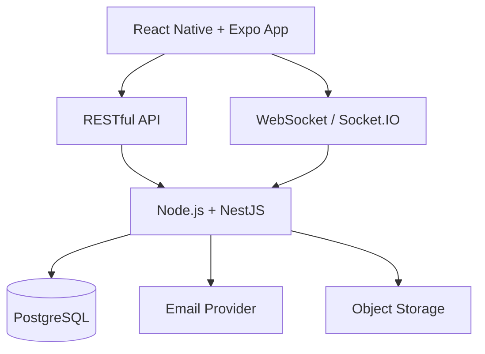

---

# 二、專案結構

```text
flashtalk/
│
├── apps/
│   ├── mobile/
│   └── api/
│
├── packages/
│   └── shared/
│
├── package.json
└── pnpm-workspace.yaml
```

## 2.1 Mobile

```text
apps/mobile
```

主要技術：

```text
React Native
Expo
TypeScript
Expo Router
Axios
Zustand
Socket.IO Client
```

## 2.2 API

```text
apps/api
```

主要技術：

```text
Node.js
Express
Prisma
PostgreSQL
Socket.IO
JWT
Swagger
```

## 2.3 Shared

```text
packages/shared
```

共用：

```text
TypeScript Types
Enums
Constants
API Models
WebSocket Event Types
```

---

# 三、Backend Module

```text
AppModule

AuthModule
UserModule
InterestModule

MatchingModule

ChatModule
ChatSessionModule

ConnectionModule

BlockModule
ReportModule

MailModule
StorageModule
```

---

# 四、Authentication

Authentication 採用 **Email 註冊 + 帳號密碼登入** 架構。

登入認證共分為四個流程：

1. 使用者註冊（Register）
2. 使用者登入（Login）
3. Email 驗證（Email Verification）
4. 忘記密碼（Forgot Password）

---

## 4.1 Register（使用者註冊）

使用者於註冊時需輸入：

```text
Email
User ID（帳號）
Password
```

註冊完成後建立未啟用帳號，並寄送 Email 驗證碼。

驗證成功後：

```text
Account Status
↓

ACTIVE
```

流程：

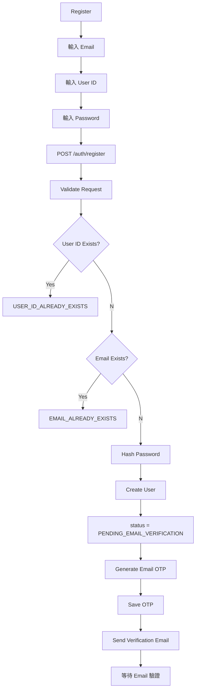

---

## 4.2 Email Verification（Email 驗證）

Email OTP 僅用於驗證 Email 是否為本人持有。

驗證成功後：

```text
status = ACTIVE

email_verified_at = now
```

流程：

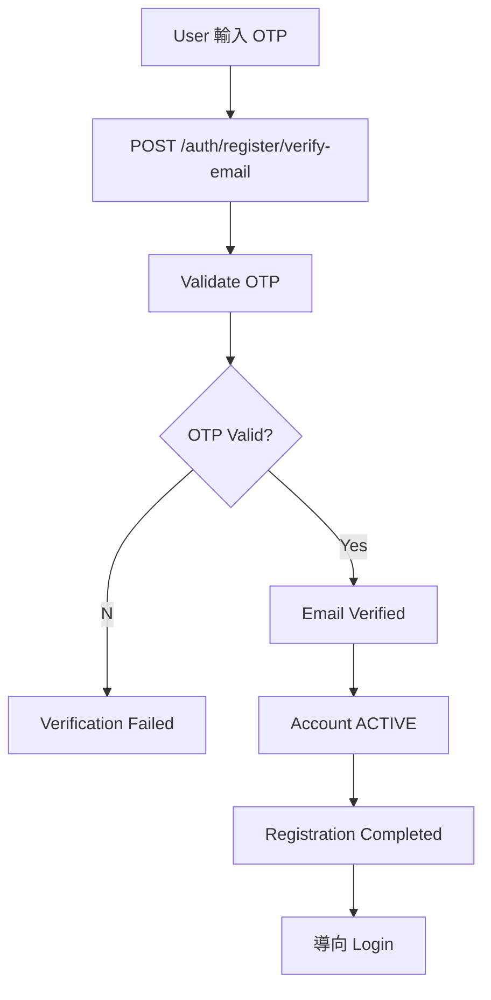

重新寄送驗證碼：

```http
POST /api/v1/auth/register/resend-code
```

---

## 4.3 Login（使用者登入）

登入方式：

```text
User ID
+
Password
```

登入成功後發放：

```text
Access Token
Refresh Token
```

流程：

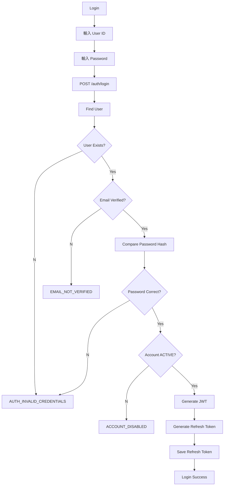

JWT：

```text
Access Token
Refresh Token
```

API：

```http
Authorization: Bearer <access_token>
```

WebSocket：

```text
JWT
↓

Socket Authentication

↓

User Identity
```

---

## 4.4 Forgot Password（忘記密碼）

忘記密碼流程使用 Email OTP 驗證。

流程：

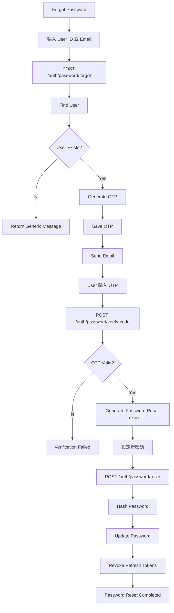

---

## 4.5 JWT Authentication

Authentication 採用 JWT Bearer Token。

Token：

```text
Access Token
Refresh Token
```

用途：

| Token | 用途 |
|--------|------|
| Access Token | REST API、WebSocket Authentication |
| Refresh Token | 重新取得 Access Token |

流程：

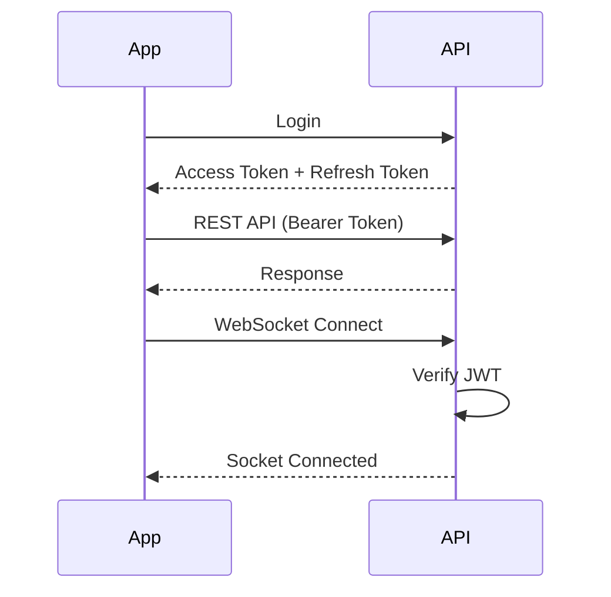

---

## 4.6 Authentication API

### Register

```http
POST /api/v1/auth/register
POST /api/v1/auth/register/verify-email
POST /api/v1/auth/register/resend-code
```

### Login

```http
POST /api/v1/auth/login
POST /api/v1/auth/refresh
POST /api/v1/auth/logout
```

### Forgot Password

```http
POST /api/v1/auth/password/forgot
POST /api/v1/auth/password/verify-code
POST /api/v1/auth/password/reset
```

---

## 4.7 User Authentication Fields

```text
id
user_id
email
password_hash
email_verified_at
status
created_at
updated_at
```

Account Status：

```text
PENDING_EMAIL_VERIFICATION
ACTIVE
SUSPENDED
DELETED
```

---

## 4.8 Authentication State Flow

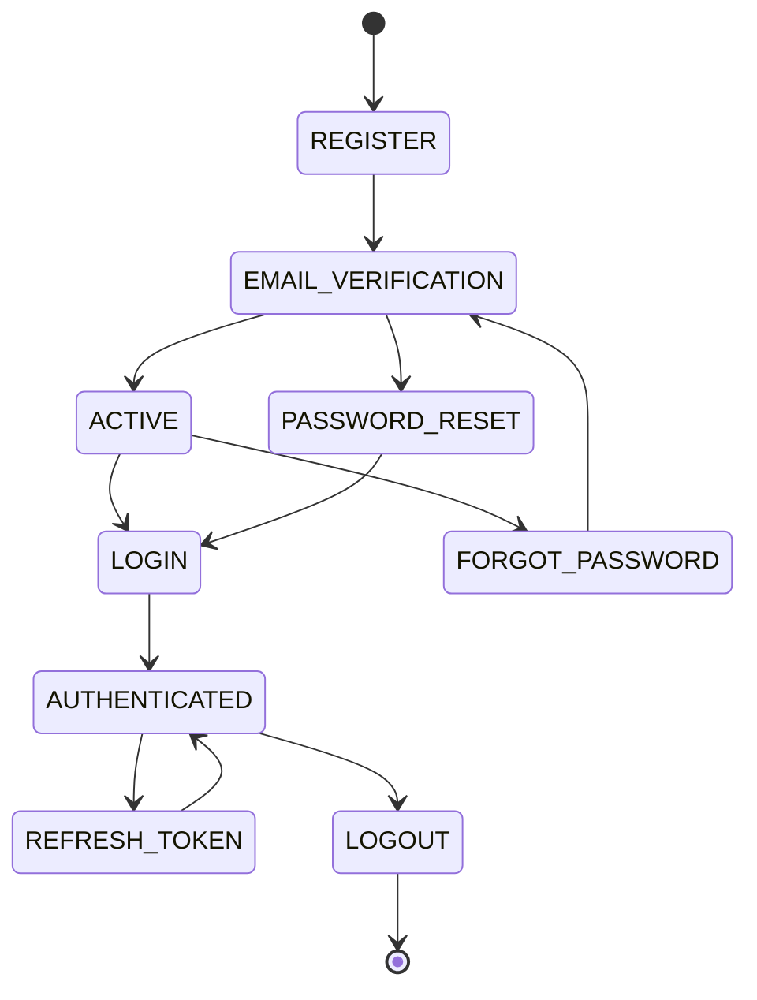

Username + Password
        │
        ▼
      Login
        │
        ▼
       JWT
        │
   ┌────┴─────┐
   ▼          ▼
REST API   WebSocket
   │          │
   └────┬─────┘
        ▼
Server 知道「你是誰」        

# 五、User Profile

## 5.1 User

```text
users
```

欄位：

```text
id
username
email
password_hash
email_verified_at

nickname
avatar_url
status

created_at
updated_at
```

建議：

```text
id: UUID
username: UNIQUE
email: UNIQUE
```

Status：

```text
PENDING_VERIFICATION
ACTIVE
SUSPENDED
DELETED
```

---

# 六、Interest

```text
interests
```

欄位：

```text
id
name
enabled
sort
created_at
updated_at
```

User 與 Interest：

```text
user_interests

user_id
interest_id
```

使用者可選擇：

```text
1～3 個官方 Interest
```

---

# 七、Matching

配對模式：

```text
RANDOM
INTEREST
```

Matching Queue：

```text
Node.js Memory
```

Server Restart 後由 App WebSocket reconnect 並重新加入 Queue。

---

# 八、Random Matching

流程：

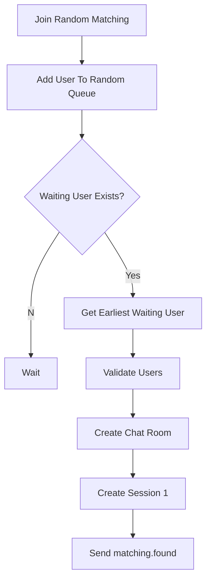

排除：

```text
Self
Blocked User
User Already Chatting
```

---

# 九、Interest Matching

加入配對：

```text
mode = INTEREST
interestIds = 1～3
```

配對條件：

```text
User A Interests
∩
User B Interests
!= Empty
```

至少具有一個共同 Interest 即可配對。

興趣配對：

```text
No Timeout
```

持續等待直到：

```text
Match Found
User Cancel
Socket Disconnect
```

---

# 十、Chat Room

```text
chat_rooms
```

欄位：

```text
id
user_a_id
user_b_id
room_type
status
current_session
created_at
closed_at
delete_at
retain_for_review
```

Room Type：

```text
MATCH
CONNECTION
```

Status：

```text
ACTIVE
WAITING_CONTINUE
WAITING_CONNECTION
SAFETY_BUFFER
CONNECTED
CLOSED
```

---

# 十一、Chat Session

```text
chat_sessions
```

欄位：

```text
id
chat_room_id
sequence
started_at
ended_at
status
created_at
```

Status：

```text
ACTIVE
FINISHED
```

Session：

```text
Session 1
15 Minutes

Session 2
15 Minutes
```

時間控制：

```text
started_at = Server Time
ended_at = started_at + 15 minutes
```

Server：

```text
now >= ended_at
→ Session Finished
→ Reject New Messages
→ Emit chat.sessionEnded
```

---

# 十二、Message

```text
messages
```

欄位：

```text
id
chat_room_id
chat_session_id
sender_id
content
created_at
delete_at
retain_for_review
```

支援：

```text
Text
Emoji
```

禁止：

```text
Image
Video
Voice
File
External URL
Social Link
```

Message Length：

```text
1～1000 Characters
```

---

# 十三、Message Validation

收到：

```text
chat.sendMessage
```

Backend 驗證：

```text
JWT Valid
Room Exists
User Is Participant
Session Active
Session Not Expired
Message Not Empty
Message Length Valid
No External URL
User Not Blocked
```

通過後：

```text
Save PostgreSQL
→ Broadcast chat.message
```

---

# 十四、WebSocket Events

## 14.1 Client → Server

```text
matching.join
matching.cancel

chat.sendMessage
chat.continueDecision
chat.connectionDecision
```

## 14.2 Server → Client

```text
matching.waiting
matching.found

chat.message
chat.sessionEnded

chat.continueResult
chat.connectionResult

chat.closed

system.error
```

---

# 十五、Chat Flow

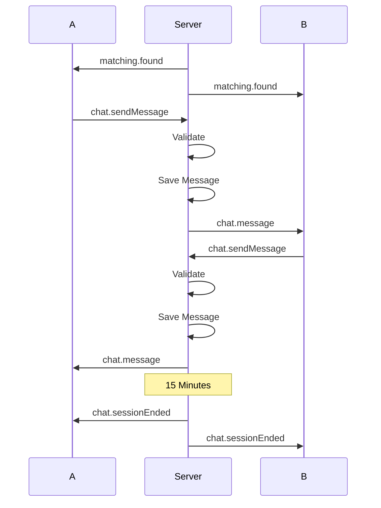

---

# 十六、Continue Decision

第一次 Session 結束後：

```text
CONTINUE
END
```

資料：

```text
chat_decisions
```

欄位：

```text
id
chat_room_id
chat_session_id
user_id
decision_type
decision
created_at
```

Decision Type：

```text
CONTINUE
CONNECTION
```

流程：

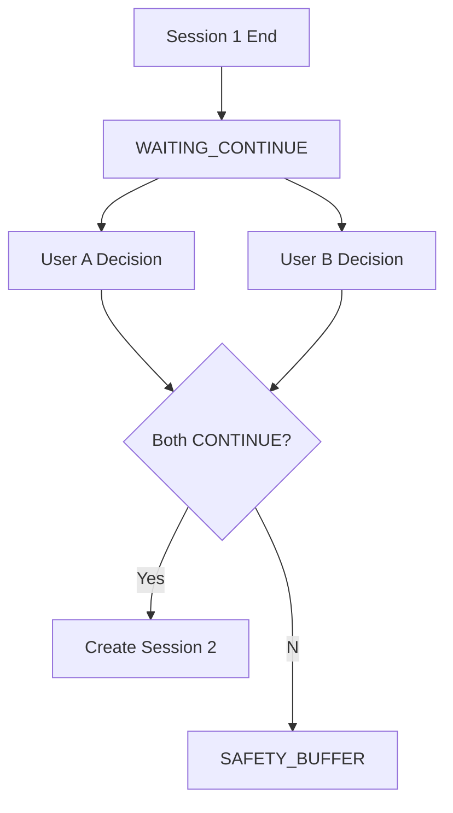

---

# 十七、Connection

第二次 Session 結束：

```text
WAITING_CONNECTION
```

雙方：

```text
YES / NO
```

只有：

```text
User A = YES
AND
User B = YES
```

建立 Connection。

資料：

```text
connections
```

欄位：

```text
id
user_a_id
user_b_id
created_at
```

---

# 十八、Connection Private Messaging

Connection 建立後：

```text
Private Messaging Enabled
```

沿用：

```text
chat_rooms
messages
WebSocket
```

Connection Room：

```text
room_type = CONNECTION
```

不使用：

```text
15 Minute Session Limit
```

---

# 十九、Block

```text
blocks
```

欄位：

```text
id
blocker_id
blocked_user_id
created_at
```

Block 後：

```text
Disable Future Matching
Disable Connection
Disable Private Messaging
```

Matching 必須排除雙向 Block 關係。

---

# 二十、Report

```text
reports
```

欄位：

```text
id
reporter_id
reported_user_id
chat_room_id
reason
description
status
created_at
reviewed_at
```

Status：

```text
PENDING
REVIEWED
RESOLVED
```

Report 建立後：

```text
Chat Room
→ retain_for_review = true

Messages
→ retain_for_review = true
```

---

# 二十一、48 小時安全緩衝區

聊天室結束：

```text
status = SAFETY_BUFFER

closed_at = now

delete_at = now + 48 hours
```

無 Report：

```text
48 Hours
→ Delete Messages
→ Delete Expired Chat Data
```

有 Report：

```text
retain_for_review = true
→ Preserve Chat Data
→ Manual Review
```

---

# 二十二、Cleanup Job

NestJS：

```text
@nestjs/schedule
```

執行：

```text
Every Hour
```

清除：

```text
delete_at < NOW()
AND
retain_for_review = false
```

資料：

```text
messages
expired chat rooms
expired sessions
expired email verification codes
expired refresh tokens
```

---

# 二十三、RESTful API

Base URL：

```text
/api/v1
```

---

# 二十四、Auth API

```http
POST /api/v1/auth/send-code
POST /api/v1/auth/verify-code
POST /api/v1/auth/refresh
POST /api/v1/auth/logout
```

---

# 二十五、User API

```http
GET /api/v1/users/me

PUT /api/v1/users/me

PUT /api/v1/users/me/avatar

PUT /api/v1/users/me/interests
```

---

# 二十六、Interest API

```http
GET /api/v1/interests
```

---

# 二十七、Chat API

```http
GET /api/v1/chat-rooms/:id
```

Connection 歷史訊息：

```http
GET /api/v1/chat-rooms/:id/messages
```

---

# 二十八、Connection API

```http
GET /api/v1/connections

GET /api/v1/connections/:id

DELETE /api/v1/connections/:id
```

---

# 二十九、Block API

```http
GET /api/v1/blocks

POST /api/v1/blocks

DELETE /api/v1/blocks/:id
```

---

# 三十、Report API

```http
POST /api/v1/reports
```

---

# 三十一、API Response

成功：

```json
{
  "success": true,
  "data": {}
}
```

失敗：

```json
{
  "success": false,
  "error": {
    "code": "CHAT_SESSION_EXPIRED",
    "message": "Chat session has expired."
  }
}
```

---

# 三十二、Error Codes

```text
AUTH_CODE_INVALID
AUTH_CODE_EXPIRED

AUTH_TOKEN_INVALID
AUTH_TOKEN_EXPIRED

USER_NOT_FOUND

MATCH_ALREADY_WAITING
MATCH_ALREADY_CHATTING
MATCH_INVALID_INTEREST

CHAT_ROOM_NOT_FOUND
CHAT_SESSION_NOT_FOUND
CHAT_SESSION_EXPIRED
CHAT_NOT_PARTICIPANT

CHAT_MESSAGE_EMPTY
CHAT_MESSAGE_TOO_LONG
CHAT_EXTERNAL_LINK_NOT_ALLOWED

CONNECTION_ALREADY_EXISTS

BLOCK_ALREADY_EXISTS

REPORT_ALREADY_EXISTS
```

---

# 三十三、PostgreSQL Tables

```text
users

interests
user_interests

email_verifications
refresh_tokens

chat_rooms
chat_sessions
messages
chat_decisions

connections

blocks

reports
```

---

# 三十四、Database Relationship

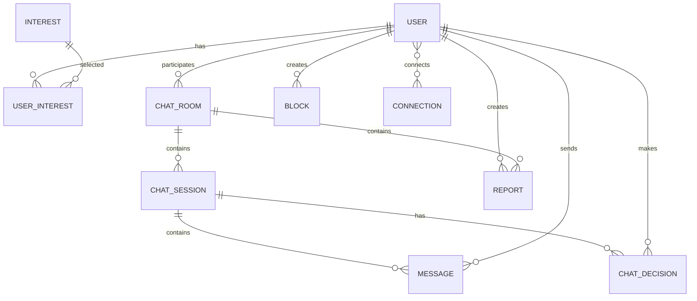

---

# 三十五、System State Machine

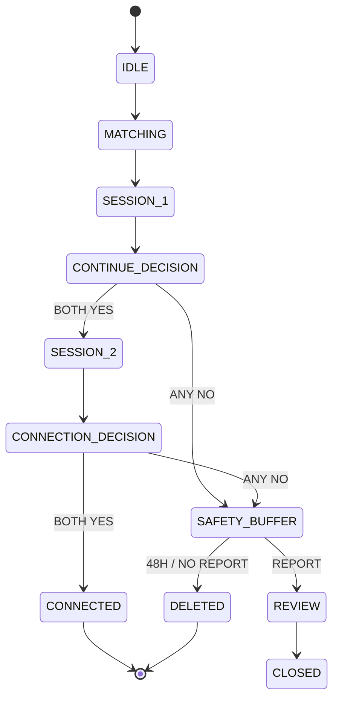

---

# 三十六、Server State Control

以下狀態只允許 Server 修改：

```text
Matching State
Room Status
Session Status
Continue Result
Connection Result
Safety Buffer Status
```

Client 只送出：

```text
User Action
User Decision
Message
```

Server：

```text
Validate
→ Update State
→ Save Database
→ Broadcast Result
```

---

# 三十七、Avatar Upload

流程：

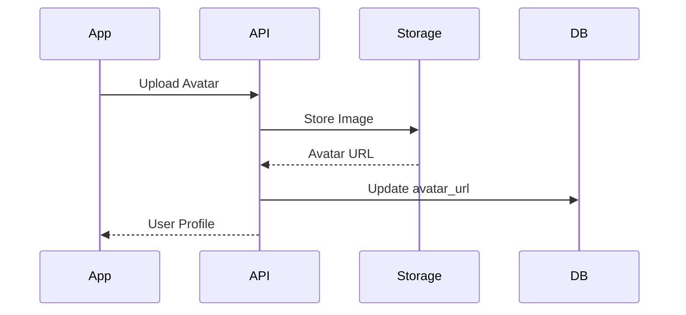

Database 僅保存：

```text
avatar_url
```

---

# 三十八、App State

## Server State

```text
TanStack Query
```

管理：

```text
Profile
Interests
Connections
API Cache
```

## Client State

```text
Zustand
```

管理：

```text
Authentication
Current User
Matching State
Current Chat Room
Current Session
Socket State
```

## Realtime

```text
Socket.IO Client
```

管理：

```text
Matching Events
Chat Messages
Session Events
Decision Events
Connection Events
```

---

# 三十九、App Screens

```text
Splash

Login

Email Verification

Profile Setup

Interest Selection

Home

Match Mode Selection

Matching Waiting

Chat Room

Continue Decision

Connection Decision

Connection List

Connection Chat

Profile

Report

Block
```

---

# 四十、App Flow

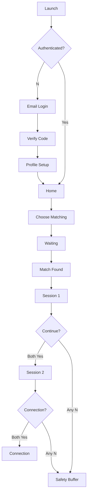

---

# 四十一、部署架構

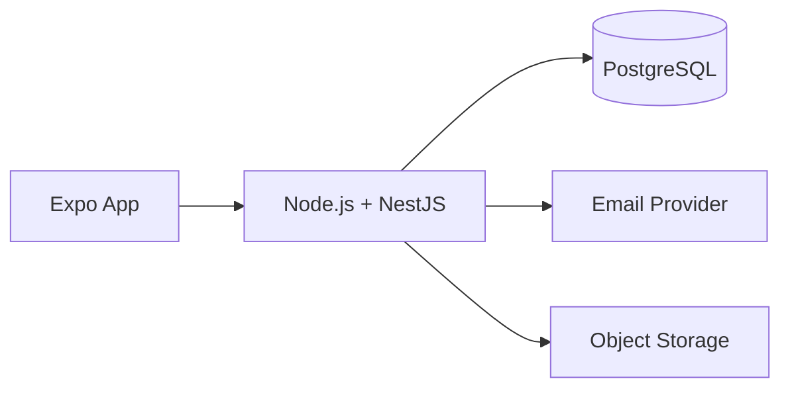

MVP：

```text
1 Mobile App
1 Backend Instance
1 PostgreSQL Database
```

---

# 四十二、MVP Infrastructure

```text
Backend
Node.js + NestJS

Database
PostgreSQL

Realtime
Socket.IO

Storage
S3 Compatible Object Storage

Email
Email Provider

API Docs
Swagger
```

---

# 四十三、開發階段

## Phase 1 — Base

```text
Expo
NestJS
PostgreSQL
Prisma
REST API
Swagger
```

## Phase 2 — Authentication

```text
Email OTP
JWT
Refresh Token
User
Profile
Interest
```

## Phase 3 — Matching

```text
WebSocket
Random Queue
Interest Queue
Matching Algorithm
```

## Phase 4 — Chat

```text
Chat Room
Chat Session
Message
15 Minute Session
WebSocket Messaging
```

## Phase 5 — Decision

```text
Continue Decision
Session 2
Connection Decision
```

## Phase 6 — Connection

```text
Connection
Private Messaging
```

## Phase 7 — Safety

```text
Block
Report
48 Hour Safety Buffer
Cleanup Job
```

---

# 四十四、MVP Scope

包含：

```text
Email Registration / Login
Email Verification Code

User Profile
Avatar
Interest Tags

Random Matching
Interest Matching

1v1 Realtime Chat

Text
Emoji

15 Minute Chat Session

Continue Decision

Second Chat Session

Connection Decision

Connection

Private Messaging

Block

Report

48 Hour Safety Buffer

External Link Blocking
```

不包含：

```text
Image Message
Video Message
Voice Message
File Message

Group Chat

Voice Call
Video Call

Social Feed

AI Matching

Microservices
Kafka
RabbitMQ
Kubernetes
Redis
Elasticsearch
GraphQL
gRPC
```

---

# 四十五、核心架構總覽

```text
React Native + Expo
        │
        ├── RESTful API
        │
        └── WebSocket / Socket.IO
                 │
                 ▼
          Node.js + NestJS
                 │
        ┌────────┼────────┐
        │        │        │
        ▼        ▼        ▼
   PostgreSQL   Email   Object Storage
```

核心 Domain：

```text
Authentication

User Profile

Matching

Chat Room

Chat Session

Continue Decision
e
Connection Decision

Connection

Block

Report

Safety Buffer
```

核心狀態流程：

```text
IDLE
↓
MATCHING
↓
SESSION 1
↓
CONTINUE DECISION
├─ Both Yes → SESSION 2
└─ Any No → SAFETY BUFFER

SESSION 2
↓
CONNECTION DECISION
├─ Both Yes → CONNECTION
└─ Any No → SAFETY BUFFER

SAFETY BUFFER
├─ Report → REVIEW
└─ No Report + 48 Hours → DELETE
```
