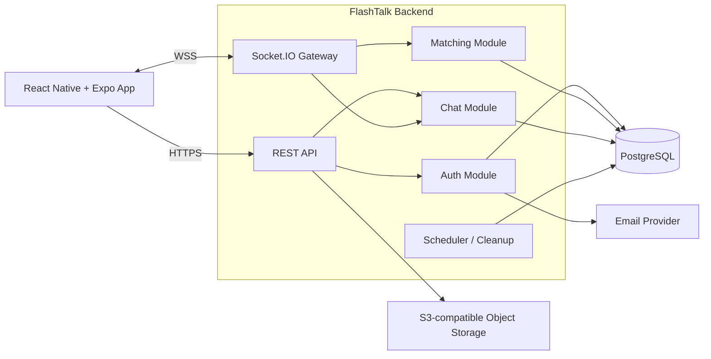
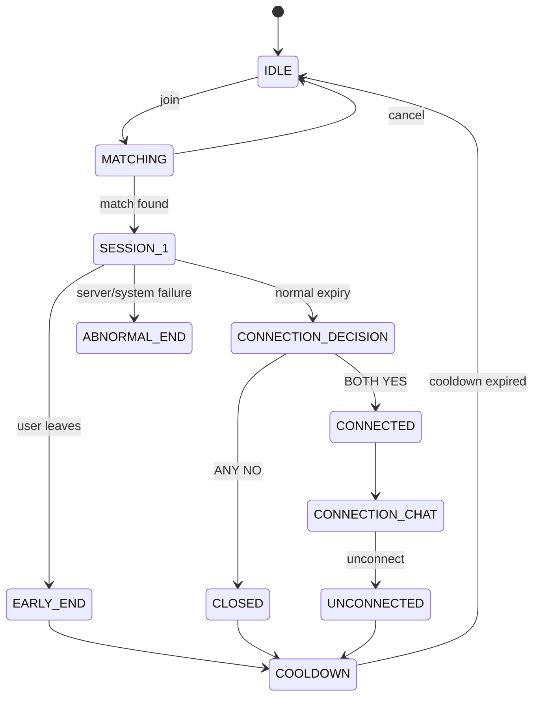
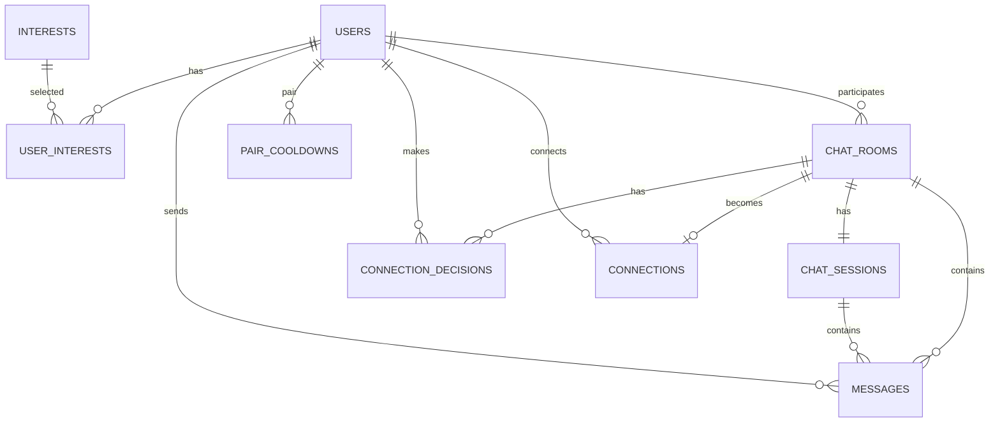

# FlashTalk v1.6.0 MVP 技術規格書（Technical Specification）

> **Version：v1.6.0**  
> **產品名稱：FlashTalk**  
> **對應需求書：FlashTalk v1.6.0 MVP 產品需求規格書（PRD）**  
> **文件定位：MVP 開發、API、資料庫、即時通訊、測試與部署的技術實作基準**

---

## 0. 文件目的與技術決策原則

本文件將 FlashTalk v1.6.0 PRD 轉換為可直接拆分工程任務的技術規格。

若舊版技術規格與 v1.6.0 PRD 衝突，以 v1.6.0 PRD 為準。主要差異包含：

- 限時聊天由舊規格的 15 分鐘調整為 **10 分鐘**。
- MVP 僅保留 **Session #1**，取消「續聊決策 → Session #2」流程。
- Session #1 正常結束後直接進入 **Connection Decision**。
- Connection 成立後，直接延續 Session #1 的聊天室與使用者可見聊天內容。
- 未建立 Connection 時使用 **Pair Cooldown**；Report 不納入 v1 MVP 核心範圍。
- Matching 等待時間不影響興趣配對優先級。
- 興趣配對不設定 Timeout，也不自動降級成全隨機配對。

技術設計原則：

1. **Server Authoritative**：配對、Session 時間、聊天室狀態、Connection 結果皆由 Server 決定。
2. **Modular Monolith First**：MVP 採模組化單體，不提前導入微服務。
3. **REST + WebSocket**：CRUD / 查詢使用 REST；配對與聊天室即時事件使用 Socket.IO。
4. **PostgreSQL 為 Source of Truth**：需要持久化的帳號、聊天室、訊息、Connection、Cooldown 皆以 PostgreSQL 為準。
5. **Redis 非 MVP 必要依賴**：第一版可使用單一 Backend Instance 的記憶體 Queue；當 Backend 水平擴展時再導入 Redis。
6. **時間統一使用 Unix Timestamp（milliseconds）**：API / WebSocket 對外時間欄位使用 `number`，以 UTC 儲存與運算。

---

## 一、系統架構（System Architecture）

### 1.1 技術棧

| Layer | Technology | 用途 |
| --- | --- | --- |
| Mobile App | React Native + Expo + TypeScript | iOS / Android App |
| App Routing | Expo Router | App 導航 |
| Server State | TanStack Query | REST API Cache / Server State |
| Client State | Zustand | Auth、Matching、Chat、Socket 狀態 |
| Realtime | Socket.IO Client | Matching / Chat 即時事件 |
| Backend | Node.js + NestJS + TypeScript | REST API、WebSocket、Domain Logic |
| ORM | Prisma | PostgreSQL Data Access / Migration |
| Database | PostgreSQL | 主要持久化資料 |
| Realtime Server | NestJS WebSocket Gateway + Socket.IO | 配對與聊天 |
| Authentication | JWT Access Token + Refresh Token | API / Socket 身分驗證 |
| Password | bcrypt | Password Hash |
| Validation | class-validator + class-transformer | DTO 驗證 |
| API Docs | Swagger / OpenAPI 3 | API 文件 |
| Email | SMTP / Transactional Email Provider | Email 驗證碼、重設密碼 |
| Object Storage | S3-compatible Storage | Avatar |
| Scheduler | @nestjs/schedule | OTP / Token / Cooldown / Cleanup |
| Logging | NestJS Logger + structured JSON logger | 系統與錯誤日誌 |
| Testing | Jest + Supertest + Socket.IO Client | Unit / Integration / E2E |

### 1.2 MVP 部署拓樸



#### MVP Infrastructure

```text
1 × Mobile App
1 × NestJS Backend Instance
1 × PostgreSQL
1 × Object Storage
1 × Email Provider
```

> 單 Backend Instance 是 MVP 的刻意限制。若未來水平擴展為 2 台以上 Backend，Matching Queue、Socket Room、分散式 Lock 與 Socket.IO Pub/Sub 必須導入 Redis 或等價的共享協調層。

---

### 1.3 Backend 模組

```text
AppModule
├── AuthModule
├── UsersModule
├── InterestsModule
├── MatchingModule
├── ChatModule
├── ConnectionsModule
├── PairCooldownModule
├── UploadModule
├── MailModule
├── RealtimeModule
├── SchedulerModule
├── HealthModule
└── CommonModule
```

#### AuthModule

負責：

- Email + Password 註冊
- Email 驗證碼
- Login
- Access Token / Refresh Token
- Forgot Password / Reset Password
- Logout
- Account Status 檢查

#### MatchingModule

負責：

- RANDOM Queue
- INTEREST Queue
- Matching Eligibility
- Interest overlap scoring
- 同優先級 Random Selection
- Pair Cooldown 排除
- Existing Connection 排除
- Block / Safety 預留排除介面
- Atomic Match Creation
- Cancel Matching

#### ChatModule

負責：

- Chat Room
- Session #1
- 10 分鐘 Server Timer
- Text / Emoji Message
- Reply Message
- Typing Indicator
- Disconnect / Reconnect
- Early End
- Session End
- Connection Decision
- Connection 成立後 Room Transition

#### ConnectionsModule

負責：

- Connection 建立
- Connection List
- Connection Chat
- Unconnect
- Connection 唯一性
- Connection 存續期間禁止再次配對

#### PairCooldownModule

負責：

- Standard Pair Cooldown
- Post-Chat Pair Cooldown
- Extended Pair Cooldown 預留
- Matching Eligibility Query

---

### 1.4 App 模組

```text
src/
├── app/
├── features/
│   ├── auth/
│   ├── profile/
│   ├── interests/
│   ├── matching/
│   ├── chat/
│   └── connections/
├── services/
│   ├── api/
│   └── socket/
├── stores/
├── hooks/
├── components/
└── types/
```

#### State Ownership

**TanStack Query**

```text
Current Profile
Interest Catalog
Connections
Connection Messages
REST Query Cache
```

**Zustand**

```text
Auth Runtime State
Matching Runtime State
Current Chat Room
Current Session
Socket Connection State
Connection Decision Runtime State
```

**Socket.IO**

```text
Matching Events
Chat Messages
Typing Events
Session State
Connection Decision Events
Room Closure Events
```

---

## 二、核心 Domain 與狀態機

### 2.1 使用者狀態

```text
PENDING_VERIFICATION
ACTIVE
SUSPENDED
BANNED
DELETED
```

只有 `ACTIVE` 可：

- 進入 Matching
- 建立陌生人 Chat Room
- 傳送聊天訊息
- 建立 Connection

---

### 2.2 Matching 狀態

```text
IDLE
QUEUED
MATCHED
CANCELLED
```

同一 User 同時最多一個有效 Matching Entry。

---

### 2.3 Chat Room 類型

```text
MATCH
CONNECTION
```

#### MATCH Room Status

```text
ACTIVE
WAITING_CONNECTION_DECISION
CONNECTED
EARLY_ENDED
ABNORMAL_ENDED
CLOSED
```

---

### 2.4 Chat Session 狀態

```text
ACTIVE
ENDED
EARLY_ENDED
ABNORMAL_ENDED
```

MVP 每次陌生人配對只建立：

```text
Session #1
duration = 10 minutes
```

---

### 2.5 核心狀態機



---

## 三、資料結構與資料庫（Data Models & Database）

### 3.1 PostgreSQL 共通規則

- Primary Key：`uuid`
- Timestamp DB 欄位：`timestamptz`
- API 對外時間：Unix milliseconds `number`
- 所有 Foreign Key 建立 Index
- 唯一關係使用 DB Unique Constraint 保護
- Server 不信任 Client 傳入的 userId
- User 身分一律由 JWT 取得

---

### 3.2 users

| Field | Type | Constraint | 說明 |
|---|---|---|---|
| id | uuid | PK | User ID |
| email | varchar(320) | UNIQUE, NOT NULL | 登入 Email |
| password_hash | varchar(255) | NOT NULL | bcrypt hash |
| email_verified_at | timestamptz | NULL | Email 驗證時間 |
| status | enum | NOT NULL | Account Status |
| nickname | varchar(50) | NULL | 顯示暱稱 |
| avatar_url | text | NULL | 頭像 URL |
| last_active_at | timestamptz | NULL | 最後有效活動 |
| created_at | timestamptz | NOT NULL | 建立時間 |
| updated_at | timestamptz | NOT NULL | 更新時間 |
| deleted_at | timestamptz | NULL | 帳號刪除時間 |

Index：

```text
UNIQUE(email)
INDEX(status)
INDEX(last_active_at)
```

---

### 3.3 interests

| Field | Type | Constraint |
|---|---|---|
| id | uuid | PK |
| code | varchar(50) | UNIQUE |
| name | varchar(50) | NOT NULL |
| is_active | boolean | DEFAULT true |
| sort_order | int | DEFAULT 0 |
| created_at | timestamptz | NOT NULL |
| updated_at | timestamptz | NOT NULL |

---

### 3.4 user_interests

| Field | Type | Constraint |
|---|---|---|
| user_id | uuid | FK users |
| interest_id | uuid | FK interests |
| created_at | timestamptz | NOT NULL |

Constraint：

```text
PRIMARY KEY(user_id, interest_id)
```

Business Rule：

```text
User Profile Interest = 0..N
Interest Matching Request = exactly 1..3 selected interests
```

---

### 3.5 email_verifications

| Field | Type | 說明 |
|---|---|---|
| id | uuid | PK |
| user_id | uuid | FK users |
| code_hash | varchar(255) | 驗證碼 Hash |
| purpose | enum | VERIFY_EMAIL / RESET_PASSWORD |
| expires_at | timestamptz | 到期時間 |
| attempt_count | int | 驗證失敗次數 |
| verified_at | timestamptz | 成功時間 |
| created_at | timestamptz | 建立時間 |

> OTP 有效期限、重送間隔、最大嘗試次數與每日上限屬營運/安全參數，應由設定檔控制，不硬編碼於 Domain。

---

### 3.6 refresh_tokens

| Field | Type | 說明 |
|---|---|---|
| id | uuid | PK |
| user_id | uuid | FK users |
| token_hash | varchar(255) | Refresh Token Hash |
| expires_at | timestamptz | 到期 |
| revoked_at | timestamptz | 撤銷 |
| device_id | varchar(128) | 裝置識別，可 NULL |
| created_at | timestamptz | 建立 |

---

### 3.7 matching_entries

MVP 可使用 In-Memory Queue，但仍建議保留資料模型介面；正式持久化可於水平擴展時啟用。

| Field | Type | 說明 |
|---|---|---|
| id | uuid | PK |
| user_id | uuid | UNIQUE |
| mode | enum | RANDOM / INTEREST |
| selected_interest_ids | uuid[] | INTEREST 模式 1～3 |
| status | enum | QUEUED / MATCHED / CANCELLED |
| created_at | timestamptz | 排隊時間 |
| updated_at | timestamptz | 更新 |

> 興趣配對 `created_at` 不參與優先級排序。

---

### 3.8 chat_rooms

| Field | Type | 說明 |
|---|---|---|
| id | uuid | PK |
| room_type | enum | MATCH / CONNECTION |
| match_mode | enum | RANDOM / INTEREST / NULL |
| user_a_id | uuid | FK users |
| user_b_id | uuid | FK users |
| status | enum | Room Status |
| connection_id | uuid | FK connections, NULL |
| created_at | timestamptz | 建立 |
| connected_at | timestamptz | Connection 成立時間 |
| closed_at | timestamptz | 關閉時間 |
| updated_at | timestamptz | 更新 |

Constraints：

```text
CHECK(user_a_id <> user_b_id)
INDEX(user_a_id, status)
INDEX(user_b_id, status)
```

---

### 3.9 chat_sessions

| Field | Type | 說明 |
|---|---|---|
| id | uuid | PK |
| chat_room_id | uuid | FK chat_rooms |
| session_no | smallint | MVP 固定 1 |
| status | enum | ACTIVE / ENDED / EARLY_ENDED / ABNORMAL_ENDED |
| started_at | timestamptz | Server Start |
| expires_at | timestamptz | started_at + 10 minutes |
| ended_at | timestamptz | 實際結束 |
| ended_reason | enum | EXPIRED / USER_LEFT / SYSTEM |
| created_at | timestamptz | 建立 |

Constraint：

```text
UNIQUE(chat_room_id, session_no)
```

---

### 3.10 messages

| Field | Type | 說明 |
|---|---|---|
| id | uuid | PK |
| chat_room_id | uuid | FK |
| chat_session_id | uuid | FK，可於 Connection Chat 為 NULL |
| sender_id | uuid | FK users |
| message_type | enum | TEXT / EMOJI |
| content | text | 訊息內容 |
| reply_to_message_id | uuid | FK messages, NULL |
| client_message_id | uuid | Client 產生，防重送 |
| created_at | timestamptz | Server 接收時間 |

Constraints / Index：

```text
UNIQUE(sender_id, client_message_id)
INDEX(chat_room_id, created_at DESC)
INDEX(chat_session_id, created_at)
```

Message Rules：

```text
Length: 1..1000 characters
No image
No video
No voice
No file
No external URL / social link
```

---

### 3.11 connection_decisions

| Field | Type | 說明 |
|---|---|---|
| id | uuid | PK |
| chat_room_id | uuid | FK |
| chat_session_id | uuid | FK |
| user_id | uuid | FK |
| decision | enum | YES / NO |
| created_at | timestamptz | 建立 |
| updated_at | timestamptz | 修改 |

Constraint：

```text
UNIQUE(chat_room_id, user_id)
```

Server 僅在雙方皆有 Decision 後計算結果。

---

### 3.12 connections

| Field | Type | 說明 |
|---|---|---|
| id | uuid | PK |
| user_low_id | uuid | FK users |
| user_high_id | uuid | FK users |
| source_chat_room_id | uuid | FK chat_rooms |
| status | enum | ACTIVE / UNCONNECTED |
| created_at | timestamptz | 建立 |
| disconnected_at | timestamptz | 解除時間 |

Canonical Pair：

```text
user_low_id = min(userA, userB)
user_high_id = max(userA, userB)
```

Constraint：

```text
UNIQUE(user_low_id, user_high_id, status) // 實作時可用 partial unique index 限制 ACTIVE
```

---

### 3.13 pair_cooldowns

| Field | Type | 說明 |
|---|---|---|
| id | uuid | PK |
| user_low_id | uuid | Pair |
| user_high_id | uuid | Pair |
| type | enum | STANDARD / POST_CHAT / EXTENDED |
| reason | enum | CONNECTION_REJECTED / EARLY_END / UNCONNECT / OTHER |
| starts_at | timestamptz | 開始 |
| expires_at | timestamptz | 結束 |
| created_at | timestamptz | 建立 |

Index：

```text
INDEX(user_low_id, user_high_id, expires_at)
```

Cooldown 實際時長依 PRD 所述營運參數配置，不硬編碼。

---

### 3.14 ER Diagram



---

## 四、Matching Algorithm

### 4.1 Matching Eligibility

候選 User 必須同時符合：

```text
Account Status = ACTIVE
Not Self
Not Already Matching in another queue
Not In Active MATCH Room
No Active Connection between pair
No Active Pair Cooldown between pair
No safety exclusion / block restriction
```

---

### 4.2 Interest Matching

Request：

```text
selectedInterestIds = 1..3
```

Candidate Score：

```text
score = count(intersection(requestInterestIds, candidateInterestIds))
```

Rules：

```text
score >= 1
highest score first
same score => random selection
waiting time => MUST NOT affect priority
no timeout
no automatic fallback to RANDOM
```

---

### 4.3 Random Matching

從目前符合 Eligibility 的 RANDOM Queue 候選人中隨機選擇。

MVP 可採：

```text
secure/random shuffle
→ eligibility filter
→ select one
```

---

### 4.4 Atomic Match

配對必須防止：

```text
A simultaneously matched with B and C
B matched by two concurrent requests
```

單 Instance MVP：

```text
Matching Service Mutex / serialized queue operation
```

多 Instance Future：

```text
Redis distributed lock / atomic Lua script
```

配對成功交易：

```text
1. lock user A + user B
2. re-check eligibility
3. remove both from queue
4. create chat_room
5. create chat_session
6. commit
7. emit matching.found to A/B
```

---

## 五、Chat Session 與 Server Timer

### 5.1 Session #1

```text
duration = 10 minutes
```

Server 建立：

```text
startedAt
expiresAt = startedAt + 10 minutes
```

Client 不自行決定 Session 是否結束。

Client 倒數顯示：

```text
remaining = expiresAt - serverNow
```

---

### 5.2 App Background / Disconnect

以下情況均不暫停 Timer：

```text
App Background
Screen Lock
Temporary Network Loss
Socket Disconnect
App Restart
```

重新連線後 Server 回傳：

```text
room status
session status
serverNow
expiresAt
latest messages
decision state
```

---

### 5.3 Session Expiry

到期時：

```text
ACTIVE
→ ENDED
→ room.status = WAITING_CONNECTION_DECISION
```

Server：

```text
stop accepting Session #1 messages
emit chat.sessionEnded
emit chat.connectionDecisionRequired
```

---

## 六、Connection Decision

### 6.1 Decision

Client 只可送：

```text
YES
NO
```

Server 驗證：

```text
JWT valid
user is room participant
room.status = WAITING_CONNECTION_DECISION
session.status = ENDED
decision not finalized
```

---

### 6.2 Result

```text
A = YES + B = YES
→ create Connection
→ room_type = CONNECTION
→ status = CONNECTED
→ preserve Session #1 messages
→ enable persistent Connection Chat
```

其他結果：

```text
ANY NO
→ no Connection
→ close MATCH room
→ create Pair Cooldown
```

任何一方不得看見對方 Decision，直到結果完成；避免透過結果 UI 施加社交壓力。

---

## 七、訊息系統（Messaging）

### 7.1 支援

```text
Text
Emoji
Reply
Typing Indicator
```

### 7.2 不支援

```text
Image
Video
Voice
File
External URL
Social Link
Read Receipt
```

---

### 7.3 Send Message Pipeline

```text
Socket Event
→ Authenticate
→ Validate Room
→ Validate Participant
→ Validate Room/Session State
→ Validate Message
→ URL/Social Link Detection
→ Idempotency Check
→ Save PostgreSQL
→ Ack Sender
→ Broadcast Recipient
```

---

### 7.4 Message Delivery State

Client UI 可使用：

```text
SENDING
SENT
FAILED
```

`SENT` 代表 Server 已成功持久化並 ACK，不代表對方已讀。

---

## 八、API 與介面設計（API & Interface Design）

### 8.1 Base URL

```text
/api/v1
```

Authorization：

```http
Authorization: Bearer <accessToken>
```

成功：

```json
{
  "success": true,
  "data": {}
}
```

失敗：

```json
{
  "success": false,
  "error": {
    "code": "CHAT_SESSION_EXPIRED",
    "message": "Chat session has expired.",
    "details": null
  }
}
```

---

### 8.2 Auth API

#### POST /auth/register

Request：

```json
{
  "email": "user@example.com",
  "password": "example-password"
}
```

Response：

```json
{
  "success": true,
  "data": {
    "userId": "uuid",
    "status": "PENDING_VERIFICATION",
    "verificationRequired": true
  }
}
```

#### POST /auth/verify-email

```json
{
  "email": "user@example.com",
  "code": "123456"
}
```

#### POST /auth/resend-verification

```json
{
  "email": "user@example.com"
}
```

#### POST /auth/login

```json
{
  "email": "user@example.com",
  "password": "example-password"
}
```

Response：

```json
{
  "success": true,
  "data": {
    "accessToken": "...",
    "refreshToken": "...",
    "expiresAt": 1790000000000,
    "user": {
      "id": "uuid",
      "status": "ACTIVE"
    }
  }
}
```

#### POST /auth/refresh

```json
{
  "refreshToken": "..."
}
```

#### POST /auth/logout

```json
{
  "refreshToken": "..."
}
```

#### POST /auth/forgot-password

```json
{
  "email": "user@example.com"
}
```

#### POST /auth/reset-password

```json
{
  "email": "user@example.com",
  "code": "123456",
  "newPassword": "new-password"
}
```

---

### 8.3 User API

```http
GET /users/me
PUT /users/me
PUT /users/me/interests
POST /users/me/avatar
DELETE /users/me
```

#### PUT /users/me

```json
{
  "nickname": "Jos"
}
```

#### PUT /users/me/interests

```json
{
  "interestIds": [
    "uuid-1",
    "uuid-2"
  ]
}
```

---

### 8.4 Interest API

```http
GET /interests
```

Response：

```json
{
  "success": true,
  "data": [
    {
      "id": "uuid",
      "code": "MUSIC",
      "name": "音樂"
    }
  ]
}
```

---

### 8.5 Chat API

```http
GET /chat-rooms/:roomId
GET /chat-rooms/:roomId/messages?cursor=<cursor>&limit=50
```

> MATCH Room 僅允許在產品規則允許的生命週期內讀取；Connection Room 可持續讀取歷史訊息。

---

### 8.6 Connection API

```http
GET /connections
GET /connections/:connectionId
DELETE /connections/:connectionId
```

`DELETE` 代表 Unconnect，而非直接物理刪除資料。

---

## 九、WebSocket Interface

Namespace：

```text
/chat
```

Handshake：

```text
auth.accessToken
```

### 9.1 Client → Server

```text
matching.join
matching.cancel

chat.sendMessage
chat.typing
chat.leave
chat.connectionDecision

chat.sync
```

---

### 9.2 Server → Client

```text
matching.waiting
matching.cancelled
matching.found

chat.message
chat.messageAck
chat.typing
chat.sessionEnded
chat.connectionDecisionRequired
chat.connectionResult
chat.closed
chat.synced

system.error
```

---

### 9.3 matching.join

Interest：

```json
{
  "mode": "INTEREST",
  "interestIds": ["uuid-1", "uuid-2"]
}
```

Random：

```json
{
  "mode": "RANDOM"
}
```

Ack：

```json
{
  "ok": true,
  "state": "QUEUED"
}
```

---

### 9.4 matching.found

```json
{
  "roomId": "uuid",
  "session": {
    "id": "uuid",
    "sessionNo": 1,
    "startedAt": 1790000000000,
    "expiresAt": 1790000600000
  },
  "peer": {
    "nickname": "Alex",
    "avatarUrl": "https://...",
    "interests": [],
    "commonInterests": []
  }
}
```

---

### 9.5 chat.sendMessage

```json
{
  "roomId": "uuid",
  "clientMessageId": "uuid",
  "type": "TEXT",
  "content": "你好",
  "replyToMessageId": null
}
```

ACK：

```json
{
  "ok": true,
  "message": {
    "id": "uuid",
    "clientMessageId": "uuid",
    "createdAt": 1790000000000
  }
}
```

---

### 9.6 chat.connectionDecision

```json
{
  "roomId": "uuid",
  "decision": "YES"
}
```

Result：

```json
{
  "roomId": "uuid",
  "result": "CONNECTED",
  "connectionId": "uuid"
}
```

或：

```json
{
  "roomId": "uuid",
  "result": "NOT_CONNECTED"
}
```

---

### 9.7 chat.sync

Reconnect Request：

```json
{
  "roomId": "uuid",
  "lastMessageId": "uuid-or-null"
}
```

Response：

```json
{
  "room": {
    "id": "uuid",
    "status": "ACTIVE"
  },
  "session": {
    "status": "ACTIVE",
    "serverNow": 1790000100000,
    "expiresAt": 1790000600000
  },
  "messages": []
}
```

---

## 十、非功能性需求（Non-functional Requirements）

### 10.1 Performance

MVP 目標值：

| 指標 | 目標 |
|---|---:|
| REST API P95 | < 500 ms |
| WebSocket message server processing P95 | < 200 ms |
| Matching result delivery after candidate selected | < 1 s |
| Chat message DB persistence + ACK P95 | < 300 ms |
| App reconnect sync | < 2 s（正常網路） |
| Availability target | 99.5% MVP |

以上為工程驗收目標，不代表 Internet 端到端網路延遲保證。

---

### 10.2 Concurrency

MVP 第一階段建議壓測基準：

```text
500 concurrent WebSocket connections
100 concurrent active 1v1 rooms
50 messages / second burst
100 simultaneous matching users
```

正式上線前依預期 DAU / CCU 再調整。

單 Instance 超出容量時：

```text
Scale Up
→ then Horizontal Scale
→ Redis Adapter / Shared Matching Queue
```

---

### 10.3 Security

必須：

- HTTPS / WSS only
- Password 使用 bcrypt hash
- Refresh Token 僅保存 hash
- JWT 短效 Access Token
- DTO allow-list validation
- Rate Limit
- Email / Login 防暴力破解
- OTP 嘗試次數限制
- Avatar MIME / Size 驗證
- SQL Injection 由 Prisma Parameterization 防護
- Server 驗證 Chat participant
- 不接受 Client 傳入 userId 作為授權依據
- Sensitive Data 不寫入一般 Log
- External URL / Social Link Blocking
- CORS / Origin Policy 依部署環境限制
- Secrets 使用環境變數或 Secret Manager

---

### 10.4 Rate Limit 建議

可配置，不硬編碼：

```text
register
login
verify-email
resend-verification
forgot-password
matching.join
chat.sendMessage
chat.typing
```

`chat.typing` 應 debounce / throttle，不寫 DB。

---

### 10.5 Logging

Structured JSON：

```json
{
  "timestamp": 1790000000000,
  "level": "info",
  "requestId": "uuid",
  "userId": "uuid",
  "module": "ChatModule",
  "event": "MESSAGE_CREATED",
  "roomId": "uuid",
  "durationMs": 42
}
```

禁止記錄：

```text
Password
Raw OTP
Raw Access Token
Raw Refresh Token
完整敏感訊息內容
```

Log Level：

```text
ERROR
WARN
INFO
DEBUG (non-production)
```

---

### 10.6 Observability

至少提供：

```text
GET /health/live
GET /health/ready
```

Metrics：

```text
active_socket_connections
matching_queue_size
active_chat_rooms
message_send_rate
api_error_rate
socket_error_rate
db_query_latency
matching_success_rate
reconnect_rate
```

---

### 10.7 Fault Tolerance

#### Database failure

```text
Reject state-changing operation
Do not emit success before transaction commit
Return retryable system error
```

#### Email provider failure

```text
Account remains PENDING_VERIFICATION
Return EMAIL_SEND_FAILED
Allow controlled resend
```

#### Object storage failure

```text
Do not update avatar_url
Return upload failure
```

#### Backend restart

MVP 單 Instance 重啟會失去 In-Memory Matching Queue，因此：

```text
queued users return to IDLE / reconnect UI
active room/session state recovered from PostgreSQL
server recalculates expired sessions from expires_at
```

---

## 十一、邊界情況與例外處理（Edge Cases & Error Handling）

### 11.1 Matching Race Condition

問題：

```text
A / B / C 同時被配對
```

處理：

```text
atomic lock
re-check eligibility
transaction
only one match can commit
```

---

### 11.2 User Cancels While Match Is Being Created

若 Match transaction 已 commit：

```text
matching.cancel => MATCH_ALREADY_FOUND
client enters room
```

若尚未 commit：

```text
cancel wins
entry removed
```

---

### 11.3 Duplicate matching.join

回傳目前 Queue State，不建立第二個 Entry：

```text
MATCH_ALREADY_WAITING
```

---

### 11.4 Socket Disconnect During Matching

短暫斷線：

```text
grace period
```

超過 Grace Period：

```text
remove from in-memory queue
state => IDLE
```

Grace Period 為可配置參數。

---

### 11.5 Socket Disconnect During Chat

```text
Session timer continues
room remains active
reconnect => chat.sync
```

若在 `expiresAt` 後才回來：

```text
Server immediately returns session ENDED
→ Connection Decision state
```

---

### 11.6 App Background

不暫停 10 分鐘 Timer。

---

### 11.7 Duplicate Message

使用：

```text
sender_id + client_message_id UNIQUE
```

若 Client Retry：

```text
return existing message ACK
do not insert duplicate
```

---

### 11.8 Out-of-order Messages

排序依：

```text
server created_at
```

必要時以：

```text
created_at + id
```

作穩定排序。

---

### 11.9 Message Sent Exactly at Expiry

Server 收到時檢查：

```text
serverNow < expiresAt
```

若已到期：

```text
reject CHAT_SESSION_EXPIRED
```

Client 顯示失敗，不得自行補寫。

---

### 11.10 Both Users Submit Decision Concurrently

使用 Transaction / Row Lock：

```text
upsert user decision
read both decisions
if both YES and no connection:
    create exactly one Connection
```

Connection Unique Constraint 作第二層防護。

---

### 11.11 One User YES, Other No Response

PRD 未明確定義 Decision 等待逾時時間。

技術上保留：

```text
connection_decision_expires_at
```

但實際 Timeout 值需產品決策後才啟用。未定義前不得擅自將「無回應」視為 YES。

---

### 11.12 Early End

使用者主動離開：

```text
session => EARLY_ENDED
room => EARLY_ENDED
create Pair Cooldown
notify peer
```

Early End 是否提供 Connection Decision，依 v1.6.0 PRD 的產品規則執行；Backend 必須以 `ended_reason` 區分 Normal / Early / Abnormal。

---

### 11.13 Existing Connection Pair Attempts Matching

直接排除，不進候選集合。

---

### 11.14 Unconnect

```text
connection.status => UNCONNECTED
disconnected_at => now
create Pair Cooldown
disable persistent connection messaging
```

Cooldown 到期後才重新具備互相配對資格。

---

### 11.15 Traffic Spike

依序：

```text
Rate Limit
→ reject duplicate matching requests
→ protect DB connection pool
→ backpressure chat send
→ return SERVER_BUSY when capacity threshold exceeded
```

不得在 DB 已不可用時持續接受「成功」狀態事件。

---

## 十二、錯誤碼（Error Codes）

### Auth

```text
AUTH_EMAIL_ALREADY_EXISTS
AUTH_INVALID_CREDENTIALS
AUTH_EMAIL_NOT_VERIFIED
AUTH_CODE_INVALID
AUTH_CODE_EXPIRED
AUTH_CODE_ATTEMPTS_EXCEEDED
AUTH_TOKEN_INVALID
AUTH_TOKEN_EXPIRED
AUTH_REFRESH_TOKEN_INVALID
AUTH_ACCOUNT_SUSPENDED
AUTH_ACCOUNT_BANNED
AUTH_ACCOUNT_DELETED
```

### User

```text
USER_NOT_FOUND
USER_NICKNAME_INVALID
USER_INTEREST_INVALID
USER_AVATAR_INVALID
```

### Matching

```text
MATCH_ALREADY_WAITING
MATCH_ALREADY_CHATTING
MATCH_ALREADY_FOUND
MATCH_INVALID_MODE
MATCH_INVALID_INTEREST
MATCH_NOT_ACTIVE_USER
MATCH_CONNECTION_EXISTS
MATCH_PAIR_COOLDOWN_ACTIVE
```

### Chat

```text
CHAT_ROOM_NOT_FOUND
CHAT_SESSION_NOT_FOUND
CHAT_SESSION_EXPIRED
CHAT_NOT_PARTICIPANT
CHAT_ROOM_CLOSED
CHAT_MESSAGE_EMPTY
CHAT_MESSAGE_TOO_LONG
CHAT_MESSAGE_TYPE_NOT_ALLOWED
CHAT_EXTERNAL_LINK_NOT_ALLOWED
CHAT_REPLY_MESSAGE_NOT_FOUND
```

### Connection

```text
CONNECTION_DECISION_NOT_ALLOWED
CONNECTION_DECISION_ALREADY_FINALIZED
CONNECTION_ALREADY_EXISTS
CONNECTION_NOT_FOUND
CONNECTION_NOT_PARTICIPANT
```

### System

```text
VALIDATION_ERROR
RATE_LIMITED
SERVER_BUSY
DATABASE_UNAVAILABLE
EMAIL_SEND_FAILED
STORAGE_UPLOAD_FAILED
INTERNAL_SERVER_ERROR
```

---

## 十三、Transaction Boundary

以下必須使用 DB Transaction：

#### Register

```text
create user
create verification record
```

Email 發送在 transaction commit 後執行。

#### Match Found

```text
validate pair
create chat_room
create chat_session
```

#### Connection Decision Finalization

```text
save decision
finalize result
create connection OR cooldown
update room
```

#### Unconnect

```text
update connection
close connection messaging
create cooldown
```

---

## 十四、資料保存與刪除

v1.6.0 PRD 已明確帳號刪除不代表安全相關資料立即物理刪除，但尚未完整定義所有 Data Retention 天數。

因此 MVP 技術設計採：

```text
Soft Delete / Status transition first
Physical deletion via scheduled retention job later
```

需由後續 Data Retention Policy 補充：

- 未成立 Connection 的聊天紀錄保存時間
- Connection Chat 保存時間
- Deleted Account 個資刪除時程
- OTP / Refresh Token 保存時程
- 安全稽核資料保存時程

在政策未定義前，不應由工程端自行決定永久保存。

---

## 十五、開發環境與設定

Environment：

```text
local
development
staging
production
```

主要 ENV：

```text
DATABASE_URL
JWT_ACCESS_SECRET
JWT_REFRESH_SECRET
JWT_ACCESS_TTL
JWT_REFRESH_TTL

BCRYPT_ROUNDS

EMAIL_PROVIDER_*
EMAIL_VERIFICATION_TTL
EMAIL_RESEND_INTERVAL

S3_ENDPOINT
S3_BUCKET
S3_ACCESS_KEY
S3_SECRET_KEY

CHAT_SESSION_DURATION_SECONDS=600

PAIR_COOLDOWN_STANDARD_SECONDS
PAIR_COOLDOWN_POST_CHAT_SECONDS

SOCKET_DISCONNECT_GRACE_SECONDS
```

---

## 十六、開發與測試計畫（Implementation & Testing Plan）

### 16.1 建議開發階段

| Phase | 工作內容 | 預估 |
|---|---|---:|
| 0 | Repo、CI、ENV、DB、Swagger、Coding Convention | 2–3 天 |
| 1 | Auth、Email Verification、JWT、Password Reset | 5–7 天 |
| 2 | User Profile、Interest、Avatar | 3–5 天 |
| 3 | Socket 基礎、Matching Queue、Interest / Random Matching | 7–10 天 |
| 4 | Chat Room、Session #1、Server Timer、Message / Reply | 7–10 天 |
| 5 | Reconnect / Sync、Background / Disconnect Recovery | 3–5 天 |
| 6 | Connection Decision、Connection、Connection Chat | 5–7 天 |
| 7 | Pair Cooldown、Unconnect、Anti-abuse 基礎 | 3–5 天 |
| 8 | Logging、Metrics、Rate Limit、Health Check | 3–5 天 |
| 9 | E2E、Load Test、Bug Fix、Release Hardening | 7–10 天 |

單一熟悉全端工程師：約 **8～10 週**可完成可驗收 MVP；若 Mobile / Backend 並行可縮短，但仍取決於 UI 完成度、Email Provider、部署環境與測試深度。

---

### 16.2 Unit Test

目標 Domain Logic Coverage：

```text
>= 80%
```

核心狀態機 / Matching / Connection Decision：

```text
>= 90%
```

必測：

#### Auth

- register duplicate email
- password hash
- verify valid / invalid / expired OTP
- refresh token rotation / revoke
- account status guard

#### Matching

- self exclusion
- inactive user exclusion
- active room exclusion
- existing connection exclusion
- pair cooldown exclusion
- interest overlap 0 / 1 / 2 / 3
- highest overlap wins
- same score random candidate set
- waiting time does not alter score
- duplicate join
- cancel
- concurrent match protection

#### Chat

- participant authorization
- 10-minute expiry
- background / reconnect does not extend timer
- message empty / too long
- external URL rejection
- duplicate clientMessageId
- reply target validation
- message after expiry rejected
- typing event not persisted

#### Connection

- YES + YES => one Connection
- YES + NO => no Connection
- duplicate decision
- concurrent decisions
- existing connection unique protection
- Unconnect => cooldown

---

### 16.3 Integration Test

使用：

```text
NestJS TestingModule
PostgreSQL test database
Supertest
Socket.IO test client
```

流程：

```text
Register
→ Verify Email
→ Login
→ Update Profile
→ Join Matching
→ Match Found
→ Chat
→ Session End
→ Connection Decision
→ Connection Chat
→ Unconnect
```

---

### 16.4 E2E Test

至少建立兩個真實測試 Client：

```text
User A
User B
```

驗證：

1. A / B 進入 Interest Matching。
2. 至少一個共同標籤才可配對。
3. 配對成功後兩端收到相同 Room ID。
4. Session expiresAt 一致。
5. A 發訊息，B 即時收到。
6. B 斷線後重新連線可 sync。
7. Timer 不因 B 斷線暫停。
8. Session 到期後禁止再送 Session Message。
9. 雙方 YES 建立 Connection。
10. Session #1 訊息仍可於 Connection Chat 顯示。
11. Connection 存續期間 A / B 不可再次互配。
12. Unconnect 後建立 Pair Cooldown。

---

### 16.5 Load Test

工具可使用：

```text
k6
Artillery
custom Socket.IO load client
```

Scenario：

```text
100 matching users join simultaneously
500 concurrent sockets
100 active rooms
50 msg/s burst
mass reconnect
simultaneous session expiry
```

觀察：

```text
CPU
Memory
Event Loop Lag
DB Connections
P95 / P99 latency
Socket disconnect rate
Error rate
Duplicate connection / duplicate room anomalies
```

---

## 十七、CI/CD 與品質門檻

Pull Request：

```text
lint
typecheck
unit test
integration test
build
```

Merge to staging：

```text
DB migration check
deploy staging
health check
smoke test
```

Production：

```text
backup / migration plan
deploy
readiness check
socket smoke test
rollback strategy
```

Migration 原則：

```text
Backward-compatible first
Deploy application
Then remove deprecated schema in later release
```

---

## 十八、MVP 驗收標準

MVP 技術驗收至少需全部成立：

- Email + Password 可完成註冊、驗證、登入、重設密碼。
- 非 ACTIVE User 無法 Matching。
- Interest Matching 僅匹配至少 1 個共同標籤。
- 共同標籤數量越高優先級越高。
- 等待時間不影響 Interest Matching 優先級。
- Interest Matching 無 Timeout。
- Random Matching 不依興趣排序。
- 同一 User 不會同時進入兩個陌生人聊天室。
- Chat Session 固定 10 分鐘且 Server Authoritative。
- App Background / Disconnect 不會暫停 Timer。
- Reconnect 可恢復 Room / Session / Messages。
- Session 到期後不可再送 Session Message。
- 僅 YES + YES 建立 Connection。
- Connection 成立後延續 Session #1 聊天內容。
- Connection 存續期間雙方不得再次互配。
- 未建立 Connection / Early End / Unconnect 依規則建立 Pair Cooldown。
- API / Socket 不信任 Client userId。
- 所有核心狀態改變具有 Transaction / Idempotency 防護。
- Production 不記錄 Password、OTP、Token 等敏感資料。
- 核心 Domain Unit Test 達成規定 Coverage。
- E2E 完成完整雙人流程。
- Load Test 無 Duplicate Match / Duplicate Connection。

---

## 十九、PRD 尚待產品確認的技術 Blocking / Open Questions

以下項目在 v1.6.0 PRD 中未完全量化，工程實作前應建立可配置參數或補充決策：

1. Email 驗證碼有效期限。
2. Email 驗證碼重送間隔、每日上限、最大錯誤次數。
3. Access Token / Refresh Token TTL。
4. Password Policy。
5. Connection Decision 最長等待時間，以及「一方永不回應」的最終處理。
6. Standard Pair Cooldown 實際時長。
7. Post-Chat Pair Cooldown 實際時長。
8. Extended Pair Cooldown 觸發條件與時長。
9. 未成立 Connection 的聊天資料保存時間。
10. Connection Chat 的資料保存與帳號刪除策略。
11. Early End 是否仍允許 Connection Decision 的最終產品規則。
12. Socket Disconnect Grace Period。
13. Rate Limit 正式數值。
14. Avatar 檔案大小、格式、解析度限制。
15. 上線初期預估 CCU / DAU，以決定壓測門檻與是否提前導入 Redis。

---

## 二十、MVP 不納入範圍

依 v1.6.0 產品方向，本技術規格不將下列項目列為 MVP 核心實作：

```text
Session #2 / Continue Decision
15-minute Session
Group Chat
Image Message
Video Message
Voice Message
File Message
Voice Call
Video Call
Social Feed
AI Matching
Read Receipt
Microservices
Kafka
RabbitMQ
Kubernetes
Elasticsearch
GraphQL
gRPC
```

Redis：

```text
非單 Instance MVP 必要項目
但水平擴展 Socket / Matching 時列為優先導入
```

Report / Moderation：

```text
v1.6.0 PRD 已標示 Report 暫不納入 v1 MVP；
資料模型與事件可保留未來擴充能力，但不應阻塞 MVP。
```

---

## 二十一、最終架構總覽

```text
React Native + Expo
        │
        ├──────── HTTPS / REST ────────┐
        │                              │
        └──────── WSS / Socket.IO ─────┤
                                       ▼
                              Node.js + NestJS
                                       │
             ┌─────────────────────────┼─────────────────────────┐
             │                         │                         │
             ▼                         ▼                         ▼
        PostgreSQL              Email Provider          Object Storage
```

核心 Domain：

```text
Authentication
User Profile
Interest
Matching
Chat Room
Chat Session #1
Messaging
Connection Decision
Connection
Pair Cooldown
Unconnect
```

核心流程：

```text
ACTIVE USER
    ↓
Choose Matching
    ↓
RANDOM / INTEREST
    ↓
Match Found
    ↓
Session #1 — 10 minutes
    ↓
Connection Decision
    ├── BOTH YES → Connection → Continue same conversation
    └── ANY NO   → Close → Pair Cooldown
```

---

### 文件結論

FlashTalk v1.6.0 MVP 的技術核心應維持在一個可控的 **Modular Monolith + PostgreSQL + Socket.IO** 架構中。

第一版最重要的工程品質不是提前微服務化，而是確保：

```text
Matching 不重複
Chat State 不錯亂
10 分鐘 Timer 由 Server 控制
Reconnect 可恢復
Message 不重複
Connection 必須雙方同意
Pair Cooldown 可正確排除
所有狀態轉換可測試、可追蹤、可恢復
```

當 MVP 驗證完成且開始需要多 Backend Instance 時，再優先導入：

```text
Redis
Socket.IO Redis Adapter
Distributed Matching Queue
Distributed Lock
Horizontal Scaling
```

以避免在產品尚未驗證前承擔不必要的分散式系統複雜度。
