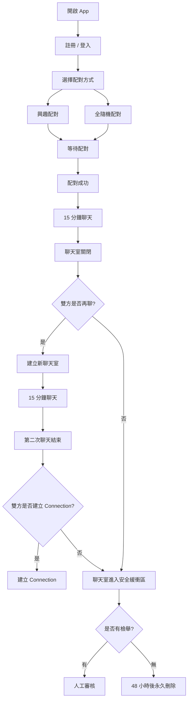

# FlashTalk v1.0 MVP 產品需求規格書（PRD）

> **Version：v1.0.0**  
> **產品名稱：FlashTalk**

---

# 一、產品定位（Product Positioning）

FlashTalk 是一款 **1 對 1 即時陌生人配對聊天平台**，核心理念為：

> **「聊得來才留下，聊不來就自然結束。」**

透過限時聊天降低社交壓力，只有當雙方都願意時，才建立長期聯繫（Connection）。

---

# 二、產品目標（Product Goals）

- 提供快速、低負擔的陌生人聊天體驗。
- 降低社交門檻，提高配對成功率。
- 以 **15 分鐘限時聊天** 提升交流效率。
- 僅於雙方皆同意時建立 Connection。
- 保持聊天匿名與安全性。

---

# 三、目標族群（Target Users）

適合以下使用者：

- 想認識陌生人
- 想分享生活
- 想交流興趣
- 想打發時間
- 想交朋友

---

# 四、登入系統（Authentication）

採用 **Email 註冊，使用帳號密碼登入**。

## 功能

- 使用 Email 註冊
- 發送 Email 驗證碼
- 驗證成功後建立使用者帳戶
- 登入帳號為使用者ＩＤ
- 支援忘記密碼功能

---

# 五、使用者資料（User Profile）

每位使用者擁有：

| 欄位 | 說明 |
|------|------|
| User ID | 系統唯一識別碼（不可重複） |
| 暱稱 | 可自由修改 |
| 頭像 | 使用者上傳 |
| 興趣標籤 | 配對依據，可選擇官方標籤 |

---

# 六、配對系統（Matching）

FlashTalk 提供兩種配對模式。

## 1. 興趣配對

- 選擇 **1～3 個官方興趣標籤**
- 進入對應配對系統
- 持續等待符合條件使用者
- **不設定 Timeout**

---

## 2. 全隨機配對

- 不考慮興趣
- 直接加入全站配對系統
- 依照排隊順序配對

---

# 七、聊天室（Chat Room）

配對成功後建立：

- 1 對 1 即時聊天室
- WebSocket 即時通訊

支援內容：

- 文字訊息
- Emoji

不支援：

- 圖片
- 影片
- 檔案
- 語音
- 外部連結

---

# 八、聊天時間（Chat Session）

每次聊天：

- 時長 **15 分鐘**
- 不提供倒數提醒
- 時間到自動關閉聊天室

---

# 九、聊天結束（Session End）

第一次聊天結束後：

雙方皆可選擇：

- ☕ 再聊 15 分鐘
- 👋 結束聊天

只有：

> **雙方皆同意**

才會：

- 建立新的 Chat Session
- 再聊天 15 分鐘

---

# 十、Connection（建立聯繫）

第二次聊天結束後：

系統詢問雙方：

> 是否願意建立 Connection？

只有：

> **雙方皆同意**

才會：

- 建立 Connection
- 解鎖私訊功能

若：

任一方不同意

則：

- 不建立 Connection
- 聊天室進入安全緩衝區

---

# 十一、安全機制（Safety）

## 安全機制（Safety）

系統透過「配對冷卻（Match Cooldown）」、「檢舉（Report）」及「黑名單（Blacklist）」三項機制，兼顧使用者安全與配對效率。

---

### 配對冷卻（Match Cooldown）

每次聊天室結束後，系統將自動建立雙方的暫時性配對冷卻時間。

#### 規則

- 聊天室結束後，雙方於配對冷卻期間內不會再次互相配對。
- 配對冷卻期間內，配對系統將暫時排除雙方互相配對。
- 配對冷卻時間結束後，系統將自動解除該限制，雙方可再次互相配對。
- 配對冷卻時間由系統統一管理，可依平台營運需求於後台調整，不對使用者公開設定值。
- 配對冷卻機制由系統自動執行，使用者無須任何操作。

#### 配對冷卻流程

當聊天室結束時，系統將自動建立一筆配對冷卻紀錄。

配對冷卻紀錄包含：

- User A
- User B
- 建立時間
- 到期時間

配對服務於媒合候選人時，將先檢查是否存在尚未到期的配對冷卻紀錄。

若存在有效紀錄，則暫時排除雙方互相配對；若紀錄已到期，則自動失效，不需額外解除或人工操作。

配對冷卻僅影響該兩位使用者之間的配對，不影響其與其他使用者的正常配對流程。

#### 設計目的

- 避免短時間內反覆配對到同一位使用者。
- 提升陌生人聊天的新鮮感。
- 降低人數不足造成的重複配對情形。
- 不永久排除任何正常使用者，維持配對新鮮感。

---

### 檢舉（Report）

使用者可於聊天過程中或聊天結束後檢舉對方。

#### 檢舉原因

- 色情或性騷擾
- 詐騙或可疑行為
- 廣告或垃圾訊息
- 不當言論
- 惡意騷擾
- 假帳號
- 其他

#### 檢舉流程

1. 使用者送出檢舉。
2. 系統保留該聊天室聊天紀錄作為審查依據。
3. 後台管理員（或 AI 輔助審查）進行案件審核。
4. 根據審核結果決定是否採取後續處置。

---

### 聊天紀錄保存

- 一般聊天室於保存期限到達後自動永久刪除。
- 若聊天室涉及檢舉案件，聊天紀錄將保留至案件審核完成後，再依平台保存政策處理。
- 聊天紀錄僅供安全審查用途，不提供使用者查閱。

---

### 黑名單（Blacklist）

黑名單為平台安全機制之一，不提供使用者自行建立或解除。

#### 建立方式

僅於檢舉案件經平台審核確認違規後，由系統建立黑名單。

#### 黑名單效果

- 雙方將永久不再互相配對。
- 系統可視違規程度，搭配限制功能、暫時停權或永久停權等處置。
- 黑名單資料僅供配對系統及平台安全管理使用。

#### 設計原則

- 「不想繼續聊天」不等於「永久封鎖」。
- 只有經平台確認存在安全或違規問題時，才建立永久性的配對限制。
- 避免使用者濫用封鎖功能，維持配對規模與配對品質。

---

### 配對系統限制

配對系統於建立聊天室前，至少需排除以下對象：

- 自己
- 已停權使用者
- 已在聊天室中的使用者
- 黑名單配對對象
- 配對冷卻期間內的配對對象

除上述限制外，其餘使用者皆可正常參與配對，由配對演算法依照配對條件進行排序與媒合。

# 十二、防騷擾設計（Anti-abuse）

為降低騷擾與詐騙風險：

僅允許：

- 文字
- Emoji

禁止：

- 圖片
- 影片
- 檔案
- 外部網址
- 社群連結

---

# 十三、產品流程（Product Flow）

## 使用流程

```text
開啟 App
    │
    ▼
註冊 / 登入
    │
    ▼
選擇配對方式
(興趣配對 / 全隨機)
    │
    ▼
等待配對
    │
    ▼
配對成功
    │
    ▼
15 分鐘聊天
    │
    ▼
聊天室關閉
    │
    ▼
是否再聊？
    │
 ┌──┴──────────┐
 │             │
 ▼             ▼
雙方同意       任一方不同意
 │             │
 ▼             ▼
建立新聊天室   安全緩衝區
 │
 ▼
15 分鐘聊天
 │
 ▼
第二次聊天結束
 │
 ▼
是否建立 Connection？
 │
┌──────────────┴─────────────┐
│                            │
▼                            ▼
雙方同意                  任一方不同意
│                            │
▼                            ▼
建立 Connection        聊天紀錄進入安全緩衝區
                             │
                  ┌──────────┴─────────┐
                  ▼                    ▼
                有檢舉              無檢舉
                  │                    │
                  ▼                    ▼
              人工審核          48 小時後永久刪除
```

---

## Mermaid 流程圖



---

# 十四、技術規劃（Technology Stack）

| 項目 | 技術 |
|------|------|
| 前端 | React Native |
| API | RESTful API |
| 即時通訊 | WebSocket |
| 後端 | Node.js |
| 資料庫 | PostgreSQL |

---

# MVP 功能總覽

| 模組 | 功能 |
|------|------|
| 帳號 | Email 註冊、登入、驗證碼 |
| 個人資料 | 暱稱、頭像、興趣標籤 |
| 配對 | 興趣配對、全隨機配對 |
| 聊天 | 文字、Emoji |
| 時間 | 15 分鐘限時聊天 |
| 延長聊天 | 雙方同意建立新 Session |
| Connection | 第二次聊天後雙向同意建立 |
| 安全 | Block、Report |
| 聊天紀錄 | 48 小時安全緩衝區 |
| 防騷擾 | 禁止圖片、影片、檔案、外部連結 |
| 技術 | RESTful API、WebSocket、Node.js、PostgreSQL |

---

# 版本資訊

| 版本 | 日期 | 說明 |
|------|------|------|
| v1.1.0 | 2026-09-07 | FlashTalk MVP 第一版產品需求規格書（PRD） |