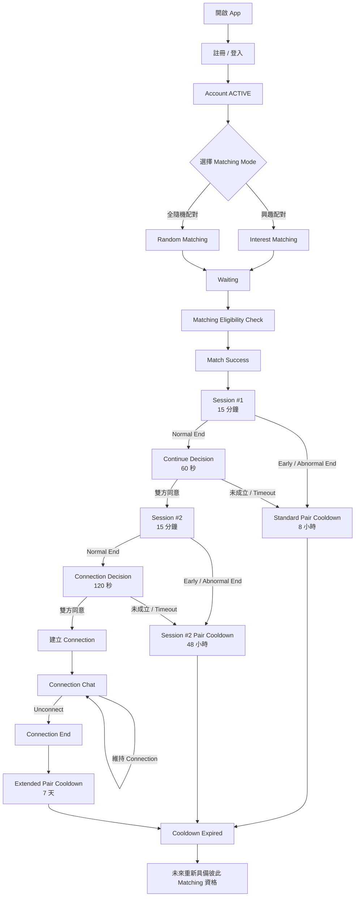

# FlashTalk v1.5.0 MVP 產品需求規格書（PRD）

> **Version：v1.5.0**  
> **產品名稱：FlashTalk**

---

## 一、產品定位（Product Positioning）

FlashTalk 是一款以 **1 對 1 即時陌生人配對與限時聊天**為核心的社交平台。

核心理念為：

> **「聊得來才留下，聊不來就自然結束。」**

FlashTalk 希望降低與陌生人開始交流時的心理負擔，讓使用者不需要先建立好友關係，也不需要承擔長期維持社交關係的壓力，即可快速開始一段即時對話。

產品透過：

- 即時陌生人配對
- 興趣配對
- 1 對 1 私密聊天
- 15 分鐘限時交流
- 雙向選擇
- Connection 機制

建立一個以「對話本身」作為認識彼此主要方式的陌生人社交體驗。

### 核心產品概念

FlashTalk 的社交流程遵循：

> **先聊天，再決定是否繼續認識彼此。**

使用者配對成功後，不會立即建立長期社交關係，而是先進入 **15 分鐘限時聊天**。

第一次聊天結束後，只有雙方都願意繼續交流，才會進入第二次聊天。

第二次聊天結束後，只有雙方都願意建立聯繫，系統才會建立 Connection。

整體關係建立流程為：

```text
陌生人
    │
    ▼
即時配對
    │
    ▼
第一次 15 分鐘聊天
    │
    ▼
雙方決定是否繼續
    │
    ▼
第二次 15 分鐘聊天
    │
    ▼
雙方決定是否建立 Connection
    │
    ▼
建立長期聯繫
```

透過階段式的雙向選擇，讓使用者可以自然決定：

- 要不要開始聊天
- 要不要繼續聊天
- 要不要建立長期聯繫

任一階段只要其中一方沒有繼續交流的意願，雙方關係即可自然結束。

### 產品核心價值

#### 1. 降低陌生人社交門檻

使用者不需要先建立好友關係，即可透過配對開始聊天。

降低「主動搭訕」以及「不知道如何開始認識陌生人」所產生的心理壓力。

#### 2. 讓對話成為認識彼此的主要方式

FlashTalk 將實際聊天體驗放在關係建立之前。

使用者先透過對話了解彼此，再決定是否值得繼續交流。

#### 3. 限時交流降低社交壓力

每次聊天具有明確的時間範圍。

使用者不需要承擔「開始聊天後不知道什麼時候可以結束」的社交壓力。

聊天時間結束後，由系統提供自然的關係選擇節點。

#### 4. 雙向同意才建立關係

無論是繼續聊天或建立 Connection，都必須建立在雙方共同意願之上。

避免單方面要求對方持續交流，降低陌生人社交過程中的心理負擔。

### 產品定位原則

FlashTalk 定位為：

> **陌生人即時社交與聊天平台。**

平台核心目的為促進陌生人之間的即時交流與自然社交。

使用者可能透過 FlashTalk：

- 認識新朋友
- 分享生活
- 交流共同興趣
- 找人聊天
- 打發時間
- 建立新的社交關係

FlashTalk MVP 不以戀愛、約會或特定性別配對作為主要產品定位。

同時，FlashTalk 不以傳統社交平台常見的：

- 公開動態
- 貼文
- 追蹤
- 粉絲
- 社群內容經營

作為 MVP 的核心體驗。

產品初期專注於：

> **配對 → 聊天 → 雙向選擇 → Connection**

建立清楚且低負擔的陌生人社交流程。

---

## 二、產品目標（Product Goals）

FlashTalk 的主要產品目標，是建立一個 **快速、低負擔、安全且具有自然關係篩選機制的陌生人聊天體驗**。

產品目標分為：

1. 配對體驗
2. 聊天體驗
3. 社交關係建立
4. 使用者安全
5. 產品驗證

### 1. 配對體驗目標

讓使用者能以簡單且低操作成本的方式開始與陌生人交流。

使用者可依照當下需求選擇：

- 興趣配對
- 全隨機配對

降低開始陌生人聊天前所需要進行的操作。

產品應盡可能提高：

> **有效配對與有效聊天的發生率。**

而非單純追求配對數量。

---

### 2. 聊天體驗目標

透過 **15 分鐘限時聊天**建立具有明確開始與結束節點的交流體驗。

降低以下陌生人聊天常見問題：

- 不知道如何結束對話
- 對話拖延造成心理負擔
- 因為沒有明確結束點而產生尷尬
- 一開始就需要承擔長期社交關係壓力

FlashTalk 希望讓每一次聊天都成為一段相對獨立且低負擔的交流。

---

### 3. 社交關係建立目標

FlashTalk 不要求使用者在第一次配對時，就決定是否與對方建立長期聯繫。

關係建立採用階段式流程：

```text
配對
 ↓
第一次聊天
 ↓
是否繼續聊天
 ↓
第二次聊天
 ↓
是否建立 Connection
```

第一次聊天後：

> **雙方皆同意，才繼續第二次聊天。**

第二次聊天後：

> **雙方皆同意，才建立 Connection。**

透過雙向選擇機制降低無效社交關係，讓 Connection 代表雙方確實具有繼續交流的意願。

---

### 4. 使用者安全目標

陌生人聊天具有騷擾、垃圾訊息、詐騙及不當內容等潛在風險。

FlashTalk 在 MVP 階段即將安全機制作為核心產品需求之一。

平台透過：

- 限制訊息類型
- Match Cooldown
- Report
- Blacklist
- 帳號停權
- 聊天紀錄安全緩衝
- 後台安全審查

降低陌生人聊天可能產生的安全風險。

安全機制的核心原則為：

> **在不過度增加正常使用者操作負擔的前提下，降低惡意使用者對平台造成的影響。**

---

### 5. 產品驗證目標

FlashTalk MVP 的主要目的不是一次建立完整的大型社交平台，而是驗證核心陌生人聊天模式是否具有持續使用價值。

MVP 優先驗證：

- 使用者是否願意進行陌生人即時配對
- 使用者是否願意完成第一次 15 分鐘聊天
- 第一次聊天後是否願意繼續第二次聊天
- 第二次聊天後是否願意建立 Connection
- 興趣配對是否能提高有效聊天意願
- 限時聊天是否能降低陌生人聊天的心理負擔
- 雙向選擇是否能提高 Connection 的有效性
- 安全機制是否足以支撐基本陌生人社交環境

MVP 的核心驗證流程為：

```text
進入平台
    ↓
開始配對
    ↓
成功配對
    ↓
第一次聊天
    ↓
繼續聊天
    ↓
第二次聊天
    ↓
建立 Connection
```

後續可依實際使用數據評估產品方向與功能擴充。

---

## 三、目標族群（Target Users）

FlashTalk 的主要使用者，是希望與陌生人進行即時交流，但不希望在一開始就承擔較高社交壓力或長期關係負擔的使用者。

### 核心使用者

主要包含：

- 想認識陌生人的使用者
- 想認識新朋友的使用者
- 想找人即時聊天的使用者
- 想分享生活或當下心情的使用者
- 想與具有共同興趣的人交流的使用者
- 想透過聊天打發時間的使用者
- 不希望一開始就建立長期社交關係的使用者
- 偏好先透過對話，再決定是否繼續認識對方的使用者

---

### 主要使用情境（Use Cases）

#### 情境一：單純想找人聊天

使用者目前有聊天需求，希望快速找到另一位同樣想聊天的人。

```text
想找人聊天
    ↓
選擇配對方式
    ↓
找到陌生人
    ↓
開始 15 分鐘聊天
```

---

#### 情境二：尋找共同興趣的聊天對象

使用者希望與具有相同興趣的人交流。

例如：

- 音樂
- 電影
- 遊戲
- 動漫
- 運動
- 旅行
- 美食

使用者可透過興趣配對尋找具有共同興趣標籤的聊天對象。

---

#### 情境三：分享生活

使用者可能只是希望有人可以：

- 聽自己分享今天發生的事情
- 聊最近的生活
- 分享興趣
- 討論某個話題

不一定以建立長期關係為目的。

---

#### 情境四：打發時間

使用者在：

- 通勤
- 等待
- 休息
- 無聊

等情境下，希望快速找到陌生人進行短時間交流。

15 分鐘聊天機制讓這類使用情境具有明確且容易理解的時間範圍。

---

#### 情境五：認識可能繼續聯絡的人

使用者可能在第一次聊天後發現彼此聊得來。

雙方可以選擇繼續第二次聊天。

若第二次聊天後仍希望保持聯繫，則可透過雙向同意建立 Connection。

因此使用者不需要在配對成功的第一時間決定：

> 「我要不要跟這個人成為朋友？」

而是可以透過實際聊天逐步決定是否建立後續關係。

---

### 使用者共同特徵

FlashTalk 的核心使用者不一定具有特定職業、興趣或社交目的，但通常具有以下其中一項需求：

> **「我現在想找一個人聊聊。」**

或：

> **「我想認識新的人，但希望先聊過再決定要不要繼續認識。」**

因此 FlashTalk 的核心不是讓使用者建立大量社交關係，而是：

> **讓陌生人之間更容易開始一段對話，並讓值得繼續的關係自然留下。**

---

## 四、登入系統（Authentication）

FlashTalk 採用 Email 註冊，並以 **Email + Password** 作為登入方式。

使用者完成註冊後，系統即建立正式帳號，但在完成 Email 驗證前，帳號維持於 **待驗證（PENDING_VERIFICATION）** 狀態。

完成 Email 驗證後，帳號才轉為 **ACTIVE**，並取得 FlashTalk 完整使用權限。

### 註冊流程

1. 使用者輸入 Email 與 Password 進行註冊。
2. 系統檢查 Email 是否已被註冊。
3. 註冊成功後立即建立使用者帳號。
4. 新建立帳號狀態設定為 **PENDING_VERIFICATION**。
5. 系統發送 Email 驗證碼至使用者註冊信箱。
6. 使用者輸入 Email 驗證碼。
7. 驗證成功後，帳號狀態由 **PENDING_VERIFICATION** 轉為 **ACTIVE**。
8. 使用者取得完整平台使用權限。

```text
輸入 Email + Password
        │
        ▼
      註冊
        │
        ▼
    建立使用者帳號
        │
        ▼
PENDING_VERIFICATION
        │
        ▼
  發送 Email 驗證碼
        │
        ▼
   使用者輸入驗證碼
        │
        ▼
     驗證成功
        │
        ▼
      ACTIVE
        │
        ▼
  可使用完整平台功能
```

### 登入規則

- 使用 **Email + Password** 登入。
- Email 為登入帳號，必須具有唯一性。
- User ID 為系統內部唯一識別碼，不作為登入帳號。
- 僅 **ACTIVE** 狀態帳號可正常使用配對與聊天功能。
- **PENDING_VERIFICATION** 帳號登入後，應引導使用者完成 Email 驗證。
- **SUSPENDED、BANNED、DELETED** 帳號依帳號狀態限制登入或平台功能。

### Email 驗證

系統提供：

- Email 驗證碼發送
- Email 驗證碼輸入
- Email 驗證碼驗證
- 重新發送驗證碼

驗證成功後：

```text
PENDING_VERIFICATION
        │
        ▼
      ACTIVE
```

Email 驗證碼的：

- 有效期限
- 重新發送間隔
- 最大驗證次數
- 每日發送上限

於後續 Authentication 技術規格統一定義，避免在產品 PRD 中綁定過早的技術限制。

### 密碼功能

支援：

- Password 登入
- 忘記密碼
- 密碼重設

密碼加密方式、Password Policy、登入失敗限制與 Token 機制於後續安全與 Authentication 技術規格中定義。

---

## 五、使用者資料（User Profile）

每位使用者完成註冊並建立帳號後，系統會建立對應的使用者資料。

FlashTalk 將使用者資料區分為：

1. **帳號基本資料（Account Data）**
2. **使用者公開資料（Profile Data）**
3. **帳號狀態（Account Status）**

帳號基本資料由系統管理；使用者公開資料則依平台規則允許使用者自行修改。

### 帳號基本資料

| 欄位 | 說明 |
| --- | --- |
| User ID | 系統內部唯一識別碼，不可重複，不作為登入帳號 |
| Email | 使用者登入帳號，必須唯一 |
| Email 驗證狀態 | 紀錄 Email 是否完成驗證 |
| 帳號狀態 | 使用者目前帳號生命週期狀態 |
| 建立時間 | 帳號建立時間 |
| 最後活動時間 | 使用者最後一次有效活動時間 |

---

### 使用者公開資料

| 欄位 | 說明 |
| --- | --- |
| 暱稱 | 使用者顯示名稱，可自行修改 |
| 頭像 | 使用者上傳的個人頭像 |
| 興趣標籤 | 配對依據，可選擇官方提供的興趣標籤 |

上述 Profile Data 可於配對或聊天流程中依產品 UI/UX 規則顯示給其他使用者。

Email、帳號狀態等 Account Data 屬於非公開資料，不提供其他一般使用者查看。

---

### 帳號狀態（Account Status）

帳號至少包含以下狀態：

| 狀態 | 說明 |
| --- | --- |
| PENDING_VERIFICATION | 已完成註冊並建立帳號，但尚未完成 Email 驗證 |
| ACTIVE | 已完成 Email 驗證，可正常使用平台功能 |
| SUSPENDED | 帳號暫時停權，期間不可正常使用配對與聊天功能 |
| BANNED | 帳號因重大或持續違規遭永久停權 |
| DELETED | 使用者已申請刪除帳號，停止提供一般平台功能 |

---

### 帳號生命週期

主要帳號狀態流程：

```text
完成註冊
    │
    ▼
PENDING_VERIFICATION
    │
    │ Email 驗證成功
    ▼
ACTIVE
    │
    ├── 違規暫時停權 ──► SUSPENDED
    │                       │
    │                       └── 停權解除 ──► ACTIVE
    │
    ├── 重大／持續違規 ──► BANNED
    │
    └── 使用者刪除帳號 ──► DELETED
```

#### PENDING_VERIFICATION

代表：

- 帳號已經建立。
- Email 尚未完成驗證。
- 可進行 Email 驗證相關操作。
- 不可進入配對系統。
- 不可建立聊天室。

#### ACTIVE

代表：

- Email 已完成驗證。
- 帳號正常。
- 可使用 FlashTalk 一般功能。
- 可進入配對系統。
- 可進入聊天室。
- 可建立 Connection。

#### SUSPENDED

代表帳號目前受到暫時性限制。

停權期間：

- 不可進入配對系統。
- 不可建立新的聊天室。
- 其他功能權限依後續安全政策定義。

停權解除後，可重新轉為 **ACTIVE**。

#### BANNED

代表帳號因重大違規或持續違反平台規範遭永久停權。

BANNED 帳號：

- 不可進行配對。
- 不可建立聊天室。
- 不可繼續使用一般平台功能。

實際處置方式由後續 Safety / Moderation 規格統一定義。

#### DELETED

代表使用者已主動申請刪除帳號。

進入 **DELETED** 狀態後：

- 不可繼續進行配對。
- 不可建立聊天室。
- 不可建立新的 Connection。
- 停止提供一般平台功能。

---

### 帳號刪除

使用者可主動申請刪除自己的帳號。

帳號刪除後：

- 帳號狀態轉為 **DELETED**。
- 停止提供一般平台功能。
- 不再參與任何新的配對。

與以下項目相關的資料不因帳號刪除立即移除：

- 檢舉案件
- 安全審查
- 違規紀錄
- 平台依法或依安全政策需要保留的資料

一般個人資料、聊天資料及其他使用者資料的實際刪除時程，於後續 **Data Retention（資料保存政策）** 中統一定義。

---

## 六、配對系統（Matching）

FlashTalk 提供兩種配對模式：

1. **興趣配對**
2. **全隨機配對**

使用者進入配對流程前，可自行選擇本次希望使用的配對方式。

---

### 1. 興趣配對（Interest Matching）

使用者可選擇 **1～3 個官方興趣標籤**進行興趣配對。

#### 配對條件

進行興趣配對時，系統只會將至少擁有 **1 個共同興趣標籤**的使用者進行配對。

例如：

使用者 A 選擇：

- 音樂
- 電影
- 遊戲

使用者 B 選擇：

- 音樂
- 旅行

A 與 B 共同擁有「音樂」標籤，因此雙方符合興趣配對條件。

若雙方沒有任何共同興趣標籤，則不符合興趣配對條件。

---

#### 配對優先順序

若同時存在多位符合興趣配對條件的使用者，系統依照 **共同興趣標籤數量**決定配對優先順序。

共同興趣標籤數量越多，配對優先級越高。

例如使用者 A 選擇：

- 音樂
- 電影
- 遊戲

其他使用者：

| 使用者 | 興趣標籤 | 與 A 共同標籤數 | 配對優先級 |
| --- | --- | ---: | --- |
| B | 音樂、電影、遊戲 | 3 | 第一優先 |
| C | 音樂、電影、旅行 | 2 | 第二優先 |
| D | 音樂、運動、旅行 | 1 | 第三優先 |
| E | 美食、運動、旅行 | 0 | 不符合配對條件 |

配對優先順序**完全以共同興趣標籤數量為主要判斷條件**。

等待時間不會提高或降低使用者的配對優先級。

---

#### 相同優先級處理

若同時有多位使用者具有相同數量的共同興趣標籤，系統將從這些使用者中進行 **隨機選擇**。

例如：

使用者 A 與：

- 使用者 B：共同 2 個興趣標籤
- 使用者 C：共同 2 個興趣標籤
- 使用者 D：共同 1 個興趣標籤

系統會優先從 B 與 C 之間進行隨機選擇。

D 因共同興趣標籤數較少，因此優先級低於 B 與 C。

---

#### 等待規則

興趣配對 **不設定 Timeout**。

使用者進入興趣配對後：

- 系統持續尋找符合興趣條件的使用者。
- 不因等待時間增加而改變配對優先級。
- 不因等待時間增加而降低共同興趣標籤條件。
- 不會自動切換為全隨機配對。
- 使用者可自行取消本次配對。

---

### 2. 全隨機配對（Random Matching）

全隨機配對不考慮使用者的興趣標籤。

使用者選擇全隨機配對後，系統將直接尋找目前同樣進行全隨機配對且符合平台基本配對條件的其他使用者。

符合條件後進行隨機配對。

興趣標籤不影響全隨機配對的優先順序。

---

### 3. 基本配對限制

無論使用興趣配對或全隨機配對，系統皆不得將使用者與以下對象進行配對：

- 使用者本人
- 非 **ACTIVE** 狀態帳號
- 已經進入其他聊天室的使用者
- 已存在有效黑名單限制的使用者
- 仍處於 Match Cooldown 的使用者

同一位使用者同一時間只能進行 **一個配對流程**。

當使用者已成功配對後，該次配對流程立即結束，並進入 1 對 1 聊天流程。

---

### 4. 配對取消

使用者在尚未成功配對前，可主動取消配對。

取消後：

- 系統停止為該使用者尋找配對對象。
- 使用者回到配對模式選擇畫面。
- 使用者可重新選擇興趣配對或全隨機配對。
- 取消配對不建立 Match Cooldown。

若系統已完成雙方配對並建立聊天室，則不再視為「取消配對」，後續行為依聊天室離開規則處理。

---

## 七、聊天室（Chat Room）

配對成功後，系統將為雙方建立一個 **1 對 1 即時聊天室**。

聊天室為 FlashTalk 陌生人交流的主要空間，使用者可在限定的聊天時間內與配對對象進行即時文字交流。

聊天室採用即時通訊機制，確保雙方可以即時接收與傳送訊息。

---

### 1. 聊天室建立

當配對系統確認雙方成功配對後，系統建立本次 1 對 1 聊天室，並將雙方加入聊天室。

基本規則：

- 每個聊天室僅包含兩位使用者。
- 使用者同一時間只能存在於一個進行中的陌生人聊天室。
- 聊天室建立後，雙方進入聊天流程。
- 聊天時間與 Chat Session 規則由第八章統一定義。
- 聊天室結束後，不可繼續於該次 Chat Session 傳送新訊息。

基本流程：

```text
配對成功
    │
    ▼
建立 1 對 1 聊天室
    │
    ▼
雙方進入聊天室
    │
    ▼
建立 Chat Session
    │
    ▼
開始即時聊天
```

---

### 2. 聊天室使用者資料

聊天室內可顯示對方的公開 Profile Data。

包含：

- 頭像
- 暱稱
- 興趣標籤

Email、User ID、帳號狀態及其他 Account Data 不對聊天對象公開。

#### 興趣配對

若雙方透過興趣配對進入聊天室，可優先呈現雙方的 **共同興趣標籤**。

例如：

```text
共同興趣

🎵 音樂
🎮 遊戲
🎬 電影
```

共同興趣可作為雙方開始聊天時的破冰資訊。

#### 全隨機配對

若雙方透過全隨機配對進入聊天室，可顯示對方設定的公開興趣標籤。

興趣標籤僅作為聊天參考資訊，不影響已完成的全隨機配對結果。

---

### 3. 訊息功能（Messaging）

FlashTalk MVP 以即時文字交流為主要聊天方式。

#### 支援內容

聊天室支援：

- 文字訊息
- Emoji
- 回覆訊息（Reply）

#### 回覆訊息（Reply）

使用者可以針對聊天室中的特定訊息進行回覆。

回覆訊息應保留被回覆訊息的基本內容，使雙方能辨識目前回覆所對應的上下文。

例如：

```text
A：
最近有推薦的電影嗎？

B 回覆：
┌ 最近有推薦的電影嗎？
│
└ 我最近看了一部科幻片，還不錯。
```

回覆功能僅用於建立訊息之間的上下文關聯，不建立獨立討論串（Thread）。

---

### 4. 不支援的訊息功能

FlashTalk MVP 不提供以下訊息類型：

- 圖片
- 影片
- 檔案
- 語音訊息
- 外部連結

同時不提供以下訊息操作：

- 複製訊息
- 刪除訊息
- 收回訊息
- 編輯已送出的訊息

訊息送出後即視為正式聊天內容，不允許使用者自行修改或移除。

單則訊息的最大內容長度、傳送頻率限制及其他 Messaging 技術限制，於後續技術規格中統一定義。

---

### 5. 訊息狀態

FlashTalk 提供基本訊息傳送狀態，讓使用者確認訊息是否成功送達聊天系統。

基本狀態包含：

```text
輸入訊息
    │
    ▼
傳送
    │
    ▼
Sending
    │
    ▼
伺服器接收
    │
    ▼
Sent
```

若訊息傳送失敗，系統應提供對應的失敗狀態，避免使用者誤認訊息已成功送出。

具體訊息確認、重新傳送及可靠性機制於後續 WebSocket / Messaging 技術規格中定義。

---

### 6. 不提供已讀狀態

FlashTalk MVP **不提供訊息已讀（Read Receipt）功能**。

使用者無法確認對方是否已讀取特定訊息。

設計目的：

- 降低陌生人聊天的回覆壓力。
- 避免「已讀未回」造成額外社交負擔。
- 維持 FlashTalk 低壓力陌生人聊天的產品定位。

---

### 7. 正在輸入（Typing Indicator）

當其中一位使用者正在輸入訊息時，可向另一位使用者顯示：

> **對方正在輸入⋯**

Typing Indicator 僅代表對方目前正在進行訊息輸入操作，不代表訊息一定會被送出。

具體觸發頻率、Timeout 與 WebSocket Event 行為於後續技術規格中定義。

---

### 8. 主動離開聊天室

使用者在聊天進行期間可隨時主動離開聊天室。

不要求使用者一定完成完整的 15 分鐘聊天。

若任一方主動離開：

```text
聊天進行中
    │
    ▼
其中一方主動離開
    │
    ▼
結束目前 Chat Session
    │
    ▼
另一方收到聊天已結束狀態
    │
    ▼
聊天室停止接受新訊息
```

一方主動離開後，另一方不需要繼續停留於聊天室等待。

主動離開代表該次聊天提前結束。

因此，若使用者於第一次 Chat Session 中主動離開，視為該使用者沒有繼續本次交流的意願，不進入「再聊 15 分鐘」的雙向選擇流程。

---

### 9. 網路中斷與重新連線

使用者在聊天期間可能因行動網路切換、Wi-Fi 不穩定或其他網路因素發生暫時性斷線。

FlashTalk 應允許短暫斷線的使用者重新連線至原聊天室。

基本流程：

```text
聊天進行中
    │
    ▼
網路暫時中斷
    │
    ▼
使用者進入暫時離線狀態
    │
    ▼
嘗試重新連線
    │
    ├── 重連成功 ──► 返回原聊天室
    │
    └── 無法重連 ──► 依 Chat Session 結束規則處理
```

暫時性網路中斷 **不立即視為使用者主動離開聊天室**。

---

### 10. 斷線期間聊天時間

網路中斷期間，Chat Session 的聊天時間 **不暫停、不重新計算、不延長**。

例如：

```text
Chat Session 開始
        │
        │ 5 分鐘
        ▼
使用者暫時斷線
        │
        │ Chat Session 持續計時
        ▼
使用者重新連線
        │
        ▼
返回原聊天室
```

重新連線後，使用者只能使用該 Chat Session 原本剩餘的聊天時間。

此規則避免透過主動斷線方式延長聊天時間。

允許重新連線的時間範圍、重連次數及斷線狀態管理，由後續 Chat Session / WebSocket 技術規格統一定義。

---

### 11. 聊天室結束條件

聊天室可能因以下情況停止目前 Chat Session：

1. Chat Session 時間結束。
2. 任一方主動離開聊天室。
3. 任一方進行檢舉並離開。
4. 使用者長時間斷線並超過系統允許的重新連線範圍。
5. 帳號因安全機制或平台管理行為失去聊天權限。
6. 系統因異常或安全原因強制終止聊天室。

其中：

- 正常時間結束後的後續流程，由第九章「聊天結束（Session End）」定義。
- 檢舉、違規及安全處理，由第十一章「安全機制（Safety）」定義。
- Chat Session 時間與生命週期，由第八章「聊天時間（Chat Session）」定義。

---

## 八、聊天時間（Chat Session）

FlashTalk 採用 **限時聊天（Timed Chat）** 作為核心聊天機制。

每次 Chat Session 固定為 **15 分鐘**。

Chat Session 代表聊天室中的一次限時聊天階段，不等同於 Chat Room 本身。

一個 Chat Room 最多包含：

1. 第一次聊天：Session #1
2. 第二次聊天：Session #2

基本流程：

```text
建立 Chat Room
      │
      ▼
Session #1
15 分鐘
      │
      ▼
第一次聊天結束
      │
      ▼
雙方決定是否繼續
      │
      ├── 雙方同意
      │       │
      │       ▼
      │   Session #2
      │    15 分鐘
      │       │
      │       ▼
      │   Connection 決策
      │
      └── 未達成雙方同意
              │
              ▼
          結束聊天
```

---

### 1. Chat Session 時間

每個 Chat Session 固定為：

> **15 分鐘**

Chat Session 開始後即開始計時。

Session 時間不因以下情況暫停：

- App 切換至背景
- 手機鎖定
- 暫時離開 App
- Wi-Fi / 行動網路切換
- 暫時性網路中斷
- WebSocket 暫時斷線
- 使用者重新連線聊天室

只要目前 Chat Session 尚未結束，其時間即持續計算。

---

### 2. 剩餘時間顯示

聊天室應持續顯示目前 Chat Session 的 **剩餘聊天時間**。

例如：

```text
14:32
08:17
03:45
00:32
00:00
```

剩餘時間應以低干擾方式顯示於聊天室介面中。

使用者可以隨時確認目前剩餘聊天時間。

---

### 3. 不提供主動倒數提醒

FlashTalk 不提供額外的主動倒數提醒。

例如不提供：

- 剩餘 10 分鐘提醒
- 剩餘 5 分鐘提醒
- 剩餘 1 分鐘提醒
- 即將結束通知
- 倒數提示 Modal
- 倒數震動
- 倒數音效
- 系統倒數訊息

聊天室僅持續顯示剩餘時間，不額外中斷使用者的聊天體驗。

設計目的：

- 降低時間壓迫感。
- 避免提醒中斷正在進行的對話。
- 維持 FlashTalk 低負擔聊天體驗。
- 同時讓使用者可以自行掌握剩餘聊天時間。

---

### 4. Chat Session 時間基準

Chat Session 的實際開始與結束時間以 **Server 所管理的 Session 狀態為準**。

Client 顯示的倒數時間僅作為使用者介面呈現，不作為實際判斷 Session 是否結束的唯一依據。

概念上：

```text
Session Start
     │
     ▼
Server 建立 Session
     │
     ├── startedAt
     │
     └── expiresAt
             │
             ▼
      Client 顯示剩餘時間
             │
             ▼
         expiresAt
             │
             ▼
        Session End
```

此原則確保不同裝置、網路狀態及重新連線情況下，雙方仍使用相同的 Chat Session 時間基準。

具體時間同步與實作方式於後續 Chat Session 技術規格中定義。

---

### 5. App Background 與鎖定畫面

Chat Session 開始後，若使用者：

- 將 App 切換至背景
- 切換至其他 App
- 鎖定手機
- 暫時離開 FlashTalk

Chat Session 仍然持續計時。

例如：

```text
00:00
Session 開始
    │
    │ 5 分鐘
    ▼
05:00
App 進入背景
    │
    │ Session 持續計時
    ▼
10:00
使用者返回 App
    │
    ▼
剩餘約 5 分鐘
```

App Background 不等同於主動離開聊天室。

---

### 6. 網路中斷與重新連線

聊天期間若使用者發生暫時性網路中斷，Chat Session 不立即結束。

系統允許使用者依第七章定義的重新連線機制返回原聊天室。

重新連線期間：

> **Chat Session 持續計時。**

例如：

```text
Session #1
剩餘 10:00
    │
    ▼
網路中斷
    │
    │ Session 持續計時
    ▼
重新連線
    │
    ▼
Session #1
剩餘 08:20
```

重新連線不會：

- 重新開始 15 分鐘
- 暫停 Session
- 延長 Session
- 補回斷線期間的聊天時間

---

### 7. Chat Session 到期

當剩餘時間到達：

```text
00:00
```

目前 Chat Session 即視為結束。

系統應：

1. 將目前 Chat Session 標記為結束。
2. 停止接受新的聊天訊息。
3. 停用聊天室訊息輸入功能。
4. 向雙方顯示本次聊天已結束。
5. 依目前 Session 階段進入對應的下一步流程。

時間到期代表：

> **目前 Chat Session 結束。**

不代表 Chat Room 必然立即銷毀。

---

### 8. Session 到期時的訊息處理

Chat Session 是否仍允許傳送訊息，以 Server 接收到訊息時的 Session 狀態為準。

若 Server 接收到訊息時 Chat Session 仍為有效狀態：

```text
Session = ACTIVE
        │
        ▼
接受訊息
```

若 Server 接收到訊息時 Chat Session 已經到期：

```text
Session = ENDED
        │
        ▼
拒絕訊息
```

因此，即使使用者在倒數最後一刻按下傳送，如果 Server 接收到訊息時 Session 已經結束，該訊息仍不會進入聊天室。

具體訊息 ACK、時間同步、Race Condition 與 Atomic State Transition 等處理方式於後續技術規格中定義。

---

### 9. 第一次 Chat Session

配對成功並建立 Chat Room 後，系統建立：

> **Session #1**

Session #1 固定為 **15 分鐘**。

Session #1 正常時間結束後：

```text
Session #1
15 分鐘
    │
    ▼
Session End
    │
    ▼
停止傳送新訊息
    │
    ▼
進入續聊決策階段
```

系統詢問雙方是否願意：

> **再聊 15 分鐘？**

雙方分別進行選擇。

---

### 10. 續聊決策

Session #1 正常結束後，雙方可選擇：

- 再聊 15 分鐘
- 結束聊天

雙方的選擇採用 **獨立且不可互相查看的決策機制**。

在對方完成選擇之前，不顯示：

- 對方選擇了什麼
- 對方是否選擇繼續
- 對方是否選擇結束

例如：

```text
User A

選擇：
「再聊 15 分鐘」

        │
        ▼

顯示：
「等待對方選擇⋯」
```

User A 不會知道 User B 在完成決策前的選擇狀態。

---

### 11. 決策時間

Session #1 正常結束後，雙方具有：

> **60 秒決策時間**

此 60 秒屬於獨立的決策階段。

不計入：

- Session #1 的 15 分鐘
- Session #2 的 15 分鐘

流程：

```text
Session #1 結束
        │
        ▼
開始 60 秒決策時間
        │
        ├── 雙方皆選擇繼續
        │          │
        │          ▼
        │     建立 Session #2
        │
        ├── 任一方選擇結束
        │          │
        │          ▼
        │       結束聊天
        │
        └── 任一方 60 秒內未完成選擇
                   │
                   ▼
                視為不同意
                   │
                   ▼
                結束聊天
```

> **決策剩餘時間顯示**

進入 60 秒決策階段後，系統應持續顯示目前剩餘的決策時間。

例如：

```text
01:00
  ↓
00:45
  ↓
00:30
  ↓
00:15
  ↓
00:00
```

---

### 12. 決策逾時

若任一方未在 **60 秒內**完成選擇：

> **系統將該使用者視為選擇「結束聊天」。**

不需要另一方繼續等待。

系統不向另一方透露：

- 對方主動選擇結束
- 對方沒有進行選擇
- 對方發生決策 Timeout

對另一方統一呈現聊天未繼續的結果。

設計目的：

- 避免使用者長時間停留於等待狀態。
- 避免透過選擇結果造成額外社交壓力。
- 保護雙方決策隱私。
- 讓聊天流程具有明確結束點。

---

### 13. 第二次 Chat Session

只有當雙方皆在決策時間內選擇：

> **再聊 15 分鐘**

系統才建立：

> **Session #2**

Session #2 為新的 Chat Session，聊天時間重新設定為完整 **15 分鐘**。

流程：

```text
Session #1 結束
        │
        ▼
60 秒決策階段
        │
        ▼
User A：繼續
User B：繼續
        │
        ▼
建立 Session #2
        │
        ▼
重新開始 15 分鐘
```

Session #2 延續原本 Chat Room 與聊天上下文。

雙方不需要重新配對，也不建立新的陌生人配對關係。

---

### 14. Session #1 與 Session #2 聊天紀錄顯示

Session #1 與 Session #2 為同一組陌生人配對關係中的兩個獨立聊天階段。

當 Session #1 正常結束，且雙方於 Continue Decision 中皆選擇「再聊 15 分鐘」後，系統建立 Session #2。

Session #2 開始後：

> **不再向雙方顯示 Session #1 的聊天訊息。**

Session #2 為新的聊天階段，使用者進入 Session #2 時，聊天訊息顯示區域從新的 Session 開始。

流程：

```text
Session #1
15 分鐘
    │
    ▼
Normal End
    │
    ▼
Continue Decision
    │
    ▼
雙方皆同意繼續
    │
    ▼
Session #2
15 分鐘
    │
    └── 不顯示 Session #1 訊息
```

此設計將兩次 Chat Session 區分為不同的關係階段：

| Chat Session | 階段定位 | 聊天紀錄 |
|---|---|---|
| Session #1 | 初次探索與認識 | 不帶入 Session #2 顯示 |
| Session #2 | 雙方主動選擇繼續後的交流 | 可於 Connection 成立後延續 |

Session #1 不帶入 Session #2，不代表其資料必須於 Session #2 建立時立即從 Server 永久刪除。

Session #1 的實際資料保存時間、刪除機制、安全緩衝、Report 與 Moderation 所需資料保存方式，由後續資料保存與安全相關章節統一定義。

---

### 15. 第二次 Chat Session 結束

Session #2 最長為 **15 分鐘**。

Session #2 正常時間結束後：

- 不再提供第三次 15 分鐘聊天。
- 不再提供一般續聊選項。
- 停止目前 Chat Session 的訊息傳送功能。
- 進入 Connection 決策階段。

流程：

```text
Session #2
15 分鐘
    │
    ▼
Session End
    │
    ▼
Connection 決策
```

Connection 的建立條件與決策流程由第十章「Connection（建立聯繫）」統一定義。

---

### 16. Session #2 與 Connection Chat 的聊天紀錄延續

Session #2 為雙方完成第一次聊天後，皆主動選擇繼續交流才建立的第二階段 Chat Session。

若 Session #2 正常結束，且雙方後續皆同意建立 Connection：

> **Session #2 的聊天訊息將作為 Connection Chat 的可見歷史紀錄保留。**

Connection 建立後，不重新顯示 Session #1 的聊天訊息。

因此 Connection Chat 的可見聊天紀錄由以下內容組成：

1. Session #2 的聊天訊息
2. Connection 建立狀態提示
3. Connection 建立後產生的新訊息

概念流程：

```text
Session #1
    │
    │ 不帶入下一階段顯示
    ▼
Session #2
    │
    │ 雙方同意建立 Connection
    ▼
Connection Created
    │
    ▼
Connection Chat
    │
    ├── Session #2 歷史訊息
    │
    ├── Connection 建立提示
    │
    └── Connection 後的新訊息
```

使用者介面應讓 Session #2 至 Connection Chat 的轉換保持自然延續。

例如：

```text
──────── Session #2 ────────
A：你剛剛說你也喜歡去日本？
B：對啊，我去年去了北海道
A：我超想去 😂
B：冬天真的很漂亮
────────────────────────────
你們已建立 Connection
現在可以繼續聊天
────────────────────────────
A：所以你最推薦北海道哪裡？
```

Connection 建立後：

- 不再受到 15 分鐘 Chat Session 時間限制。
- 不再進入 Chat Session Decision。
- Session #2 訊息持續對雙方可見。
- Session #1 訊息不重新出現在 Connection Chat。
- Connection 後的新訊息接續於 Session #2 之後。

此設計的產品階段概念為：

```text
Session #1
第一次遇見
    │
    ▼
Session #2
雙方選擇繼續
    │
    ▼
Connection
雙方選擇留下
```

其核心設計原則為：

> **第一次是遇見，第二次是選擇，Connection 是留下。**

聊天紀錄的實際 Server 儲存結構、資料轉移方式、Conversation 關聯方式與 Data Retention Policy 不於本章限定，於後續技術規格與資料保存規格中統一定義。

---

### 17. 主動離開

使用者可依第七章規則，在 Chat Session 進行期間主動離開聊天室。

若任一方主動離開：

```text
ACTIVE SESSION
      │
      ▼
使用者主動離開
      │
      ▼
提前結束目前 Session
      │
      ▼
結束本次聊天
```

主動離開代表該使用者已明確表達不繼續本次交流。

因此：

- 不等待目前 15 分鐘結束。
- 不進入續聊決策。
- 不建立下一個 Chat Session。
- 不進入 Connection 決策。
- 另一方收到本次聊天已結束的結果。

---

### 18. Chat Session 核心規則

FlashTalk Chat Session 核心規則統一如下：

| 項目 | 規則 |
|---|---|
| 單次聊天時間 | 15 分鐘 |
| Session #1 | 配對成功後建立 |
| Session #2 | Session #1 結束後雙方同意才建立 |
| Session #3 | 不提供 |
| 剩餘時間 | 持續顯示 |
| 主動倒數提醒 | 不提供 |
| 時間基準 | Server |
| App Background | 持續計時 |
| 手機鎖定 | 持續計時 |
| 暫時斷線 | 持續計時 |
| 重新連線 | 返回原 Session，不重置時間 |
| Session 到期 | 停止接受新訊息 |
| Session #1 結束 | 進入續聊決策 |
| 續聊決策時間 | 60 秒 |
| 決策逾時 | 視為不同意 |
| 雙方選擇結果 | 決策完成前互相不可見 |
| 雙方皆同意續聊 | 建立 Session #2 |
| Session #2 結束 | 進入 Connection 決策 |
| 主動離開 | 提前結束，不進入續聊或 Connection 決策 |

---

## 九、聊天結束與續聊決策（Session End & Continue Decision）

FlashTalk 將 Chat Session 的結束分為：

1. 正常結束（Normal End）
2. 提前結束（Early End）
3. 異常結束（Abnormal End）

只有 **Chat Session 因 15 分鐘聊天時間自然到期而正常結束**，才會進入後續 Decision 流程。

其他提前或異常結束情況，不進入續聊或 Connection 決策。

---

### 1. Session 結束類型

Chat Session 可能因不同原因結束。

基本分類如下：

```text
Chat Session
      │
      ▼
 Session End
      │
      ├── Normal End
      │      │
      │      └── 15 分鐘聊天時間自然到期
      │
      ├── Early End
      │      │
      │      ├── 使用者主動離開
      │      └── 使用者檢舉並離開
      │
      └── Abnormal End
             │
             ├── 長時間斷線
             ├── 帳號失去聊天權限
             ├── Safety 機制終止
             └── 系統強制終止
```

不同結束原因應保留其實際結束類型，以供後續安全機制、營運分析、系統監控與問題追蹤使用。

具體技術狀態、Enum 與事件名稱於後續技術規格中定義。

---

### 2. 正常結束（Normal End）

當 Chat Session 完整進行至 15 分鐘，並因聊天時間自然到期而結束時，視為：

> **Normal End**

Normal End 為唯一可以進入後續 Decision 的 Session 結束類型。

依 Session 階段不同：

```text
Session #1 Normal End
        │
        ▼
Continue Decision
        │
        ▼
是否再聊 15 分鐘？
```

```text
Session #2 Normal End
        │
        ▼
Connection Decision
        │
        ▼
是否建立 Connection？
```

Session #1 的 Continue Decision 由本章定義。

Session #2 的 Connection Decision 與 Connection 建立流程由第十章定義。

---

### 3. 提前結束（Early End）

若 Chat Session 尚未到達 15 分鐘，但因使用者主動行為提前結束，視為：

> **Early End**

包含：

- 使用者主動離開聊天室
- 使用者檢舉並離開聊天室

Early End 代表目前聊天已明確提前結束。

因此：

- 不進入 Continue Decision
- 不進入 Connection Decision
- 不建立新的 Chat Session
- 不等待目前 Session 原定結束時間

流程：

```text
ACTIVE SESSION
      │
      ▼
Early End
      │
      ▼
結束本次聊天
```

具體離開聊天室與檢舉流程分別依第七章及安全機制相關章節定義。

---

### 4. 異常結束（Abnormal End）

若 Chat Session 因非一般使用者結束行為而無法繼續進行，視為：

> **Abnormal End**

可能包含：

- 長時間無法重新連線
- 帳號失去聊天權限
- 帳號受到系統限制
- Safety 機制強制終止聊天室
- 系統異常導致 Session 無法繼續
- 其他系統強制終止原因

Abnormal End 不進入後續 Decision。

流程：

```text
ACTIVE SESSION
      │
      ▼
Abnormal End
      │
      ▼
結束本次聊天
```

暫時性網路中斷本身不立即視為 Abnormal End。

若使用者仍處於允許重新連線的範圍內，應依第七、八章重新連線規則處理。

具體重新連線期限、異常狀態判斷與系統終止條件於後續技術規格中定義。

---

### 5. Decision 共通機制

FlashTalk 在需要雙方共同決定下一階段關係時，採用：

> **雙向盲選（Blind Decision）**

Decision 的核心原則為：

- 雙方分別獨立進行選擇
- 不顯示對方目前選擇
- 雙方皆同意才成立
- 任一方不同意則 Decision 不成立
- Decision Timeout 視為不同意
- 使用者送出選擇後不可修改
- 不公開是哪一方選擇不同意
- 不公開對方是否因 Timeout 而未完成選擇

此機制適用於：

1. Continue Decision
2. Connection Decision

---

### 6. Decision 選擇隱私

Decision 進行期間，雙方不可查看對方的選擇。

例如：

```text
User A
選擇「再聊 15 分鐘」
        │
        ▼
等待對方選擇⋯
```

此時 User A 不會知道：

- User B 是否已經選擇
- User B 選擇繼續或結束
- User B 是否暫時離線
- User B 是否最終發生 Timeout

只有 Decision 最終結果會呈現給使用者。

---

### 7. Decision 送出後不可修改

使用者完成 Decision 並送出選擇後：

> **不得修改已送出的選擇。**

例如：

```text
User A
選擇「再聊 15 分鐘」
        │
        ▼
Decision Submitted
        │
        ▼
不可修改
```

此規則適用於：

- Continue Decision
- Connection Decision

避免 Decision 期間因重複修改造成雙方結果與系統狀態不一致。

---

### 8. 任一方選擇不同意

若任一方明確選擇不同意，代表該 Decision 已無法成立。

系統不需要繼續等待另一方完成剩餘決策時間。

例如：

```text
User A：CONTINUE
User B：END
        │
        ▼
Decision Failed
        │
        ▼
結束聊天
```

或：

```text
User A：尚未選擇
User B：END
        │
        ▼
Decision Failed
        │
        ▼
結束聊天
```

即使另一方尚未完成選擇，系統仍可立即結束目前 Decision。

---

### 9. Decision 結果呈現

若 Decision 未成立，不向使用者公開失敗原因。

不顯示：

```text
對方拒絕了你
```

不顯示：

```text
對方沒有選擇繼續聊天
```

不顯示：

```text
對方選擇逾時
```

統一使用中性結果，例如：

> **本次聊天已結束。**

設計目的：

- 降低被拒絕感
- 降低陌生人社交壓力
- 保護雙方決策隱私
- 避免使用者對另一方產生不必要的負面情緒

---

### 10. Continue Decision

當 Session #1 因 15 分鐘時間自然到期而 Normal End 後，進入：

> **Continue Decision**

系統詢問雙方：

> **是否再聊 15 分鐘？**

雙方可選擇：

- 再聊 15 分鐘
- 結束聊天

Continue Decision 時間為：

> **60 秒**

---

### 11. Continue Decision 剩餘時間

進入 Continue Decision 後，系統應持續顯示剩餘決策時間。

例如：

```text
01:00
  ↓
00:59
  ↓
00:30
  ↓
00:10
  ↓
00:00
```

Decision Timer 只作為剩餘時間顯示。

不提供：

- 額外倒數通知
- 剩餘 30 秒警告
- 剩餘 10 秒警告
- 震動提醒
- 音效提醒
- 強制彈出提示

使用者完成選擇後，若 Decision 尚未產生最終結果，畫面仍持續顯示剩餘決策時間。

例如：

```text
已送出你的選擇
等待對方選擇⋯
00:37
```

Decision 剩餘時間以 Server 管理的 Decision 到期時間為準。

---

### 12. Continue Decision 成立

只有當雙方皆在 60 秒內選擇：

> **再聊 15 分鐘**

Continue Decision 才成立。

流程：

```text
Session #1 Normal End
        │
        ▼
Continue Decision
      60 秒
        │
        ▼
User A：CONTINUE
User B：CONTINUE
        │
        ▼
Decision Success
        │
        ▼
建立 Session #2
        │
        ▼
重新開始 15 分鐘聊天
```

Session #2 延續原 Chat Room 與既有聊天上下文。

---

### 13. Continue Decision 不成立

以下任一情況發生時，Continue Decision 不成立：

#### 情況 A：任一方選擇結束

```text
A：CONTINUE
B：END
     │
     ▼
聊天結束
```

#### 情況 B：雙方皆選擇結束

```text
A：END
B：END
   │
   ▼
聊天結束
```

#### 情況 C：任一方 Decision Timeout

```text
A：CONTINUE
B：TIMEOUT
       │
       ▼
TIMEOUT 視為 END
       │
       ▼
聊天結束
```

Decision 不成立後：

- 不建立 Session #2
- 不進入 Connection Decision
- 不公開是哪一方不同意
- 不公開是否有人發生 Timeout
- 統一進入聊天結束流程

---

### 14. Continue Decision Timeout

若使用者未在 **60 秒內**完成 Continue Decision：

> **系統將該使用者視為選擇「結束聊天」。**

即：

```text
TIMEOUT = END
```

Timeout 後不可補送原 Decision。

---

### 15. Decision 階段網路中斷

若使用者在 Decision 階段發生暫時性網路中斷：

> **不立即視為不同意。**

Decision Timer 持續計時，不暫停、不重新開始、不延長。

例如：

```text
Continue Decision
剩餘 00:45
      │
      ▼
網路中斷
      │
      │ Timer 持續
      ▼
重新連線
      │
      ▼
恢復 Decision
剩餘 00:27
```

若使用者在 Decision 到期前成功重新連線，且尚未送出選擇，可以繼續完成 Decision。

若直到：

```text
00:00
```

仍未完成選擇，則：

```text
TIMEOUT
   │
   ▼
視為 END
```

---

### 16. Session #2 與 Connection Decision

當 Continue Decision 成立後，系統建立 Session #2。

Session #2 正常進行最多 15 分鐘。

當 Session #2 因時間自然到期而 Normal End：

```text
Session #2 Normal End
        │
        ▼
Connection Decision
```

Connection Decision 採用與 Continue Decision 相同的共通規則，包括：

- 雙向盲選
- 選擇互相不可見
- 送出後不可修改
- 雙方皆同意才成立
- 任一方不同意則立即不成立
- Timeout 視為不同意
- 不公開個別選擇結果
- 顯示剩餘決策時間
- Decision Timer 以 Server 為準
- 暫時斷線不暫停 Decision Timer

但 Connection Decision 的決策時間調整為：

> **2 分鐘（120 秒）**

其完整 Connection 建立條件與後續行為由第十章「Connection（建立聯繫）」定義。

---

### 17. Decision 時間總覽

| Decision 類型 | 觸發條件 | 決策時間 | 成立條件 | Timeout |
|---|---|---:|---|---|
| Continue Decision | Session #1 Normal End | 60 秒 | 雙方皆選擇繼續 | 視為不同意 |
| Connection Decision | Session #2 Normal End | 120 秒 | 雙方皆同意建立 Connection | 視為不同意 |

---

### 18. Session End 與 Decision 流程總覽

```text
Session #1
15 分鐘
    │
    ├── Early End
    │       │
    │       ▼
    │    聊天結束
    │
    ├── Abnormal End
    │       │
    │       ▼
    │    聊天結束
    │
    └── Normal End
            │
            ▼
    Continue Decision
         60 秒
            │
       ┌────┴────┐
       │         │
   雙方同意    NO / TIMEOUT
       │         │
       ▼         ▼
  Session #2   聊天結束
    15 分鐘
       │
       ├── Early End
       │       │
       │       ▼
       │    聊天結束
       │
       ├── Abnormal End
       │       │
       │       ▼
       │    聊天結束
       │
       └── Normal End
               │
               ▼
       Connection Decision
            120 秒
               │
          ┌────┴────┐
          │         │
       雙方同意   NO / TIMEOUT
          │         │
          ▼         ▼
     Connection   聊天結束
```

---

### 19. 核心規則

| 項目 | 規則 |
|---|---|
| Normal End | Session 15 分鐘自然到期 |
| Early End | 使用者主動提前結束 |
| Abnormal End | 斷線逾時、安全或系統原因終止 |
| Normal End | 可依 Session 階段進入 Decision |
| Early End | 不進入 Decision |
| Abnormal End | 不進入 Decision |
| Decision 模式 | 雙向盲選 |
| 對方選擇 | 不公開 |
| 選擇送出後 | 不可修改 |
| 雙方同意 | Decision 成立 |
| 任一方不同意 | Decision 立即不成立 |
| Decision Timeout | 視為不同意 |
| Decision 失敗原因 | 不向另一方公開 |
| Continue Decision | 60 秒 |
| Connection Decision | 120 秒 |
| Decision 剩餘時間 | 顯示 |
| Decision 主動倒數提醒 | 不提供 |
| Decision 暫時斷線 | Timer 持續計時 |
| Session #1 Continue 成功 | 建立 Session #2 |
| Session #2 Connection 成功 | 建立 Connection |

---

## 十、Connection（建立聯繫）

Connection 代表兩名使用者完成兩階段限時聊天後，透過雙向同意建立的持續聯繫關係。

FlashTalk 不以傳統「好友邀請」或「追蹤」作為陌生人關係建立方式。

使用者必須依序完成：

```text
陌生人配對
    │
    ▼
Session #1
15 分鐘
    │
    ▼
Continue Decision
    │
    ▼
雙方同意繼續
    │
    ▼
Session #2
15 分鐘
    │
    ▼
Connection Decision
    │
    ▼
雙方同意建立 Connection
    │
    ▼
Connected
```

Connection 的核心概念為：

> **雙方經過兩階段聊天後，都明確選擇願意繼續保持聯繫。**

---

### 1. Connection 定義

Connection 是 FlashTalk 中雙方建立長期聯繫關係的正式狀態。

Connection 不等同於：

- Follow
- Follower
- Friend Request
- 單方面加好友
- 單方面收藏使用者

Connection 必須由雙方共同確認後才能成立。

不存在單方面建立 Connection 的情況。

關係流程：

```text
STRANGER
    │
    ▼
MATCHED
    │
    ▼
Session #1
    │
    ▼
Session #2
    │
    ▼
Connection Decision
    │
    ▼
CONNECTED
```

MVP 統一使用：

> **Connection**

作為雙方持續聯繫關係的產品名稱，不另外建立 Friend / Follow 等其他社交關係。

---

### 2. Connection Decision 觸發條件

只有 Session #2 因 15 分鐘聊天時間自然到期並形成：

> **Normal End**

才會進入 Connection Decision。

流程：

```text
Session #2
15 分鐘
    │
    ▼
Normal End
    │
    ▼
Connection Decision
```

若 Session #2 屬於：

- Early End
- Abnormal End

則不進入 Connection Decision。

例如：

```text
Session #2
    │
    ├── 使用者主動離開
    ├── 檢舉並離開
    ├── 長時間斷線
    ├── Safety 強制終止
    └── 系統強制終止
            │
            ▼
        聊天結束
            │
            ▼
不進入 Connection Decision
```

Session End 類型依第九章定義。

---

### 3. Connection Decision

Session #2 Normal End 後，系統詢問雙方：

> **是否願意和對方建立 Connection？**

產品介面可使用較自然的使用者文案，例如：

```text
想繼續和對方保持聯繫嗎？
[ 就聊到這裡 ]
[ 建立 Connection ]
```

雙方分別獨立完成選擇。

Connection Decision 採用第九章定義的 Decision 共通機制。

---

### 4. Connection Decision 時間

Connection Decision 的決策時間為：

> **2 分鐘（120 秒）**

進入 Connection Decision 後，系統開始 Decision Timer。

例如：

```text
02:00
  ↓
01:59
  ↓
01:30
  ↓
01:00
  ↓
00:30
  ↓
00:00
```

Decision Timer 應持續顯示於 Connection Decision 畫面。

不提供：

- 額外倒數警告
- 剩餘 1 分鐘通知
- 剩餘 30 秒通知
- 剩餘 10 秒警告
- 震動提醒
- 音效提醒
- 強制彈出提示

Decision Timer 以 Server 管理的到期時間為準。

---

### 5. Connection Decision 共通規則

Connection Decision 完全沿用第九章定義的 Blind Decision 共通規則。

包含：

- 雙方獨立選擇
- 雙方選擇互相不可見
- 選擇送出後不可修改
- 雙方皆同意才成立
- 任一方不同意則 Decision 不成立
- 任一方不同意後不需要繼續等待
- Decision Timeout 視為不同意
- 不公開是哪一方不同意
- 不公開對方是否發生 Timeout
- 暫時性網路中斷不暫停 Decision Timer
- 重新連線後可於剩餘時間內恢復 Decision

Connection Decision 不另外建立另一套決策規則。

---

### 6. Connection 建立條件

只有雙方皆在 120 秒內選擇：

> **建立 Connection**

Connection Decision 才成立。

例如：

```text
User A：CONNECT
User B：CONNECT
        │
        ▼
Decision Success
        │
        ▼
Create Connection
        │
        ▼
CONNECTED
```

Connection 建立必須為雙向同意。

不得因單一使用者選擇 CONNECT 而建立 Connection。

---

### 7. Connection Decision 不成立

以下任一情況發生時，Connection Decision 不成立：

#### 情況 A：任一方選擇不建立 Connection

```text
User A：CONNECT
User B：END
        │
        ▼
Connection Not Created
        │
        ▼
聊天結束
```

#### 情況 B：雙方皆選擇不建立 Connection

```text
User A：END
User B：END
      │
      ▼
Connection Not Created
      │
      ▼
聊天結束
```

#### 情況 C：任一方 Decision Timeout

```text
User A：CONNECT
User B：TIMEOUT
        │
        ▼
TIMEOUT = END
        │
        ▼
Connection Not Created
        │
        ▼
聊天結束
```

Connection Decision 不成立後：

- 不建立 Connection
- 不建立 Connection Chat
- 不加入 Connection List
- 雙方仍維持非 Connection 關係
- 不公開是哪一方不同意
- 不公開是否有人發生 Timeout

---

### 8. Connection Decision 結果隱私

Connection Decision 不成立時，不向任何一方公開另一方的實際選擇。

不顯示：

```text
對方拒絕建立 Connection
```

不顯示：

```text
對方不想繼續和你聯絡
```

不顯示：

```text
對方沒有在時間內做出選擇
```

系統統一使用中性結果，例如：

> **本次聊天已結束。**

避免讓 Connection Decision 形成額外的拒絕壓力。

---

### 9. Connection 建立

當 Connection Decision 成立後，系統建立雙方的 Connection 關係。

流程：

```text
Connection Decision
        │
        ▼
雙方 CONNECT
        │
        ▼
Create Connection
        │
        ▼
CONNECTED
```

Connection 建立後：

- 雙方正式成為 Connection
- 雙方可以持續聊天
- 不再受到 15 分鐘 Chat Session 限制
- 不再進入 Continue Decision
- 不再進入 Connection Decision
- 建立 Connection Chat
- Connection 顯示於雙方的 Connection List
- Session #2 聊天紀錄延續至 Connection Chat

---

### 10. Connection Chat

Connection 建立後，雙方進入：

> **Connection Chat**

Connection Chat 為雙方建立 Connection 後使用的持續聊天空間。

Connection Chat 不再使用陌生人 Chat Session 的 15 分鐘限制。

因此：

```text
Connection Chat
      │
      ├── 無 15 分鐘限制
      ├── 無 Chat Session Timer
      ├── 無 Continue Decision
      └── 無 Connection Decision
```

只要 Connection 關係仍存在，雙方即可持續使用 Connection Chat。

---

### 11. Connection Chat 訊息功能

MVP 階段的 Connection Chat 沿用陌生人聊天室的基本訊息功能。

支援：

- 文字訊息
- Emoji
- Reply

Reply 可引用原訊息的基本內容與上下文，但不建立獨立 Thread。

MVP 不提供：

- 圖片
- 影片
- 檔案
- 語音訊息
- 外部連結
- 訊息複製
- 訊息刪除
- 訊息收回
- 訊息編輯

Connection Chat 的進階訊息能力不列入目前 MVP 核心範圍。

---

### 12. Session #2 聊天紀錄延續

Connection 建立後：

> **只將 Session #2 作為 Connection Chat 的可見歷史聊天紀錄延續。**

Session #1 不重新顯示於 Connection Chat。

因此：

```text
Session #1
    │
    │ 不帶入 Connection Chat 顯示
    ▼
Session #2
    │
    │ 雙方同意建立 Connection
    ▼
Connection Created
    │
    ▼
Connection Chat
    │
    ├── Session #2 歷史訊息
    ├── Connection 建立提示
    └── Connection 建立後的新訊息
```

Connection Chat 的使用者可見聊天紀錄為：

1. Session #2 聊天訊息
2. Connection 建立狀態提示
3. Connection 建立後產生的新訊息

---

### 13. Session #1 不重新顯示

Session #1 屬於雙方第一次陌生人探索聊天階段。

即使雙方最終成功建立 Connection：

> **Session #1 訊息仍不重新出現在 Connection Chat。**

不得因 Connection 建立而重新恢復 Session #1 的使用者可見聊天紀錄。

產品階段概念為：

```text
Session #1
第一次遇見
    │
    ▼
Session #2
雙方選擇繼續
    │
    ▼
Connection
雙方選擇留下
```

核心設計原則：

> **第一次是遇見，第二次是選擇，Connection 是留下。**

Session #1 是否仍於 Server 保存，以及實際保存期限，不由 Connection 的使用者介面可見性決定。

其資料保存、刪除、安全緩衝、Report 與 Moderation 規則由後續 Data Retention 與 Safety 相關規格統一定義。

---

### 14. Connection 建立提示

Connection 建立成功後，Connection Chat 應於 Session #2 訊息與後續 Connection 訊息之間顯示狀態提示。

例如：

```text
A：你剛剛說你也喜歡去日本？
B：對啊，我去年去了北海道
A：我超想去 😂
B：冬天真的很漂亮

────────────────────────

你們已建立 Connection

現在可以繼續聊天

────────────────────────

A：所以你最推薦北海道哪裡？
```

此提示用於明確區分：

```text
限時陌生人聊天
        ↓
Connection
        ↓
持續聊天
```

Connection 建立後不需要重新建立使用者可感知的新聊天流程。

產品介面應讓 Session #2 至 Connection Chat 的轉換保持自然延續。

---

### 15. Connection List

Connection 建立後，雙方應出現在彼此的：

> **Connection List**

Connection List 為使用者重新進入既有 Connection Chat 的主要入口。

MVP 至少顯示：

- 對方頭像
- 對方暱稱
- 最後一則訊息摘要
- 最後訊息時間
- 未讀訊息數量

概念：

```text
Connections

┌──────────────────────────┐
│ Avatar  Alice            │
│ 最後一則訊息內容...      │
│                    10:32 │
│                      ● 2 │
└──────────────────────────┘

┌──────────────────────────┐
│ Avatar  Ian              │
│ 哈哈哈真的 😂            │
│                     昨天 │
└──────────────────────────┘
```

Connection List 不等同於 Follow / Followers / Friends List。

其目的僅為管理已建立 Connection 的持續聊天關係。

---

### 16. 已建立 Connection 的使用者不得再次互相配對

當兩名使用者目前存在有效 Connection：

```text
User A ↔ User B
     CONNECTED
```

系統不得再次將兩人進行陌生人配對。

此規則同時適用於：

- 興趣配對
- 全隨機配對

例如：

```text
A 與 B 已 CONNECTED

A 開始興趣配對
B 開始興趣配對
        │
        ▼
A / B 不得再次互相配對
```

Connection 存在期間，雙方應透過 Connection Chat 持續聯繫，而不是重新進入陌生人配對流程。

---

### 17. 解除 Connection

Connection 建立後，任一方皆可主動：

> **解除 Connection（Unconnect）**

解除 Connection 不需要另一方同意。

流程：

```text
CONNECTED
    │
    ▼
任一方選擇解除 Connection
    │
    ▼
確認解除
    │
    ▼
Connection End
```

解除 Connection 後：

- Connection 關係失效
- 雙方停止使用原 Connection Chat
- 不再以有效 Connection 關係顯示
- Connection Chat 不再接受新的聊天訊息

解除 Connection 為單方面即可完成的關係終止操作。

---

### 18. 解除 Connection 後的重新配對

解除 Connection（Unconnect）代表：

> **結束目前雙方已建立的持續聯繫關係。**

解除 Connection 不代表其中一方存在違規或安全問題，因此不建立永久性的配對排除關係。

但為避免雙方剛解除 Connection 後立即再次透過陌生人配對遇到彼此，系統應於 Connection 解除後建立：

> **Pair Cooldown**

流程：

```text
CONNECTED
    │
    ▼
任一方解除 Connection
    │
    ▼
CONNECTION ENDED
    │
    ▼
建立 Pair Cooldown
    │
    ▼
Cooldown 有效期間內
雙方不得再次互相配對
```

Pair Cooldown 到期後：

> 若雙方帳號狀態正常，且符合當下配對條件，未來仍可能再次透過系統配對。

若再次配對成功，雙方視為新的陌生人配對關係，必須重新經歷完整流程：

```text
Match
  ↓
Session #1
  ↓
Continue Decision
  ↓
Session #2
  ↓
Connection Decision
  ↓
Connection
```

過去曾建立 Connection 不會讓新的配對直接恢復原 Connection。

---

### 19. Unconnect 與 Report 的差異

FlashTalk MVP 不提供一般使用者自由使用的 Block / Unblock 功能。

使用者若單純不希望繼續維持目前 Connection，應使用：

> **Unconnect**

若涉及：

- 騷擾
- 色情或不當內容
- 威脅
- 仇恨或歧視
- 詐騙
- 垃圾訊息
- 冒充
- 其他安全問題

則應使用：

> **Report**

兩者目的不同：

| 操作 | 目的 | 是否代表安全事件 |
|---|---|---|
| Unconnect | 結束目前 Connection 關係 | 否 |
| Report | 回報可能存在的不當行為 | 是 |

基本流程：

```text
單純不想繼續聯絡
        │
        ▼
    Unconnect
        │
        ▼
Connection End
        │
        ▼
 Pair Cooldown
```

安全或違規問題：

```text
發現不當行為
      │
      ▼
    Report
      │
      ▼
Safety Mechanism
```

Report 後的安全隔離、聊天紀錄保存與 Moderation 機制由第十一章「安全機制（Safety）」統一定義。

---

### 20. 解除 Connection 後的聊天紀錄

解除 Connection 後，原 Connection Chat 停止提供新的聊天功能。

雙方：

- 不再維持有效 Connection
- 不再透過原 Connection Chat 傳送新訊息
- 不再以有效 Connection 關係顯示
- 進入 Pair Cooldown

但：

> **解除 Connection 不直接等同於立即永久刪除 Server 上的所有聊天資料。**

聊天資料的實際處理可能涉及：

- Data Retention
- Safety Buffer
- Report
- Moderation
- Account Safety
- 系統資料保存政策

因此，本章僅定義：

> **解除 Connection 後，原 Connection Chat 對雙方停止作為有效聊天空間使用。**

實際聊天資料保存期限、使用者可見期限與刪除方式，由後續資料保存與安全相關規格統一定義。

---

### 21. Connection 生命週期

Connection 的基本生命週期如下：

```text
Session #2 Normal End
          │
          ▼
Connection Decision
       120 秒
          │
     ┌────┴─────┐
     │          │
雙方 CONNECT   END / TIMEOUT
     │          │
     ▼          ▼
CONNECTED     聊天結束
     │
     ├── Connection Chat
     ├── Connection List
     ├── 持續聊天
     ├── Report / Safety
     │
     └── Unconnect
             │
             ▼
      CONNECTION ENDED
             │
             ▼
        Pair Cooldown
             │
             ▼
        Cooldown 到期
             │
             ▼
未來符合條件時可再次配對
```

若 Connection Chat 中發生安全問題：

```text
CONNECTED
    │
    ▼
Connection Chat
    │
    ▼
Report
    │
    ▼
Safety Mechanism
```

Report 不屬於一般 Connection 關係管理，其後續處理由第十一章定義。

---

### 22. Connection 與聊天紀錄生命週期

使用者可見聊天紀錄的階段關係如下：

```text
Session #1
15 分鐘
    │
    ▼
Continue Decision
    │
    │ 雙方同意
    ▼
Session #2
15 分鐘
    │
    │ Session #1 不顯示
    ▼
Connection Decision
120 秒
    │
    ├── 雙方同意
    │       │
    │       ▼
    │   Connection
    │       │
    │       ├── 保留 Session #2 可見紀錄
    │       ├── 不恢復 Session #1
    │       └── 持續產生 Connection 訊息
    │
    └── 未成立
            │
            ▼
        聊天結束
```

若 Connection 後解除關係：

```text
Connection Chat
      │
      ▼
  Unconnect
      │
      ▼
Connection End
      │
      ├── 停止新的聊天
      │
      └── Pair Cooldown
```

若涉及安全問題：

```text
Connection Chat
      │
      ▼
    Report
      │
      ▼
Safety Mechanism
```

此設計將：

- 關係建立
- 關係解除
- 重新配對限制
- 安全事件

分為不同機制處理。

---

### 23. Connection 核心規則

| 項目 | 規則 |
|---|---|
| Connection 觸發條件 | Session #2 Normal End |
| Connection Decision | 120 秒 |
| Decision 模式 | 雙向盲選 |
| Decision 剩餘時間 | 顯示 |
| Decision 主動提醒 | 不提供 |
| 建立條件 | 雙方皆同意 |
| 任一方不同意 | 不建立 Connection |
| Timeout | 視為不同意 |
| 個別選擇結果 | 不公開 |
| Connection 建立後 | 開放持續聊天 |
| 15 分鐘限制 | Connection 後取消 |
| Connection Chat | 提供 |
| Session #1 紀錄 | 不帶入、不重新顯示 |
| Session #2 紀錄 | Connection 成功後延續顯示 |
| Connection 後訊息 | 接續 Session #2 |
| 訊息功能 | 文字、Emoji、Reply |
| 圖片 / 影片 / 檔案 / 語音 | MVP 不提供 |
| 訊息複製 / 刪除 / 收回 / 編輯 | MVP 不提供 |
| Connection List | 提供 |
| 已 Connection 雙方重新配對 | 不允許 |
| 解除 Connection | 任一方可單方面解除 |
| 解除是否需要對方同意 | 不需要 |
| Unconnect 後 | 建立 Pair Cooldown |
| Pair Cooldown 期間 | 雙方不得互相配對 |
| Pair Cooldown 到期 | 符合配對條件時可再次配對 |
| 再次配對 | 必須重新經歷完整 Session #1 → Session #2 → Connection 流程 |
| Block / Unblock | MVP 不提供 |
| 安全問題 | 使用 Report |
| Report 後處理 | 由 Safety 機制定義 |
| 解除後聊天 | 停止使用原 Connection Chat |
| Server 資料實際刪除 | 由 Data Retention / Safety 規格定義 |

---

## 十一、安全與配對保護機制（Safety & Matching Protection）

FlashTalk v1 MVP 的安全與配對保護機制，主要聚焦於避免短時間內重複配對、降低重複遇見相同使用者所造成的負面體驗，並維持陌生人配對的新鮮感。

v1 MVP 主要提供：

> **配對冷卻（Pair Cooldown）**

Pair Cooldown 為系統自動執行的配對限制機制，不需要使用者手動設定或解除。

檢舉（Report）、Moderation、安全案件審核等進階安全管理功能暫不納入 v1 MVP 開發範圍。

---

### 1. Pair Cooldown 定義

Pair Cooldown 為系統自動建立的暫時性雙方配對限制。

當兩名使用者已成功形成 Match，且後續聊天關係結束時，系統依照雙方目前所處的聊天階段建立對應的 Pair Cooldown。

Pair Cooldown 有效期間內：

> **雙方不得再次互相配對。**

Pair Cooldown 僅限制該兩名使用者彼此之間的配對，不影響雙方與其他使用者進行正常配對。

例如：

```text
User A ↔ User B
      │
      ▼
成功 Match
      │
      ▼
Chat Session
      │
      ▼
聊天關係結束
      │
      ▼
建立 Pair Cooldown
      │
      ▼
Cooldown 有效期間
      │
      ├── User A 可正常配對其他使用者
      ├── User B 可正常配對其他使用者
      └── User A / User B 不得再次互相配對
```

Pair Cooldown 到期後，系統自動解除該組使用者之間的配對限制。

若雙方帳號狀態及配對條件皆符合要求，未來仍可能再次透過 Matching System 配對成功。

---

### 2. Pair Cooldown 設計目的

Pair Cooldown 的主要設計目的：

- 避免短時間內反覆配對到相同使用者。
- 維持陌生人配對的新鮮感。
- 降低聊天結束後立即再次遇到相同使用者的尷尬情況。
- 避免使用者透過重複進出 Matching 快速重新遇到相同對象。
- 在不永久排除任何正常使用者的前提下，提供合理的再次配對間隔。
- 維持可配對使用者數量與整體配對效率。

Pair Cooldown 屬於：

> **配對流程控制機制。**

Pair Cooldown 不代表任一方存在違規行為，也不屬於帳號處罰。

---

### 3. Pair Cooldown 營運參數

Pair Cooldown Duration 不寫死於核心配對邏輯。

不同階段的 Pair Cooldown 時間統一透過：

> **營運參數（Operational Parameters）**

進行管理。

平台可依實際營運狀況調整 Cooldown Duration，例如參考：

- 活躍使用者數量。
- 同時配對人數。
- 平均配對等待時間。
- 重複配對率。
- 配對成功率。
- 各配對模式的使用者數量。
- 使用者實際配對行為。

營運參數調整不需要改變 Matching 核心流程。

---

### 4. Standard Pair Cooldown

一般配對成功後，若雙方關係於 Session #1 階段結束，系統建立：

> **Standard Pair Cooldown**

MVP 初始營運參數：

> **8 小時**

適用情況包含：

- Match 成功後，其中一方立即離開。
- Session #1 Early End。
- Session #1 Normal End，且雙方未進入 Session #2。
- Session #1 Abnormal End。
- Continue Decision 未成立。

流程：

```text
Match Success
      │
      ▼
Session #1
      │
      ├── Early End
      │
      ├── Abnormal End
      │
      └── Normal End
              │
              ▼
       Continue Decision
              │
              ▼
       未進入 Session #2
              │
              ▼
   Standard Pair Cooldown
              │
              ▼
           8 小時
        （MVP 初始值）
```

8 小時僅為 MVP 初始營運參數。

平台後續可依實際營運資料調整，不視為永久固定值。

---

### 5. Session #2 Pair Cooldown

若雙方已成功進入 Session #2，代表雙方於第一次聊天結束後皆曾主動選擇繼續交流。

因此 Session #2 結束後，若最終未建立 Connection，系統使用較長的 Pair Cooldown。

系統建立：

> **Session #2 Pair Cooldown**

MVP 初始營運參數：

> **48 小時**

適用情況包含：

- Session #2 Early End。
- Session #2 Abnormal End。
- Session #2 Normal End，但 Connection Decision 未成立。
- Session #2 結束後最終未建立 Connection。

流程：

```text
Session #2
    │
    ├── Early End
    │       │
    │       └──────────────┐
    │                      │
    ├── Abnormal End       │
    │       │              │
    │       └──────────────┤
    │                      │
    └── Normal End         │
            │              │
            ▼              │
   Connection Decision     │
            │              │
            ▼              │
   Connection 未成立       │
            │              │
            └──────────────┘
                    │
                    ▼
       Session #2 Pair Cooldown
                    │
                    ▼
                 48 小時
              （MVP 初始值）
```

Session #2 Cooldown 高於 Session #1，主要用於降低已進行兩輪聊天的使用者在短時間內再次遇見彼此的機率。

---

### 6. Connection 存續期間

若 Session #2 Normal End 後，雙方於 Connection Decision 皆同意建立 Connection：

```text
Session #2
    │
    ▼
Connection Decision
    │
    ▼
雙方皆同意
    │
    ▼
CONNECTED
```

此時：

> **不建立 Pair Cooldown。**

Connection 存續期間，雙方本身即屬於已建立聯繫的使用者，因此不得再次透過陌生人 Matching System 互相配對。

概念：

```text
Connection(A, B) = CONNECTED
        │
        ▼
CanMatch(A, B) = false
```

只要 Connection 仍然有效，Matching System 必須排除雙方互相配對。

---

### 7. Unconnect Pair Cooldown

Connection 存續期間，任一方皆可執行 Unconnect。

當任一方解除 Connection 後：

1. Connection 結束。
2. Connection Chat 停止作為有效聊天室使用。
3. 系統建立 Extended Pair Cooldown。

此類型定義為：

> **Extended Pair Cooldown**

MVP 初始營運參數：

> **7 天**

流程：

```text
CONNECTED
    │
    ▼
Unconnect
    │
    ▼
Connection End
    │
    ▼
Extended Pair Cooldown
    │
    ▼
7 天
（MVP 初始值）
```

此設計主要避免雙方剛解除長期聯繫關係後，立即再次透過陌生人 Matching 遇到彼此。

Extended Pair Cooldown 到期後：

> 若雙方帳號狀態正常，且符合當下配對條件，未來仍可能再次互相配對。

---

### 8. Unconnect 後再次配對

Extended Pair Cooldown 到期後，雙方不再受到該筆 Cooldown 限制。

若未來再次配對成功：

> **視為一個全新的 Match。**

不得直接恢復過去的 Connection。

雙方必須重新經過完整流程：

```text
Match
  │
  ▼
Session #1
  │
  ▼
Continue Decision
  │
  ▼
Session #2
  │
  ▼
Connection Decision
  │
  ▼
雙方皆同意
  │
  ▼
New Connection
```

過去曾經建立 Connection，不會使雙方跳過 Session #1、Session #2 或 Connection Decision。

---

### 9. 不建立 Pair Cooldown 的情況

#### 9.1 等待配對階段取消

使用者仍處於：

```text
Waiting for Match
```

且尚未成功與另一名使用者形成 Match 時，如果使用者取消 Matching：

```text
Waiting for Match
       │
       ▼
Cancel Matching
       │
       ▼
Leave Matching
```

不建立 Pair Cooldown。

原因為：

> 雙方尚未形成有效 Match，因此不存在需要建立 Pair Cooldown 的配對關係。

---

#### 9.2 Connection 成功建立

若雙方成功建立 Connection：

> 不建立 Pair Cooldown。

由 Connection 關係本身排除雙方再次互相 Matching。

直到 Connection 被解除後，才建立 Extended Pair Cooldown。

---

### 10. Abnormal End

若 Chat Session 因非正常流程結束，例如：

- 網路長時間中斷。
- Reconnect Timeout。
- App 異常關閉。
- Server 判定 Session 無法繼續。
- 帳號失去目前聊天資格。
- 其他導致 Session 無法繼續的系統事件。

仍須建立對應階段的 Pair Cooldown。

系統不需要判斷：

> 使用者是故意中斷，還是真實發生網路或裝置問題。

統一依 Session 所在階段套用對應規則：

```text
Session #1 Abnormal End
        │
        ▼
Standard Pair Cooldown
        │
        ▼
8 小時

Session #2 Abnormal End
        │
        ▼
Session #2 Pair Cooldown
        │
        ▼
48 小時
```

此規則可避免使用者透過關閉 App、刻意斷線或其他非正常結束方式繞過 Pair Cooldown。

---

### 11. Pair Cooldown 建立資料

當符合 Pair Cooldown 建立條件時，系統建立雙方的 Pair Cooldown 關係。

產品層級至少需要記錄以下概念資訊：

| 資料 | 說明 |
|---|---|
| User A | 配對使用者 A |
| User B | 配對使用者 B |
| Cooldown Type | Cooldown 類型 |
| Cooldown Reason | 建立原因 |
| Created At | 建立時間 |
| Expires At | 到期時間 |

實際：

- Database Schema
- Index
- Field Name
- Storage Structure
- Cache Strategy
- Matching Query Strategy

統一於後續技術規格書定義，本 PRD 不綁定實作方式。

---

### 12. Matching 時的 Cooldown 檢查

Matching System 在建立 Match 前，必須確認兩名使用者之間不存在有效 Pair Cooldown。

流程：

```text
Matching Candidate
        │
        ▼
Check Pair Cooldown
        │
    ┌───┴────────┐
    │            │
    ▼            ▼
Active       Expired / None
    │            │
    ▼            ▼
排除配對      繼續 Matching
```

如果存在：

```text
Current Time < Expires At
```

則視為 Pair Cooldown 仍有效。

雙方不得互相 Match。

當：

```text
Current Time >= Expires At
```

Pair Cooldown 視為失效。

不需要使用者或管理員額外解除。

---

### 13. Pair Cooldown 營運參數

MVP 初始營運參數如下：

| Cooldown Type | 主要適用情況 | MVP 初始值 |
|---|---|---:|
| Standard Pair Cooldown | Match / Session #1 結束 | 8 小時 |
| Session #2 Pair Cooldown | Session #2 結束且未建立 Connection | 48 小時 |
| Extended Pair Cooldown | Unconnect | 7 天 |

以上數值皆屬於：

> **Operational Parameters**

平台可依營運狀況調整。

---

### 14. 營運參數修改規則

Pair Cooldown 營運參數修改：

> **僅影響修改後新建立的 Pair Cooldown。**

不得回溯修改已經建立的 Cooldown 到期時間。

例如：

```text
10:00

User A / User B
建立 Standard Pair Cooldown

當時營運參數：
8 小時

Expires At：
18:00
```

若：

```text
14:00

營運將 Standard Pair Cooldown
由 8 小時調整為 12 小時
```

User A / User B 原本的 Cooldown：

```text
Expires At = 18:00
```

維持不變。

14:00 之後新建立的 Standard Pair Cooldown：

```text
Duration = 12 小時
```

使用新的營運參數。

此設計避免營運參數調整造成既有配對限制突然縮短或延長。

---

### 15. Matching 排除條件

Matching System 在正式建立 Match 前，至少需要排除：

- 使用者自己。
- 非 ACTIVE 狀態的使用者。
- 已處於其他有效 Match 的使用者。
- 已處於其他有效 Chat Session 的使用者。
- 已與自己存在有效 Connection 的使用者。
- 與自己存在有效 Pair Cooldown 的使用者。
- 不符合目前配對模式條件的使用者。

概念：

```text
CanMatch(A, B)

A != B

AND

A.status = ACTIVE
B.status = ACTIVE

AND

A / B 皆可進入 Matching

AND

NOT Connected(A, B)

AND

NOT ActivePairCooldown(A, B)

AND

符合目前 Matching Mode 條件
```

所有條件成立後，雙方才可進入後續配對演算法。

---

### 16. Report 暫不納入 v1 MVP

FlashTalk v1 MVP 暫不提供：

> **檢舉（Report）功能。**

因此 v1 MVP 不需要建立：

- Report Case。
- Report Reason。
- Report Snapshot。
- Report Moderation。
- Safety Isolation。
- Report Admin Console。
- 因 Report 產生的帳號處置流程。

Report 屬於後續版本可重新評估的安全功能。

是否加入以及具體產品流程，應依 FlashTalk MVP 上線後的：

- 實際使用者規模。
- 使用者回饋。
- 平台營運需求。
- 實際安全事件。
- 聊天使用行為。

重新進行產品設計。

本章不預先定義後續版本的 Report 實作方式。

---

### 17. MVP Safety Scope

FlashTalk v1 MVP 本階段的 Safety & Matching Protection Scope 收斂為：

```text
Safety & Matching Protection
│
└── Pair Cooldown
    │
    ├── Standard Pair Cooldown
    │   └── 初始值：8 小時
    │
    ├── Session #2 Pair Cooldown
    │   └── 初始值：48 小時
    │
    └── Extended Pair Cooldown
        └── 初始值：7 天
```

Report 及其衍生的安全審核系統暫不納入 v1 MVP。

---

### 18. 核心規則

| 項目 | v1 MVP 規則 |
|---|---|
| Pair Cooldown | 提供 |
| Pair Cooldown 執行方式 | 系統自動執行 |
| Cooldown Duration | 營運參數控制 |
| Standard Pair Cooldown | 初始 8 小時 |
| Session #2 Pair Cooldown | 初始 48 小時 |
| Extended Pair Cooldown | 初始 7 天 |
| 等待 Matching 時取消 | 不建立 Cooldown |
| Match 成功後立即離開 | Standard Pair Cooldown |
| Session #1 Early End | Standard Pair Cooldown |
| Session #1 Normal End 且未續聊 | Standard Pair Cooldown |
| Session #1 Abnormal End | Standard Pair Cooldown |
| Session #2 Early End | Session #2 Pair Cooldown |
| Session #2 Normal End 且未 Connection | Session #2 Pair Cooldown |
| Session #2 Abnormal End | Session #2 Pair Cooldown |
| Connection 成功 | 不建立 Cooldown |
| Connection 存續期間 | 雙方不得互相 Matching |
| Unconnect | Extended Pair Cooldown |
| Cooldown 到期 | 自動失效 |
| Cooldown 到期後 | 符合條件即可再次 Matching |
| 再次 Match | 重新開始完整 Session 流程 |
| 使用者自行設定 Cooldown | 不提供 |
| 使用者自行解除 Cooldown | 不提供 |
| 營運調整 Cooldown Duration | 提供 |
| 營運參數修改影響既有 Cooldown | 否 |
| Report | v1 MVP 暫不提供 |
| Moderation | v1 MVP 暫不提供 |
| Safety Admin Console | v1 MVP 暫不提供 |

## 十二、防騷擾設計（Anti-abuse）

為降低騷擾與詐騙風險：

僅允許：

- 文字
- Emoji

禁止：

- 圖片
- 影片
- 檔案
- 外部網址
- 社群連結

---

## 十三、產品流程（Product Flow）

本章整合 FlashTalk v1 MVP 從登入、配對、限時聊天、續聊決策、Connection Decision、Connection Chat 至 Pair Cooldown 的完整產品流程。

FlashTalk 的核心流程為：

> **Matching → Session #1 → Continue Decision → Session #2 → Connection Decision → Connection**

只有雙方皆表達相同的正向意願，關係才會進入下一個階段。

---

### 1. 核心使用流程

FlashTalk 的主要使用流程如下：

```text
開啟 App
    │
    ▼
註冊 / 登入
    │
    ▼
Account = ACTIVE
    │
    ▼
選擇配對模式
    │
    ├── 興趣配對
    │
    └── 全隨機配對
            │
            ▼
        等待配對
            │
            ▼
       Match Success
            │
            ▼
       Session #1
         15 分鐘
            │
            ▼
        Normal End
            │
            ▼
    Continue Decision
          60 秒
            │
       ┌────┴────┐
       │         │
       ▼         ▼
   雙方同意     未成立
       │         │
       ▼         ▼
 Session #2     End
   15 分鐘       │
       │         ▼
       │    Pair Cooldown
       │       8 小時
       ▼
   Normal End
       │
       ▼
Connection Decision
      120 秒
       │
  ┌────┴────┐
  │         │
  ▼         ▼
雙方同意    未成立
  │         │
  ▼         ▼
Connection  End
  │         │
  ▼         ▼
Connection  Pair Cooldown
   Chat       48 小時
```

---

### 2. 註冊與登入流程

使用者必須完成帳號註冊與 Email 驗證，帳號狀態為 `ACTIVE` 後，才可正常進入 Matching。

```text
開啟 App
    │
    ▼
是否已有帳號？
    │
 ┌──┴──┐
 │     │
否      是
 │     │
 ▼     ▼
註冊   登入
 │     │
 ▼     │
Email 驗證
 │     │
 ▼     │
Account ACTIVE
 │     │
 └──┬──┘
    ▼
進入 FlashTalk
    │
    ▼
可使用 Matching
```

若帳號仍處於：

```text
PENDING_VERIFICATION
```

則使用者必須先完成 Email 驗證。

非 `ACTIVE` 帳號不得正常進入 Matching。

---

### 3. Matching 流程

使用者進入 Matching 前，可選擇：

1. 興趣配對
2. 全隨機配對

流程：

```text
選擇配對模式
      │
  ┌───┴─────────┐
  │             │
  ▼             ▼
興趣配對      全隨機配對
  │             │
  └──────┬──────┘
         ▼
     Waiting
         │
         ▼
   Find Candidate
         │
         ▼
  Eligibility Check
         │
         ▼
     可否配對？
         │
    ┌────┴────┐
    │         │
   可以      不可以
    │         │
    ▼         ▼
Match Success  排除
              │
              ▼
         繼續尋找候選人
```

---

### 4. Matching Eligibility Check

Matching System 建立 Match 前，至少需要確認：

- 雙方皆為可正常 Matching 的帳號。
- 使用者不得與自己配對。
- 雙方皆未處於其他有效 Match。
- 雙方皆未處於其他有效 Chat Session。
- 雙方之間不存在有效 Connection。
- 雙方之間不存在有效 Pair Cooldown。
- 雙方符合目前 Matching Mode 的配對條件。

概念：

```text
Candidate A / Candidate B
          │
          ▼
A != B ?
          │
          ▼
Both ACTIVE ?
          │
          ▼
Both Matchable ?
          │
          ▼
Already Connected ?
          │
          ▼
Active Pair Cooldown ?
          │
          ▼
Matching Mode Eligible ?
          │
          ▼
     Match Success
```

任何一項條件不成立：

> 不建立 Match，繼續尋找其他符合條件的使用者。

---

### 5. 興趣配對流程

興趣配對依照雙方：

> **共同興趣標籤數量**

作為主要 Matching 依據。

使用者可選擇 1～3 個官方興趣標籤。

系統比較符合基本 Matching Eligibility 的使用者後，優先選擇共同興趣標籤數量較高的對象。

```text
Interest Matching
        │
        ▼
選擇 1～3 個官方興趣標籤
        │
        ▼
進入 Waiting
        │
        ▼
尋找符合基本 Matching Eligibility
的使用者
        │
        ▼
比較共同興趣標籤數量
        │
        ▼
共同標籤數較高者優先
        │
        ▼
若最高共同標籤數相同
        │
        ▼
Random
        │
        ▼
Match Success
```

興趣配對：

> **不設定 Matching Timeout。**

使用者可持續等待，直到：

- Match Success。
- 使用者主動取消 Matching。
- 使用者離開 Matching 流程。
- 系統判定使用者已不符合 Matching 資格。

等待 Matching 期間取消：

> 不建立 Pair Cooldown。

---

### 6. 全隨機配對流程

全隨機配對不以興趣標籤作為排序依據。

系統先排除不符合 Matching Eligibility 的使用者，再從符合條件的使用者中進行隨機配對。

```text
Random Matching
       │
       ▼
進入 Waiting
       │
       ▼
Find Candidates
       │
       ▼
Eligibility Check
       │
       ▼
Eligible Candidates
       │
       ▼
Random
       │
       ▼
Match Success
```

---

### 7. Session #1 流程

Match Success 後，系統建立第一階段：

> **Session #1**

Session #1 時長：

> **15 分鐘**

流程：

```text
Match Success
      │
      ▼
建立 Session #1
      │
      ▼
1 對 1 即時聊天
      │
      ▼
15 分鐘
      │
      ▼
Session End
```

Session #1 可能存在三種結束方式：

```text
Session #1
│
├── Normal End
│
├── Early End
│
└── Abnormal End
```

---

### 8. Session #1 Normal End

Session #1 完整經過 15 分鐘後：

```text
Session #1
    │
    ▼
15 分鐘結束
    │
    ▼
Normal End
    │
    ▼
Continue Decision
```

只有 `Normal End` 進入 Continue Decision。

---

### 9. Session #1 Early / Abnormal End

若 Session #1 發生：

```text
Early End
```

或：

```text
Abnormal End
```

則不進入 Continue Decision。

流程：

```text
Session #1
    │
    ├── Early End
    │
    └── Abnormal End
            │
            ▼
        Session End
            │
            ▼
Standard Pair Cooldown
            │
            ▼
         8 小時
```

8 小時為 MVP 初始營運參數。

---

### 10. Continue Decision

Session #1 Normal End 後，雙方進入：

> **Continue Decision**

目的：

> 決定雙方是否願意再進行一次 15 分鐘聊天。

Decision Duration：

> **60 秒**

採用：

> **Blind Decision**

雙方無法看到對方目前的選擇。

可選擇：

```text
再聊 15 分鐘
```

或：

```text
結束聊天
```

流程：

```text
Continue Decision
       │
       ▼
     60 秒
       │
   ┌───┴────┐
   │        │
雙方同意   Decision 未成立
   │        │
   ▼        ▼
Session #2 End
            │
            ▼
     Standard Pair Cooldown
            │
            ▼
          8 小時
```

Decision 未成立包含：

- 任一方選擇結束。
- 任一方 Timeout。
- 雙方皆未於時間內完成有效的正向 Decision。

Timeout：

> 視為不同意繼續。

---

### 11. Session #2 流程

只有 Continue Decision 雙方皆同意時：

> 建立 Session #2。

Session #2 為新的 15 分鐘 Chat Session。

```text
Continue Decision
       │
       ▼
Both Continue
       │
       ▼
建立 Session #2
       │
       ▼
15 分鐘聊天
       │
       ▼
Session End
```

Session #2 同樣存在：

- Normal End
- Early End
- Abnormal End

---

### 12. Session #1 與 Session #2 訊息關係

Session #2 建立後：

> **不顯示 Session #1 的聊天訊息。**

因此使用者進入 Session #2 時，聊天室視覺上為新的聊天階段。

```text
Session #1 Messages
        │
        ▼
Session #1 End
        │
        ▼
Continue Decision
        │
        ▼
Session #2
        │
        └── 不顯示 Session #1 Messages
```

Session #1 是否仍於 Server 暫時保存，不由本章流程決定。

---

### 13. Session #2 Normal End

Session #2 完整經過 15 分鐘：

```text
Session #2
    │
    ▼
15 分鐘結束
    │
    ▼
Normal End
    │
    ▼
Connection Decision
```

只有 Session #2 `Normal End`：

> 進入 Connection Decision。

---

### 14. Session #2 Early / Abnormal End

若 Session #2：

- Early End
- Abnormal End

則：

```text
Session #2
    │
    ├── Early End
    │
    └── Abnormal End
            │
            ▼
        Session End
            │
            ▼
Session #2 Pair Cooldown
            │
            ▼
         48 小時
```

不進入 Connection Decision。

---

### 15. Connection Decision

Session #2 Normal End 後：

> 雙方進入 Connection Decision。

Decision Duration：

> **120 秒**

採用：

> **Blind Decision**

系統詢問：

> **想繼續和對方保持聯繫嗎？**

雙方可選擇：

```text
建立 Connection
```

或：

```text
就聊到這裡
```

流程：

```text
Connection Decision
        │
        ▼
      120 秒
        │
    ┌───┴─────┐
    │         │
雙方同意    Decision 未成立
    │         │
    ▼         ▼
Connection   End
              │
              ▼
     Session #2 Pair Cooldown
              │
              ▼
           48 小時
```

Timeout：

> 視為不同意建立 Connection。

---

### 16. Blind Decision 共通規則

Continue Decision 與 Connection Decision 皆使用 Blind Decision。

共通規則：

- 雙方獨立進行選擇。
- 不顯示對方目前是否已完成選擇。
- 不顯示對方選擇內容。
- Decision 提交後不得修改。
- 只有雙方皆選擇正向結果才成立。
- 任一方明確選擇結束，可直接判定 Decision 不成立。
- Timeout 視為負向結果。
- 不向另一方透露是拒絕或 Timeout。
- Decision 結果使用中性文字呈現。

例如 Decision 未成立：

> **本次聊天已結束。**

不得顯示：

> 對方拒絕了你。

---

### 17. Connection 建立流程

只有：

```text
Session #2 Normal End
        │
        ▼
Connection Decision
        │
        ▼
雙方皆選擇 Connection
```

才建立 Connection。

流程：

```text
Connection Created
       │
       ▼
Connection = CONNECTED
       │
       ▼
建立 / 開啟 Connection Chat
       │
       ▼
可持續聊天
```

Connection Chat：

- 不受 15 分鐘限制。
- 不再進入 Continue Decision。
- 不再進入 Connection Decision。
- Connection 存續期間可持續聊天。

---

### 18. Session #2 與 Connection Chat 訊息延續

成功建立 Connection 後：

> **Session #2 的聊天訊息保留並延續至 Connection Chat。**

Session #1 訊息：

> **不重新顯示。**

概念：

```text
Session #1
Messages
   │
   └───────────────X
                   不帶入 Connection Chat

Session #2
Messages
   │
   ▼
Connection Created
   │
   ▼
Connection Chat
   │
   ├── Session #2 Messages
   │
   ├── Connection Status Separator
   │
   └── New Connection Messages
```

Connection 建立位置應顯示狀態分隔資訊，例如：

```text
──────────────
你們已建立 Connection
現在可以繼續聊天
──────────────
```

---

### 19. Connection 存續流程

Connection 建立後：

```text
CONNECTED
    │
    ▼
Connection Chat
    │
    ▼
持續聊天
```

Connection 存續期間：

> 雙方不得透過陌生人 Matching 再次互相配對。

Matching System 必須排除：

```text
Connected(A, B) = true
```

的雙方。

---

### 20. Unconnect 流程

任一方皆可單方面解除 Connection。

Unconnect：

> 不需要另一方同意。

流程：

```text
CONNECTED
    │
    ▼
任一方 Unconnect
    │
    ▼
Connection End
    │
    ▼
Connection Chat 停止
    │
    ▼
Extended Pair Cooldown
    │
    ▼
7 天
```

7 天為 MVP 初始營運參數。

---

### 21. Pair Cooldown 流程

FlashTalk v1 MVP 依不同關係階段使用三種 Pair Cooldown。

```text
Match / Session #1 End
        │
        ▼
Standard Pair Cooldown
        │
        ▼
8 小時

Session #2 End
且未建立 Connection
        │
        ▼
Session #2 Pair Cooldown
        │
        ▼
48 小時

Connection
    │
    ▼
Unconnect
    │
    ▼
Extended Pair Cooldown
    │
    ▼
7 天
```

所有 Duration 均為營運參數。

---

### 22. Pair Cooldown 到期

Pair Cooldown 到期後：

```text
Pair Cooldown
      │
      ▼
Expires At
      │
      ▼
Cooldown Expired
      │
      ▼
解除彼此配對限制
```

Cooldown Expired：

> 不代表雙方立即重新配對。

只代表：

> 雙方重新具備未來互相 Matching 的可能性。

雙方仍必須符合當下：

- Account Status。
- Matching Availability。
- Matching Mode。
- 其他 Matching Eligibility。

---

### 23. 再次配對流程

如果曾經聊天或曾建立 Connection 的兩名使用者，在 Pair Cooldown 到期後再次 Match：

> 視為新的配對。

不得恢復：

- 舊 Session。
- 舊 Continue Decision。
- 舊 Connection Decision。
- 舊 Connection。

重新開始：

```text
New Match
   │
   ▼
Session #1
   │
   ▼
Continue Decision
   │
   ▼
Session #2
   │
   ▼
Connection Decision
   │
   ▼
New Connection
```

---

### 24. 完整 End-to-End Flow

```text
開啟 App
    │
    ▼
註冊 / 登入
    │
    ▼
Account ACTIVE
    │
    ▼
選擇 Matching Mode
    │
    ├── Interest Matching
    │
    └── Random Matching
            │
            ▼
        Waiting
            │
            ▼
     Eligibility Check
            │
            ▼
       Match Success
            │
            ▼
       Session #1
         15 分鐘
            │
            ├── Early / Abnormal End
            │          │
            │          ▼
            │     Pair Cooldown
            │        8 小時
            │
            ▼
        Normal End
            │
            ▼
    Continue Decision
          60 秒
            │
       ┌────┴─────────────┐
       │                  │
   雙方同意             未成立
       │                  │
       ▼                  ▼
  Session #2         Pair Cooldown
    15 分鐘              8 小時
       │
       ├── Early / Abnormal End
       │          │
       │          ▼
       │     Pair Cooldown
       │       48 小時
       │
       ▼
   Normal End
       │
       ▼
Connection Decision
      120 秒
       │
  ┌────┴─────────────┐
  │                  │
雙方同意            未成立
  │                  │
  ▼                  ▼
Connection       Pair Cooldown
  │                48 小時
  ▼
Connection Chat
  │
  ▼
持續聊天
  │
  ▼
是否 Unconnect？
  │
  ├── 否
  │    │
  │    ▼
  │  維持 Connection
  │
  └── 是
       │
       ▼
  Connection End
       │
       ▼
Extended Pair Cooldown
       │
       ▼
      7 天
       │
       ▼
Cooldown Expired
       │
       ▼
未來重新具備
互相 Matching 資格
```

---

### 25. Mermaid 完整流程圖



---

### 26. 核心流程規則

| 流程 | v1 MVP 規則 |
|---|---|
| Matching Mode | 興趣配對 / 全隨機配對 |
| 興趣配對 Timeout | 不設定 |
| 興趣配對主要依據 | 共同興趣標籤數量 |
| 興趣配對同分處理 | Random |
| Waiting 階段取消 | 不建立 Pair Cooldown |
| Match 成功 | 建立 Session #1 |
| Session #1 | 15 分鐘 |
| Session #1 Normal End | 進入 Continue Decision |
| Session #1 Early / Abnormal End | Pair Cooldown 8 小時 |
| Continue Decision | 60 秒 |
| Continue Decision | Blind Decision |
| Continue Decision Timeout | 視為不同意 |
| Continue Decision 成功 | 雙方皆同意 |
| Continue Decision 失敗 | Pair Cooldown 8 小時 |
| Session #2 | 15 分鐘 |
| Session #2 顯示 Session #1 訊息 | 否 |
| Session #2 Normal End | 進入 Connection Decision |
| Session #2 Early / Abnormal End | Pair Cooldown 48 小時 |
| Connection Decision | 120 秒 |
| Connection Decision | Blind Decision |
| Connection Decision Timeout | 視為不同意 |
| Connection 建立條件 | 雙方皆同意 |
| Connection Decision 未成立 | Pair Cooldown 48 小時 |
| Connection Chat | 無 15 分鐘限制 |
| Connection Chat 歷史 | 保留 Session #2 可見訊息 |
| Session #1 是否帶入 Connection | 否 |
| Connection 存續期間 | 雙方不得互相 Matching |
| Unconnect | 任一方皆可執行 |
| Unconnect 是否需要對方同意 | 否 |
| Unconnect 後 Cooldown | 7 天 |
| Cooldown Duration | 營運參數 |
| Cooldown 到期 | 自動失效 |
| Cooldown 到期後 | 恢復未來互相 Matching 資格 |
| 再次 Match | 從 Session #1 重新開始 |
| Report | v1 MVP 暫不提供 |

## 十四、技術規劃（Technology Architecture）

### 14.1 技術規劃目標

FlashTalk v1 MVP 的技術架構應優先滿足以下需求：

1. 支援 1 對 1 即時陌生人配對。
2. 支援興趣配對與全隨機配對。
3. 支援即時聊天與 WebSocket 長連線。
4. 支援 Session #1、Session #2、Decision、Connection 等產品狀態。
5. 支援 Server Authoritative Timer。
6. 支援 Pair Cooldown。
7. 避免同一使用者同時被多名使用者配對。
8. 支援使用者短暫斷線與重新連線。
9. 保證重要狀態具有一致性與可恢復性。
10. 保留未來水平擴充能力，但 MVP 階段避免過早導入 Microservices。

FlashTalk v1 MVP 採用：

> Modular Monolith + Independent Worker

作為主要架構方向。

MVP 階段不採用完整 Microservices Architecture。

---

### 14.2 整體技術架構

FlashTalk v1 MVP 建議技術組成如下：

| Layer | Technology |
|---|---|
| Mobile App | React Native |
| Language | TypeScript |
| API Server | NestJS |
| Runtime | Node.js |
| REST API | HTTPS / JSON |
| Realtime Communication | WebSocket / Socket.IO |
| Primary Database | PostgreSQL |
| ORM | Prisma |
| Runtime / Matching State | Redis |
| Authentication | JWT Access Token + Refresh Token |
| Password Hashing | bcrypt |
| Email Verification | Email Verification Service |
| Object Storage | S3-compatible Object Storage |
| Background Processing | Worker |
| Scheduled Processing | Worker / Scheduler |
| API Documentation | OpenAPI / Swagger |
| Deployment | Docker |

---

### 14.3 Backend Architecture

FlashTalk v1 MVP 後端採用 NestJS Modular Monolith。

主要 Domain Module 規劃：

- Auth Module
- User Module
- Matching Module
- Chat Module
- Session Module
- Decision Module
- Connection Module
- Cooldown Module

各 Module 維持明確 Domain Boundary。

MVP 階段不將上述 Module 拆分為獨立 Microservice。

當未來使用量、即時事件量或服務規模增加後，再評估將 Matching、Chat、Notification 或其他高負載服務獨立拆分。

---

### 14.4 API 與 Realtime Communication

FlashTalk 同時使用：

- REST API
- WebSocket

兩者負責不同類型的系統行為。

#### REST API

REST API 主要負責具有明確 Request / Response 特性的操作，例如：

- Register
- Login
- Verify Email
- Refresh Token
- Get Profile
- Update Profile
- Get Interest Tags
- Start Matching
- Cancel Matching
- Get Connection List
- Unconnect

REST API 不負責主要即時聊天訊息傳輸。

#### WebSocket

WebSocket 主要負責即時事件，例如：

- Match Found
- Session Started
- Message Sent
- Message Received
- Reply Message
- Session End
- Decision State
- Session #2 Started
- Connection Decision
- Connection Created
- Connection Ended

WebSocket Connection 不應作為 Session 唯一狀態來源。

WebSocket 暫時斷線時，不代表 Session、Matching 或其他 Domain State 必須立即消失。

---

### 14.5 PostgreSQL

FlashTalk v1 MVP 主要持久化資料庫採用 PostgreSQL。

選擇 PostgreSQL 的主要原因為 FlashTalk Domain 具有大量明確關聯：

User  
↕  
Match  
↕  
Conversation  
↕  
Session  
↕  
Decision  
↕  
Connection  
↕  
Pair Cooldown

系統需要處理：

- Relationship
- Transaction
- State Consistency
- Unique Constraint
- Concurrent State Transition

因此 MVP 優先採用 PostgreSQL，而非以 MongoDB 作為主要資料庫。

ORM 建議採用 Prisma。

---

### 14.6 Redis

Redis 作為 FlashTalk 即時系統的重要 Runtime Infrastructure。

主要用途包括：

- Matching Waiting State
- Matching Index
- Online Presence
- WebSocket Connection Mapping
- Session Runtime State
- Decision Runtime State
- Short-lived State
- Reconnect State
- Distributed Lock
- Atomic Matching Support

Redis 不作為主要永久資料來源。

重要 Domain Data 最終仍應由 PostgreSQL 保存。

---

### 14.7 Matching Mode

FlashTalk v1 MVP 提供兩種 Matching Mode：

- INTEREST
- RANDOM

兩種 Matching Mode 使用獨立的 Waiting Pool。

```text
INTEREST
只能與 INTEREST 使用者配對

RANDOM
只能與 RANDOM 使用者配對

## MVP 功能總覽

| 模組 | 功能 |
| ------ | ------ |
| 帳號 | Email 註冊、登入、驗證碼 |
| 個人資料 | 暱稱、頭像、興趣標籤 |
| 配對 | 興趣配對、全隨機配對 |
| 聊天 | 文字、Emoji |
| 時間 | 15 分鐘限時聊天 |
| 延長聊天 | 雙方同意建立新 Session |
| Connection | 第二次聊天後雙向同意建立 |
| 安全 | Block、Report |
| 聊天紀錄 | 48 小時安全緩衝區 |
| 防騷擾 | 禁止圖片、影片、檔案、外部連結 |
| 技術 | RESTful API、WebSocket、Node.js、PostgreSQL |

---

## 版本資訊

| 版本 | 日期 | 說明 |
|------|------|------|
| v1.5.0 | 2026-09-19 | FlashTalk MVP 第一版產品需求規格書（PRD） |
