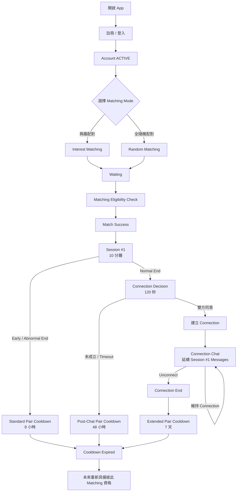

# FlashTalk v1.6.0 MVP 產品需求規格書（PRD）

> **Version：v1.6.0**  
> **產品名稱：FlashTalk**

---

## 一、產品定位（Product Positioning）

FlashTalk 是一款以 **1 對 1 即時陌生人配對與限時聊天**為核心的社交平台。

核心理念為：

> **「聊得來才留下，聊不來就自然結束。」**

FlashTalk 希望降低與陌生人開始交流時的心理負擔，讓使用者不需要先建立好友關係，也不需要承擔長期維持社交關係的壓力，即可快速開始一段即時對話。

產品透過：

- 即時陌生人配對
- 興趣配對
- 1 對 1 私密聊天
- 10 分鐘限時交流
- 雙向選擇
- Connection 機制

建立一個以「對話本身」作為認識彼此主要方式的陌生人社交體驗。

### 核心產品概念

FlashTalk 的社交流程遵循：

> **先聊天，再決定是否留下。**

使用者配對成功後，不會立即建立長期社交關係，而是先進入 **10 分鐘限時聊天（Session #1）**。

Session #1 正常結束後，系統直接進入 **Connection Decision**。只有雙方都願意建立聯繫，系統才會建立 Connection。

Connection 建立後，雙方可立即延續 Session #1 的聊天內容繼續交流，不重新建立一段空白對話，也不清除 Session #1 的使用者可見聊天紀錄。

整體關係建立流程為：

```text
陌生人
    │
    ▼
即時配對
    │
    ▼
Session #1
10 分鐘限時聊天
    │
    ▼
Connection Decision
    │
    ├── 雙方同意 ──► 建立 Connection
    │                  │
    │                  ▼
    │             延續 Session #1
    │             聊天內容持續聊天
    │
    └── 未成立 ─────► 聊天結束
                       │
                       ▼
                 Pair Cooldown
```

透過一次限時交流與一次雙向選擇，讓使用者可以自然決定：

- 要不要開始聊天
- 10 分鐘聊天後要不要建立長期聯繫

若 Connection Decision 未成立，雙方關係自然結束，並依 Pair Cooldown 規則處理。

### 產品核心價值

#### 1. 降低陌生人社交門檻

使用者不需要先建立好友關係，即可透過配對開始聊天。

降低「主動搭訕」以及「不知道如何開始認識陌生人」所產生的心理壓力。

#### 2. 讓對話成為認識彼此的主要方式

FlashTalk 將實際聊天體驗放在關係建立之前。

使用者先透過對話了解彼此，再決定是否值得繼續交流。

#### 3. 限時交流降低社交壓力

每次聊天具有明確的時間範圍。

使用者不需要承擔「開始聊天後不知道什麼時候可以結束」的社交壓力。

聊天時間結束後，由系統提供自然的關係選擇節點。

#### 4. 雙向同意才建立關係

無論是繼續聊天或建立 Connection，都必須建立在雙方共同意願之上。

避免單方面要求對方持續交流，降低陌生人社交過程中的心理負擔。

### 產品定位原則

FlashTalk 定位為：

> **陌生人即時社交與聊天平台。**

平台核心目的為促進陌生人之間的即時交流與自然社交。

使用者可能透過 FlashTalk：

- 認識新朋友
- 分享生活
- 交流共同興趣
- 找人聊天
- 打發時間
- 建立新的社交關係

FlashTalk MVP 不以戀愛、約會或特定性別配對作為主要產品定位。

同時，FlashTalk 不以傳統社交平台常見的：

- 公開動態
- 貼文
- 追蹤
- 粉絲
- 社群內容經營

作為 MVP 的核心體驗。

產品初期專注於：

> **配對 → 聊天 → 雙向選擇 → Connection**

建立清楚且低負擔的陌生人社交流程。

---

## 二、產品目標（Product Goals）

FlashTalk 的主要產品目標，是建立一個 **快速、低負擔、安全且具有自然關係篩選機制的陌生人聊天體驗**。

產品目標分為：

1. 配對體驗
2. 聊天體驗
3. 社交關係建立
4. 使用者安全
5. 產品驗證

### 1. 配對體驗目標

讓使用者能以簡單且低操作成本的方式開始與陌生人交流。

使用者可依照當下需求選擇：

- 興趣配對
- 全隨機配對

降低開始陌生人聊天前所需要進行的操作。

產品應盡可能提高：

> **有效配對與有效聊天的發生率。**

而非單純追求配對數量。

---

### 2. 聊天體驗目標

透過 **10 分鐘限時聊天**建立具有明確開始與結束節點的交流體驗。

降低以下陌生人聊天常見問題：

- 不知道如何結束對話
- 對話拖延造成心理負擔
- 因為沒有明確結束點而產生尷尬
- 一開始就需要承擔長期社交關係壓力

FlashTalk 希望讓每一次聊天都成為一段相對獨立且低負擔的交流。

---

### 3. 社交關係建立目標

FlashTalk 不要求使用者在第一次配對時，就決定是否與對方建立長期聯繫。

關係建立採用單一限時聊天後的雙向決策流程：

```text
配對
 ↓
Session #1（10 分鐘）
 ↓
Connection Decision
 ↓
雙方皆同意才建立 Connection
```

Session #1 正常結束後：

> **雙方皆同意，才建立 Connection。**

Connection 建立後，Session #1 的聊天內容直接延續至 Connection Chat，讓關係從限時陌生人聊天自然轉為持續聊天。

透過雙向選擇機制降低無效社交關係，讓 Connection 代表雙方確實具有繼續交流的意願。

---

### 4. 使用者安全目標

陌生人聊天具有騷擾、垃圾訊息、詐騙及不當內容等潛在風險。

FlashTalk 在 MVP 階段即將安全機制作為核心產品需求之一。

平台透過：

- 限制訊息類型
- Match Cooldown
- Report
- Blacklist
- 帳號停權
- 聊天紀錄安全緩衝
- 後台安全審查

降低陌生人聊天可能產生的安全風險。

安全機制的核心原則為：

> **在不過度增加正常使用者操作負擔的前提下，降低惡意使用者對平台造成的影響。**

---

### 5. 產品驗證目標

FlashTalk MVP 的主要目的不是一次建立完整的大型社交平台，而是驗證核心陌生人聊天模式是否具有持續使用價值。

MVP 優先驗證：

- 使用者是否願意進行陌生人即時配對
- 使用者是否願意完成 10 分鐘 Session #1
- Session #1 結束後是否願意建立 Connection
- 興趣配對是否能提高有效聊天意願
- 限時聊天是否能降低陌生人聊天的心理負擔
- 雙向選擇是否能提高 Connection 的有效性
- 安全機制是否足以支撐基本陌生人社交環境

MVP 的核心驗證流程為：

```text
進入平台
    ↓
開始配對
    ↓
成功配對
    ↓
Session #1（10 分鐘）
    ↓
Connection Decision
    ↓
建立 Connection
```

後續可依實際使用數據評估產品方向與功能擴充。

---

## 三、目標族群（Target Users）

FlashTalk 的主要使用者，是希望與陌生人進行即時交流，但不希望在一開始就承擔較高社交壓力或長期關係負擔的使用者。

### 核心使用者

主要包含：

- 想認識陌生人的使用者
- 想認識新朋友的使用者
- 想找人即時聊天的使用者
- 想分享生活或當下心情的使用者
- 想與具有共同興趣的人交流的使用者
- 想透過聊天打發時間的使用者
- 不希望一開始就建立長期社交關係的使用者
- 偏好先透過對話，再決定是否繼續認識對方的使用者

---

### 主要使用情境（Use Cases）

#### 情境一：單純想找人聊天

使用者目前有聊天需求，希望快速找到另一位同樣想聊天的人。

```text
想找人聊天
    ↓
選擇配對方式
    ↓
找到陌生人
    ↓
開始 10 分鐘聊天
```

---

#### 情境二：尋找共同興趣的聊天對象

使用者希望與具有相同興趣的人交流。

例如：

- 音樂
- 電影
- 遊戲
- 動漫
- 運動
- 旅行
- 美食

使用者可透過興趣配對尋找具有共同興趣標籤的聊天對象。

---

#### 情境三：分享生活

使用者可能只是希望有人可以：

- 聽自己分享今天發生的事情
- 聊最近的生活
- 分享興趣
- 討論某個話題

不一定以建立長期關係為目的。

---

#### 情境四：打發時間

使用者在：

- 通勤
- 等待
- 休息
- 無聊

等情境下，希望快速找到陌生人進行短時間交流。

10 分鐘聊天機制讓這類使用情境具有明確且容易理解的時間範圍。

---

#### 情境五：認識可能繼續聯絡的人

使用者可能在 10 分鐘 Session #1 後發現彼此聊得來。

Session #1 正常結束後，雙方可透過 Connection Decision 決定是否保持聯繫。

只有雙方皆同意，系統才建立 Connection；建立後直接延續 Session #1 的聊天內容。

因此使用者不需要在配對成功的第一時間決定：

> 「我要不要跟這個人成為朋友？」

而是可以透過實際聊天逐步決定是否建立後續關係。

---

### 使用者共同特徵

FlashTalk 的核心使用者不一定具有特定職業、興趣或社交目的，但通常具有以下其中一項需求：

> **「我現在想找一個人聊聊。」**

或：

> **「我想認識新的人，但希望先聊過再決定要不要繼續認識。」**

因此 FlashTalk 的核心不是讓使用者建立大量社交關係，而是：

> **讓陌生人之間更容易開始一段對話，並讓值得繼續的關係自然留下。**

---

## 四、登入系統（Authentication）

FlashTalk 採用 Email 註冊，並以 **Email + Password** 作為登入方式。

使用者完成註冊後，系統即建立正式帳號，但在完成 Email 驗證前，帳號維持於 **待驗證（PENDING_VERIFICATION）** 狀態。

完成 Email 驗證後，帳號才轉為 **ACTIVE**，並取得 FlashTalk 完整使用權限。

### 註冊流程

1. 使用者輸入 Email 與 Password 進行註冊。
2. 系統檢查 Email 是否已被註冊。
3. 註冊成功後立即建立使用者帳號。
4. 新建立帳號狀態設定為 **PENDING_VERIFICATION**。
5. 系統發送 Email 驗證碼至使用者註冊信箱。
6. 使用者輸入 Email 驗證碼。
7. 驗證成功後，帳號狀態由 **PENDING_VERIFICATION** 轉為 **ACTIVE**。
8. 使用者取得完整平台使用權限。

```text
輸入 Email + Password
        │
        ▼
      註冊
        │
        ▼
    建立使用者帳號
        │
        ▼
PENDING_VERIFICATION
        │
        ▼
  發送 Email 驗證碼
        │
        ▼
   使用者輸入驗證碼
        │
        ▼
     驗證成功
        │
        ▼
      ACTIVE
        │
        ▼
  可使用完整平台功能
```

### 登入規則

- 使用 **Email + Password** 登入。
- Email 為登入帳號，必須具有唯一性。
- User ID 為系統內部唯一識別碼，不作為登入帳號。
- 僅 **ACTIVE** 狀態帳號可正常使用配對與聊天功能。
- **PENDING_VERIFICATION** 帳號登入後，應引導使用者完成 Email 驗證。
- **SUSPENDED、BANNED、DELETED** 帳號依帳號狀態限制登入或平台功能。

### Email 驗證

系統提供：

- Email 驗證碼發送
- Email 驗證碼輸入
- Email 驗證碼驗證
- 重新發送驗證碼

驗證成功後：

```text
PENDING_VERIFICATION
        │
        ▼
      ACTIVE
```

Email 驗證碼的：

- 有效期限
- 重新發送間隔
- 最大驗證次數
- 每日發送上限

於後續 Authentication 技術規格統一定義，避免在產品 PRD 中綁定過早的技術限制。

### 密碼功能

支援：

- Password 登入
- 忘記密碼
- 密碼重設

密碼加密方式、Password Policy、登入失敗限制與 Token 機制於後續安全與 Authentication 技術規格中定義。

---

## 五、使用者資料（User Profile）

每位使用者完成註冊並建立帳號後，系統會建立對應的使用者資料。

FlashTalk 將使用者資料區分為：

1. **帳號基本資料（Account Data）**
2. **使用者公開資料（Profile Data）**
3. **帳號狀態（Account Status）**

帳號基本資料由系統管理；使用者公開資料則依平台規則允許使用者自行修改。

### 帳號基本資料

| 欄位 | 說明 |
| --- | --- |
| User ID | 系統內部唯一識別碼，不可重複，不作為登入帳號 |
| Email | 使用者登入帳號，必須唯一 |
| Email 驗證狀態 | 紀錄 Email 是否完成驗證 |
| 帳號狀態 | 使用者目前帳號生命週期狀態 |
| 建立時間 | 帳號建立時間 |
| 最後活動時間 | 使用者最後一次有效活動時間 |

---

### 使用者公開資料

| 欄位 | 說明 |
| --- | --- |
| 暱稱 | 使用者顯示名稱，可自行修改 |
| 頭像 | 使用者上傳的個人頭像 |
| 興趣標籤 | 配對依據，可選擇官方提供的興趣標籤 |

上述 Profile Data 可於配對或聊天流程中依產品 UI/UX 規則顯示給其他使用者。

Email、帳號狀態等 Account Data 屬於非公開資料，不提供其他一般使用者查看。

---

### 帳號狀態（Account Status）

帳號至少包含以下狀態：

| 狀態 | 說明 |
| --- | --- |
| PENDING_VERIFICATION | 已完成註冊並建立帳號，但尚未完成 Email 驗證 |
| ACTIVE | 已完成 Email 驗證，可正常使用平台功能 |
| SUSPENDED | 帳號暫時停權，期間不可正常使用配對與聊天功能 |
| BANNED | 帳號因重大或持續違規遭永久停權 |
| DELETED | 使用者已申請刪除帳號，停止提供一般平台功能 |

---

### 帳號生命週期

主要帳號狀態流程：

```text
完成註冊
    │
    ▼
PENDING_VERIFICATION
    │
    │ Email 驗證成功
    ▼
ACTIVE
    │
    ├── 違規暫時停權 ──► SUSPENDED
    │                       │
    │                       └── 停權解除 ──► ACTIVE
    │
    ├── 重大／持續違規 ──► BANNED
    │
    └── 使用者刪除帳號 ──► DELETED
```

#### PENDING_VERIFICATION

代表：

- 帳號已經建立。
- Email 尚未完成驗證。
- 可進行 Email 驗證相關操作。
- 不可進入配對系統。
- 不可建立聊天室。

#### ACTIVE

代表：

- Email 已完成驗證。
- 帳號正常。
- 可使用 FlashTalk 一般功能。
- 可進入配對系統。
- 可進入聊天室。
- 可建立 Connection。

#### SUSPENDED

代表帳號目前受到暫時性限制。

停權期間：

- 不可進入配對系統。
- 不可建立新的聊天室。
- 其他功能權限依後續安全政策定義。

停權解除後，可重新轉為 **ACTIVE**。

#### BANNED

代表帳號因重大違規或持續違反平台規範遭永久停權。

BANNED 帳號：

- 不可進行配對。
- 不可建立聊天室。
- 不可繼續使用一般平台功能。

實際處置方式由後續 Safety / Moderation 規格統一定義。

#### DELETED

代表使用者已主動申請刪除帳號。

進入 **DELETED** 狀態後：

- 不可繼續進行配對。
- 不可建立聊天室。
- 不可建立新的 Connection。
- 停止提供一般平台功能。

---

### 帳號刪除

使用者可主動申請刪除自己的帳號。

帳號刪除後：

- 帳號狀態轉為 **DELETED**。
- 停止提供一般平台功能。
- 不再參與任何新的配對。

與以下項目相關的資料不因帳號刪除立即移除：

- 檢舉案件
- 安全審查
- 違規紀錄
- 平台依法或依安全政策需要保留的資料

一般個人資料、聊天資料及其他使用者資料的實際刪除時程，於後續 **Data Retention（資料保存政策）** 中統一定義。

---

## 六、配對系統（Matching）

FlashTalk 提供兩種配對模式：

1. **興趣配對**
2. **全隨機配對**

使用者進入配對流程前，可自行選擇本次希望使用的配對方式。

---

### 1. 興趣配對（Interest Matching）

使用者可選擇 **1～3 個官方興趣標籤**進行興趣配對。

#### 配對條件

進行興趣配對時，系統只會將至少擁有 **1 個共同興趣標籤**的使用者進行配對。

例如：

使用者 A 選擇：

- 音樂
- 電影
- 遊戲

使用者 B 選擇：

- 音樂
- 旅行

A 與 B 共同擁有「音樂」標籤，因此雙方符合興趣配對條件。

若雙方沒有任何共同興趣標籤，則不符合興趣配對條件。

---

#### 配對優先順序

若同時存在多位符合興趣配對條件的使用者，系統依照 **共同興趣標籤數量**決定配對優先順序。

共同興趣標籤數量越多，配對優先級越高。

例如使用者 A 選擇：

- 音樂
- 電影
- 遊戲

其他使用者：

| 使用者 | 興趣標籤 | 與 A 共同標籤數 | 配對優先級 |
| --- | --- | ---: | --- |
| B | 音樂、電影、遊戲 | 3 | 第一優先 |
| C | 音樂、電影、旅行 | 2 | 第二優先 |
| D | 音樂、運動、旅行 | 1 | 第三優先 |
| E | 美食、運動、旅行 | 0 | 不符合配對條件 |

配對優先順序**完全以共同興趣標籤數量為主要判斷條件**。

等待時間不會提高或降低使用者的配對優先級。

---

#### 相同優先級處理

若同時有多位使用者具有相同數量的共同興趣標籤，系統將從這些使用者中進行 **隨機選擇**。

例如：

使用者 A 與：

- 使用者 B：共同 2 個興趣標籤
- 使用者 C：共同 2 個興趣標籤
- 使用者 D：共同 1 個興趣標籤

系統會優先從 B 與 C 之間進行隨機選擇。

D 因共同興趣標籤數較少，因此優先級低於 B 與 C。

---

#### 等待規則

興趣配對 **不設定 Timeout**。

使用者進入興趣配對後：

- 系統持續尋找符合興趣條件的使用者。
- 不因等待時間增加而改變配對優先級。
- 不因等待時間增加而降低共同興趣標籤條件。
- 不會自動切換為全隨機配對。
- 使用者可自行取消本次配對。

---

### 2. 全隨機配對（Random Matching）

全隨機配對不考慮使用者的興趣標籤。

使用者選擇全隨機配對後，系統將直接尋找目前同樣進行全隨機配對且符合平台基本配對條件的其他使用者。

符合條件後進行隨機配對。

興趣標籤不影響全隨機配對的優先順序。

---

### 3. 基本配對限制

無論使用興趣配對或全隨機配對，系統皆不得將使用者與以下對象進行配對：

- 使用者本人
- 非 **ACTIVE** 狀態帳號
- 已經進入其他聊天室的使用者
- 已存在有效黑名單限制的使用者
- 仍處於 Match Cooldown 的使用者

同一位使用者同一時間只能進行 **一個配對流程**。

當使用者已成功配對後，該次配對流程立即結束，並進入 1 對 1 聊天流程。

---

### 4. 配對取消

使用者在尚未成功配對前，可主動取消配對。

取消後：

- 系統停止為該使用者尋找配對對象。
- 使用者回到配對模式選擇畫面。
- 使用者可重新選擇興趣配對或全隨機配對。
- 取消配對不建立 Match Cooldown。

若系統已完成雙方配對並建立聊天室，則不再視為「取消配對」，後續行為依聊天室離開規則處理。

---

## 七、聊天室（Chat Room）

配對成功後，系統將為雙方建立一個 **1 對 1 即時聊天室**。

聊天室為 FlashTalk 陌生人交流的主要空間，使用者可在限定的聊天時間內與配對對象進行即時文字交流。

聊天室採用即時通訊機制，確保雙方可以即時接收與傳送訊息。

---

### 1. 聊天室建立

當配對系統確認雙方成功配對後，系統建立本次 1 對 1 聊天室，並將雙方加入聊天室。

基本規則：

- 每個聊天室僅包含兩位使用者。
- 使用者同一時間只能存在於一個進行中的陌生人聊天室。
- 聊天室建立後，雙方進入聊天流程。
- 聊天時間與 Chat Session 規則由第八章統一定義。
- 聊天室結束後，不可繼續於該次 Chat Session 傳送新訊息。

基本流程：

```text
配對成功
    │
    ▼
建立 1 對 1 聊天室
    │
    ▼
雙方進入聊天室
    │
    ▼
建立 Chat Session
    │
    ▼
開始即時聊天
```

---

### 2. 聊天室使用者資料

聊天室內可顯示對方的公開 Profile Data。

包含：

- 頭像
- 暱稱
- 興趣標籤

Email、User ID、帳號狀態及其他 Account Data 不對聊天對象公開。

#### 興趣配對

若雙方透過興趣配對進入聊天室，可優先呈現雙方的 **共同興趣標籤**。

例如：

```text
共同興趣

🎵 音樂
🎮 遊戲
🎬 電影
```

共同興趣可作為雙方開始聊天時的破冰資訊。

#### 全隨機配對

若雙方透過全隨機配對進入聊天室，可顯示對方設定的公開興趣標籤。

興趣標籤僅作為聊天參考資訊，不影響已完成的全隨機配對結果。

---

### 3. 訊息功能（Messaging）

FlashTalk MVP 以即時文字交流為主要聊天方式。

#### 支援內容

聊天室支援：

- 文字訊息
- Emoji
- 回覆訊息（Reply）

#### 回覆訊息（Reply）

使用者可以針對聊天室中的特定訊息進行回覆。

回覆訊息應保留被回覆訊息的基本內容，使雙方能辨識目前回覆所對應的上下文。

例如：

```text
A：
最近有推薦的電影嗎？

B 回覆：
┌ 最近有推薦的電影嗎？
│
└ 我最近看了一部科幻片，還不錯。
```

回覆功能僅用於建立訊息之間的上下文關聯，不建立獨立討論串（Thread）。

---

### 4. 不支援的訊息功能

FlashTalk MVP 不提供以下訊息類型：

- 圖片
- 影片
- 檔案
- 語音訊息
- 外部連結

同時不提供以下訊息操作：

- 複製訊息
- 刪除訊息
- 收回訊息
- 編輯已送出的訊息

訊息送出後即視為正式聊天內容，不允許使用者自行修改或移除。

單則訊息的最大內容長度、傳送頻率限制及其他 Messaging 技術限制，於後續技術規格中統一定義。

---

### 5. 訊息狀態

FlashTalk 提供基本訊息傳送狀態，讓使用者確認訊息是否成功送達聊天系統。

基本狀態包含：

```text
輸入訊息
    │
    ▼
傳送
    │
    ▼
Sending
    │
    ▼
伺服器接收
    │
    ▼
Sent
```

若訊息傳送失敗，系統應提供對應的失敗狀態，避免使用者誤認訊息已成功送出。

具體訊息確認、重新傳送及可靠性機制於後續 WebSocket / Messaging 技術規格中定義。

---

### 6. 不提供已讀狀態

FlashTalk MVP **不提供訊息已讀（Read Receipt）功能**。

使用者無法確認對方是否已讀取特定訊息。

設計目的：

- 降低陌生人聊天的回覆壓力。
- 避免「已讀未回」造成額外社交負擔。
- 維持 FlashTalk 低壓力陌生人聊天的產品定位。

---

### 7. 正在輸入（Typing Indicator）

當其中一位使用者正在輸入訊息時，可向另一位使用者顯示：

> **對方正在輸入⋯**

Typing Indicator 僅代表對方目前正在進行訊息輸入操作，不代表訊息一定會被送出。

具體觸發頻率、Timeout 與 WebSocket Event 行為於後續技術規格中定義。

---

### 8. 主動離開聊天室

使用者在聊天進行期間可隨時主動離開聊天室。

不要求使用者一定完成完整的 10 分鐘聊天。

若任一方主動離開：

```text
聊天進行中
    │
    ▼
其中一方主動離開
    │
    ▼
結束目前 Chat Session
    │
    ▼
另一方收到聊天已結束狀態
    │
    ▼
聊天室停止接受新訊息
```

一方主動離開後，另一方不需要繼續停留於聊天室等待。

主動離開代表該次聊天提前結束。

因此，若使用者於 Session #1 中主動離開，視為該使用者沒有繼續本次交流的意願，不進入 Connection Decision。

---

### 9. 網路中斷與重新連線

使用者在聊天期間可能因行動網路切換、Wi-Fi 不穩定或其他網路因素發生暫時性斷線。

FlashTalk 應允許短暫斷線的使用者重新連線至原聊天室。

基本流程：

```text
聊天進行中
    │
    ▼
網路暫時中斷
    │
    ▼
使用者進入暫時離線狀態
    │
    ▼
嘗試重新連線
    │
    ├── 重連成功 ──► 返回原聊天室
    │
    └── 無法重連 ──► 依 Chat Session 結束規則處理
```

暫時性網路中斷 **不立即視為使用者主動離開聊天室**。

---

### 10. 斷線期間聊天時間

網路中斷期間，Chat Session 的聊天時間 **不暫停、不重新計算、不延長**。

例如：

```text
Chat Session 開始
        │
        │ 5 分鐘
        ▼
使用者暫時斷線
        │
        │ Chat Session 持續計時
        ▼
使用者重新連線
        │
        ▼
返回原聊天室
```

重新連線後，使用者只能使用該 Chat Session 原本剩餘的聊天時間。

此規則避免透過主動斷線方式延長聊天時間。

允許重新連線的時間範圍、重連次數及斷線狀態管理，由後續 Chat Session / WebSocket 技術規格統一定義。

---

### 11. 聊天室結束條件

聊天室可能因以下情況停止目前 Chat Session：

1. Chat Session 時間結束。
2. 任一方主動離開聊天室。
3. 任一方進行檢舉並離開。
4. 使用者長時間斷線並超過系統允許的重新連線範圍。
5. 帳號因安全機制或平台管理行為失去聊天權限。
6. 系統因異常或安全原因強制終止聊天室。

其中：

- 正常時間結束後的後續流程，由第九章「聊天結束（Session End）」定義。
- 檢舉、違規及安全處理，由第十一章「安全機制（Safety）」定義。
- Chat Session 時間與生命週期，由第八章「聊天時間（Chat Session）」定義。

---

## 八、聊天時間（Chat Session）

FlashTalk 採用 **單一限時聊天（Single Timed Chat）** 作為 MVP 核心聊天機制。

每次陌生人配對成功後只建立一個 Chat Session：

> **Session #1，固定 10 分鐘。**

MVP 不提供 Session #2。Session #1 正常到期後，直接進入 Connection Decision。

### 1. Chat Session 時間

Session #1 固定為 **10 分鐘**。開始後即持續計時，不因 App Background、手機鎖定、暫時離開 App、網路切換、暫時斷線或 WebSocket 重連而暫停、重置或延長。

### 2. 剩餘時間顯示

聊天室持續顯示剩餘時間，例如：

```text
09:42
06:17
03:45
00:32
00:00
```

不提供額外的主動倒數提醒、Modal、震動、音效或系統倒數訊息。

### 3. Server Authoritative Timer

Session 的實際開始與結束時間以 Server 管理狀態為準。Client 倒數僅作為 UI 呈現。

```text
Session Start
     │
     ▼
Server 建立 Session
     │
     ├── startedAt
     └── expiresAt
             │
             ▼
      Client 顯示剩餘時間
             │
             ▼
         expiresAt
             │
             ▼
        Session End
```

### 4. App Background、鎖定與斷線

Session #1 進行期間，App 進入背景、手機鎖定或暫時斷線時仍持續計時。若於允許的重連範圍內成功重新連線，使用者返回原 Session，僅能使用原本剩餘時間。

### 5. Session 到期

當剩餘時間到達 `00:00`，Session #1 Normal End。系統應停止接受新訊息、停用訊息輸入，並直接進入 Connection Decision。

訊息是否可接受，以 Server 收到訊息當下的 Session 狀態為準。

### 6. Connection Decision

Session #1 因 10 分鐘自然到期而 Normal End 後，系統直接詢問雙方：

> **想繼續和對方保持聯繫嗎？**

可選擇：

- 建立 Connection
- 就聊到這裡

Connection Decision 採雙向盲選，決策時間固定為 **120 秒**。只有雙方皆同意才建立 Connection；任一方不同意或 Timeout，皆視為 Decision 未成立。

### 7. Connection 建立後的聊天內容延續

若 Connection Decision 成立：

> **Session #1 的聊天內容直接延續至 Connection Chat。**

不清空、不隱藏、不重新建立一段使用者可感知的空白聊天室。Connection 建立位置顯示狀態分隔資訊，之後的新訊息直接接續於 Session #1 之後。

```text
Session #1 Messages
        │
        ▼
Connection Decision
        │
        ▼
雙方皆同意
        │
        ▼
Connection Created
        │
        ▼
Connection Chat
        │
        ├── Session #1 歷史訊息
        ├── Connection 建立提示
        └── Connection 後的新訊息
```

### 8. Connection 未建立

若 Connection Decision 未成立：

- 不建立 Connection。
- 不建立 Connection Chat。
- 雙方維持非 Connection 關係。
- 聊天流程結束。
- 依第十一章建立 **Post-Chat Pair Cooldown**。

Session #1 的 Server 資料保存期限仍由後續 Data Retention 規格統一定義。

### 9. 主動離開與 Early End

使用者可在 Session #1 進行期間隨時主動離開。任一方主動離開即形成 Early End，直接結束本次聊天，不進入 Connection Decision。

此規則在 MVP 維持不變。

> **第二版評估但書：** v2 可依 MVP 實際數據與使用者回饋，評估是否允許「已進行一定時間的 Session #1」在 Early End 前進入 Connection Decision，或提供其他雙向保留聯繫機制。v1 MVP 不實作此例外。

### 10. Chat Session 核心規則

| 項目 | 規則 |
|---|---|
| 陌生人聊天 Session 數量 | 1 個 |
| Session #1 | 10 分鐘 |
| Session #2 | 不提供 |
| 剩餘時間 | 持續顯示 |
| 主動倒數提醒 | 不提供 |
| 時間基準 | Server |
| App Background / 鎖定 / 暫時斷線 | 持續計時 |
| 重新連線 | 返回原 Session，不重置時間 |
| Session #1 Normal End | 進入 Connection Decision |
| Connection Decision | 120 秒、雙向盲選 |
| Connection 成功 | 延續 Session #1 聊天內容 |
| Connection 未成立 | 聊天結束並進入 Post-Chat Pair Cooldown |
| Early / Abnormal End | 不進入 Connection Decision |
| Early End 例外 | v1 不提供；v2 再評估 |

---

## 九、聊天結束與 Connection Decision（Session End & Connection Decision）

FlashTalk 將 Session #1 的結束分為：

1. 正常結束（Normal End）
2. 提前結束（Early End）
3. 異常結束（Abnormal End）

只有 **Session #1 因 10 分鐘自然到期而 Normal End**，才進入 Connection Decision。

### 1. Session 結束類型

```text
Session #1
    │
    ├── Normal End
    │      └── 10 分鐘自然到期 → Connection Decision
    │
    ├── Early End
    │      └── 使用者主動離開 → 聊天結束
    │
    └── Abnormal End
           └── 長時間斷線 / 帳號失去聊天權限 / 系統終止 → 聊天結束
```

暫時性網路中斷本身不立即視為 Abnormal End；仍依重新連線規則處理。

### 2. Normal End

Session #1 完整進行 10 分鐘並自然到期時，視為 Normal End，直接進入 Connection Decision。

### 3. Early End

Session #1 尚未到達 10 分鐘，由任一方主動離開而提前結束時，視為 Early End。

Early End：

- 不進入 Connection Decision。
- 不建立 Connection。
- 不等待原定 10 分鐘結束。
- 建立 Standard Pair Cooldown。

> **v2 評估但書：** 保留未來重新評估 Early End 是否可在特定條件下進入 Connection Decision；v1 MVP 維持「Early End 不進 Decision」規則。

### 4. Abnormal End

因長時間斷線、帳號限制或系統原因導致 Session 無法繼續時，視為 Abnormal End，不進入 Connection Decision，並依第十一章套用 Standard Pair Cooldown。

### 5. Connection Decision 共通機制

Connection Decision 採：

> **雙向盲選（Blind Decision）**

核心規則：

- 雙方獨立選擇。
- 不顯示對方是否已選擇或選擇內容。
- 選擇送出後不可修改。
- 雙方皆同意才成立。
- 任一方不同意則立即不成立。
- Timeout 視為不同意。
- 不公開是哪一方不同意或 Timeout。
- 決策時間為 120 秒。
- 暫時斷線不暫停 Decision Timer。

### 6. Connection Decision 結果

雙方皆選擇建立 Connection：

```text
Session #1 Normal End
        │
        ▼
Connection Decision
      120 秒
        │
        ▼
雙方 CONNECT
        │
        ▼
Connection Created
        │
        ▼
延續 Session #1 聊天內容
```

若任一方選擇結束或 Timeout：

```text
Connection Decision
        │
        ▼
Decision Failed
        │
        ▼
本次聊天結束
        │
        ▼
Post-Chat Pair Cooldown
```

Decision 未成立時，統一使用中性結果，例如：

> **本次聊天已結束。**

不得向另一方顯示拒絕者或 Timeout 原因。

### 7. 核心規則

| 項目 | 規則 |
|---|---|
| Normal End | Session #1 10 分鐘自然到期 |
| Early End | 使用者主動提前結束 |
| Abnormal End | 斷線逾時、帳號或系統原因終止 |
| Normal End | 進入 Connection Decision |
| Early / Abnormal End | 不進入 Decision |
| Connection Decision | 120 秒 |
| Decision 模式 | 雙向盲選 |
| Timeout | 視為不同意 |
| Decision 成功 | 建立 Connection |
| Decision 未成立 | Post-Chat Pair Cooldown |
| Early End 第二版評估 | 保留，但 v1 不更動 |

---

## 十、Connection（建立聯繫）

Connection 代表兩名使用者完成 **10 分鐘 Session #1** 後，透過雙向同意建立的持續聯繫關係。

FlashTalk 不以傳統好友邀請或追蹤作為陌生人關係建立方式。

```text
陌生人配對
    │
    ▼
Session #1
10 分鐘
    │
    ▼
Connection Decision
120 秒
    │
    ▼
雙方同意
    │
    ▼
CONNECTED
    │
    ▼
延續 Session #1 內容持續聊天
```

### 1. Connection 定義

Connection 必須由雙方共同確認後成立，不存在單方面建立 Connection。MVP 統一使用 Connection 作為雙方持續聯繫關係的產品名稱。

### 2. Connection Decision 觸發條件

只有 Session #1 因 10 分鐘自然到期形成 Normal End，才進入 Connection Decision。Early End 或 Abnormal End 不進入 Connection Decision。

### 3. Connection Decision

系統詢問雙方：

> **想繼續和對方保持聯繫嗎？**

可選擇：

- 就聊到這裡
- 建立 Connection

決策時間為 **120 秒**，完全沿用第九章 Blind Decision 規則。

### 4. Connection 建立條件

只有雙方皆於 120 秒內選擇建立 Connection，才建立雙方的 Connection 關係。任一方不同意或 Timeout，皆不建立。

### 5. Connection 建立後

Connection 建立後：

- 雙方正式成為 Connection。
- 立即開放持續聊天。
- 不再受到 10 分鐘 Session 限制。
- 不再進入任何 Chat Session Decision。
- 建立／切換為 Connection Chat。
- Connection 顯示於雙方 Connection List。
- **Session #1 的聊天內容完整延續至 Connection Chat。**

### 6. Connection Chat

Connection Chat 不設陌生人限時聊天 Timer。MVP 訊息能力沿用：

- 文字
- Emoji
- Reply

不提供圖片、影片、檔案、語音訊息、外部連結、訊息刪除、收回或編輯。

### 7. Session #1 聊天紀錄延續

Connection 建立後，Session #1 的可見聊天內容直接保留：

```text
──────── Session #1 ────────
A：你也喜歡去日本？
B：對啊，我去年去了北海道
A：我超想去 😂
B：冬天真的很漂亮
────────────────────────────
你們已建立 Connection
現在可以繼續聊天
────────────────────────────
A：所以你最推薦北海道哪裡？
```

使用者不需要重新進入一個空白聊天室，讓限時聊天至 Connection Chat 的轉換保持自然連續。

### 8. Connection Decision 未成立

若 Connection Decision 未成立：

- 不建立 Connection。
- 不建立 Connection Chat。
- 不加入 Connection List。
- 雙方維持非 Connection 關係。
- 不公開是哪一方不同意。
- 依第十一章建立 Post-Chat Pair Cooldown。

### 9. Connection List

Connection List 至少顯示：

- 對方頭像
- 對方暱稱
- 最後一則訊息摘要
- 最後訊息時間
- 未讀訊息數量

MVP 不向訊息發送者提供 Read Receipt；Connection List 的未讀數僅代表目前使用者自己的未讀狀態。

### 10. 已建立 Connection 的使用者不得再次互相配對

Connection 存續期間，雙方不得透過興趣配對或全隨機配對再次互相 Match。

### 11. 解除 Connection（Unconnect）

任一方可單方面解除 Connection，不需要另一方同意。解除後原 Connection Chat 停止接受新訊息，並建立 Extended Pair Cooldown。

### 12. Unconnect 後重新配對

Extended Pair Cooldown 到期後，若雙方帳號與配對條件皆符合，未來仍可能再次 Match。再次 Match 視為全新關係，必須重新經歷：

```text
Match
  ↓
Session #1（10 分鐘）
  ↓
Connection Decision
  ↓
Connection
```

### 13. Connection 核心規則

| 項目 | 規則 |
|---|---|
| Connection 觸發條件 | Session #1 Normal End |
| Session #1 | 10 分鐘 |
| Session #2 | 不提供 |
| Connection Decision | 120 秒 |
| Decision 模式 | 雙向盲選 |
| 建立條件 | 雙方皆同意 |
| Timeout | 視為不同意 |
| Connection 建立後 | 開放持續聊天 |
| Connection Chat 歷史 | 延續 Session #1 可見訊息 |
| Connection List | 提供 |
| 已 Connection 雙方重新配對 | 不允許 |
| Unconnect | 任一方可單方面解除 |
| Unconnect 後 | Extended Pair Cooldown |
| 再次 Match | 從新的 Session #1 重新開始 |
| Early End | v1 不進 Connection Decision；v2 可再評估 |

---

## 十一、安全與配對保護機制（Safety & Matching Protection）

FlashTalk v1 MVP 先將兩個概念明確區分：

- **Matching Protection：** 處理特定兩名使用者之間的重複配對問題。
- **Anti-abuse：** 處理垃圾訊息、騷擾、詐騙與其他濫用行為。

本版僅調整概念邊界，不擴充新的 Anti-abuse 功能；實際 Anti-abuse Scope 維持第十二章既有設計。

Matching Protection 主要透過 **Pair Cooldown** 執行。

### 1. Pair Cooldown 定義

Pair Cooldown 是特定 User Pair 的暫時性配對限制，只限制兩人彼此再次 Match，不影響任一方與其他使用者配對。

### 2. Standard Pair Cooldown

MVP 初始值：**8 小時**。

適用：

- Match 成功後立即離開。
- Session #1 Early End。
- Session #1 Abnormal End。

### 3. Post-Chat Pair Cooldown

Session #1 已完整進行 10 分鐘並進入 Connection Decision，但最終未建立 Connection 時，建立：

> **Post-Chat Pair Cooldown**

MVP 初始值：**48 小時**。

適用：

- Session #1 Normal End 後，Connection Decision 任一方不同意。
- Connection Decision Timeout。
- Connection Decision 最終未成立。

此規則延續原本「完成完整聊天但未建立 Connection 時使用較長 Cooldown」的產品目的。

### 4. Connection 存續期間

Connection 存續期間不建立 Pair Cooldown；由 Connection 關係本身排除雙方再次互相 Matching。

### 5. Extended Pair Cooldown

任一方 Unconnect 後建立 Extended Pair Cooldown，MVP 初始值：**7 天**。

### 6. Cooldown 營運參數

所有 Cooldown Duration 均屬 Operational Parameters，可依活躍使用者數、配對等待時間、重複配對率與配對成功率調整。參數修改僅影響修改後新建立的 Pair Cooldown，不回溯改變既有 Expires At。

| Cooldown Type | 主要適用情況 | MVP 初始值 |
|---|---|---:|
| Standard Pair Cooldown | Session #1 Early / Abnormal End | 8 小時 |
| Post-Chat Pair Cooldown | Session #1 Normal End 後未建立 Connection | 48 小時 |
| Extended Pair Cooldown | Unconnect | 7 天 |

### 7. Matching 時的 Cooldown 檢查

Matching System 建立 Match 前，必須確認兩名使用者之間不存在有效 Pair Cooldown。

```text
Matching Candidate
        │
        ▼
Check Pair Cooldown
        │
    ┌───┴────────┐
    │            │
    ▼            ▼
Active       Expired / None
    │            │
    ▼            ▼
排除配對      繼續 Matching
```

### 8. Matching 排除條件

至少排除：

- 使用者自己。
- 非 ACTIVE 狀態。
- 已處於其他有效 Match / Chat Session。
- 已存在有效 Connection。
- 已存在有效 Pair Cooldown。
- 不符合目前 Matching Mode 條件。

### 9. 再次配對

Pair Cooldown 到期後，雙方若再次 Match，視為全新配對，重新開始：

```text
Match
  ↓
Session #1（10 分鐘）
  ↓
Connection Decision
  ↓
Connection
```

### 10. Report 暫不納入 v1 MVP

FlashTalk v1 MVP 暫不提供 Report、Moderation 與 Safety Admin Console。是否加入於後續版本依實際安全事件與營運需求重新評估。

### 11. 核心規則

| 項目 | v1 MVP 規則 |
|---|---|
| Matching Protection | Pair Cooldown |
| Anti-abuse | 與 Matching Protection 概念區分；本版不擴充功能 |
| Standard Pair Cooldown | 初始 8 小時 |
| Post-Chat Pair Cooldown | 初始 48 小時 |
| Extended Pair Cooldown | 初始 7 天 |
| Session #2 Pair Cooldown | 取消 |
| Connection 成功 | 不建立 Cooldown |
| Connection 存續期間 | 雙方不得互相 Matching |
| Unconnect | Extended Pair Cooldown |
| Cooldown 到期 | 自動失效 |
| Report / Moderation | v1 MVP 暫不提供 |

## 十二、防騷擾設計（Anti-abuse）

為降低騷擾與詐騙風險：

僅允許：

- 文字
- Emoji

禁止：

- 圖片
- 影片
- 檔案
- 外部網址
- 社群連結

---

## 十三、產品流程（Product Flow）

本章整合 FlashTalk v1 MVP 從登入、配對、10 分鐘 Session #1、Connection Decision、Connection Chat 至 Pair Cooldown 的完整流程。

核心流程：

> **Matching → Session #1（10 分鐘）→ Connection Decision → Connection**

### 1. 核心使用流程

```text
開啟 App
    │
    ▼
註冊 / 登入
    │
    ▼
Account = ACTIVE
    │
    ▼
選擇配對模式
    │
    ├── 興趣配對
    └── 全隨機配對
            │
            ▼
        等待配對
            │
            ▼
       Match Success
            │
            ▼
       Session #1
         10 分鐘
            │
     ┌──────┴─────────┐
     │                │
Early / Abnormal   Normal End
     │                │
     ▼                ▼
Standard Pair   Connection Decision
Cooldown 8h          120 秒
                      │
                 ┌────┴────┐
                 │         │
               雙方同意    未成立
                 │         │
                 ▼         ▼
             Connection  Post-Chat
                 │       Pair Cooldown
                 ▼          48h
          Connection Chat
                 │
                 └── 延續 Session #1 聊天內容
```

### 2. Matching 流程

Matching Mode 維持：興趣配對與全隨機配對。興趣配對不設定 Timeout，共同興趣標籤數量越高者優先；同分時 Random。Waiting 階段取消不建立 Pair Cooldown。

Matching Eligibility 至少確認：雙方 ACTIVE、非自己、未處於其他有效 Match / Session、無有效 Connection、無有效 Pair Cooldown，且符合目前 Matching Mode。

### 3. Session #1 流程

Match Success 後只建立一個陌生人 Chat Session：

> **Session #1，10 分鐘。**

MVP 不建立 Session #2。

Session #1 有 Normal End、Early End、Abnormal End 三種結束方式。只有 Normal End 進入 Connection Decision。

### 4. Connection Decision

Session #1 Normal End 後直接進入 Connection Decision。

- Duration：120 秒。
- Mode：Blind Decision。
- 雙方皆同意：建立 Connection。
- 任一方不同意或 Timeout：Decision 未成立。
- 不公開個別選擇或 Timeout 原因。

### 5. Connection Chat 與訊息延續

Connection 建立後，取消陌生人限時限制，並將 **Session #1 可見聊天內容直接延續至 Connection Chat**。

```text
Session #1 Messages
        │
        ▼
Connection Created
        │
        ▼
Connection Chat
        │
        ├── Session #1 Messages
        ├── Connection Status Separator
        └── New Connection Messages
```

### 6. Connection 未成立

Session #1 已 Normal End 但 Connection Decision 未成立時，建立 **Post-Chat Pair Cooldown：48 小時**。

Session #1 Early / Abnormal End 則建立 **Standard Pair Cooldown：8 小時**。

### 7. Early End 規則與第二版評估但書

MVP 維持原有原則：

> **Session #1 若 Early End，不進入 Connection Decision。**

此規則不於 v1.6.0 更動。

但列入第二版產品評估項目：可依 MVP 數據檢視是否允許已聊天達一定時間的雙方，在 Early End 前仍有機會進入 Connection Decision，或設計其他雙向保留聯繫機制。

### 8. Pair Cooldown 與 Anti-abuse 概念區分

Pair Cooldown 屬於 **Matching Protection**，處理特定 Pair 的重複配對。Anti-abuse 處理騷擾、垃圾訊息、詐騙與內容濫用。兩者概念分離，但本版不新增 Anti-abuse 實作。

### 9. Unconnect 流程

Connection 存續期間任一方可單方面 Unconnect。Unconnect 後建立 Extended Pair Cooldown，MVP 初始值 7 天。

### 10. 完整 End-to-End Flow

```text
開啟 App
  ↓
註冊 / 登入
  ↓
Account ACTIVE
  ↓
Matching Mode
  ↓
Waiting
  ↓
Eligibility Check
  ↓
Match Success
  ↓
Session #1（10 分鐘）
  ├─ Early / Abnormal End → Standard Pair Cooldown 8h
  │
  └─ Normal End
       ↓
     Connection Decision（120 秒）
       ├─ 雙方同意 → Connection → Connection Chat
       │                         └─ 延續 Session #1 Messages
       │
       └─ 未成立 / Timeout → Post-Chat Pair Cooldown 48h

Connection Chat
  ↓
是否 Unconnect？
  ├─ 否 → 維持 Connection
  └─ 是 → Connection End → Extended Pair Cooldown 7 天
```

### 11. Mermaid 完整流程圖



### 12. 核心流程規則

| 流程 | v1 MVP 規則 |
|---|---|
| Matching Mode | 興趣配對 / 全隨機配對 |
| 興趣配對 Timeout | 不設定 |
| Match 成功 | 建立 Session #1 |
| Session #1 | 10 分鐘 |
| Session #2 | 取消 / 不提供 |
| Session #1 Normal End | Connection Decision |
| Session #1 Early / Abnormal End | Standard Pair Cooldown 8 小時 |
| Connection Decision | 120 秒、Blind Decision |
| Connection 建立條件 | 雙方皆同意 |
| Connection Decision 未成立 | Post-Chat Pair Cooldown 48 小時 |
| Connection Chat | 無時間限制 |
| Connection Chat 歷史 | 延續 Session #1 可見訊息 |
| Early End | v1 不進 Connection Decision；v2 再評估 |
| Pair Cooldown | Matching Protection |
| Anti-abuse | 與 Pair Cooldown 概念區分，本版不擴充 |
| Unconnect 後 Cooldown | 7 天 |
| Report | v1 MVP 暫不提供 |

## 十四、技術規劃（Technology Architecture）

### 14.1 技術規劃目標

FlashTalk v1 MVP 的技術架構應優先滿足以下需求：

1. 支援 1 對 1 即時陌生人配對。
2. 支援興趣配對與全隨機配對。
3. 支援即時聊天與 WebSocket 長連線。
4. 支援 Session #1、Connection Decision、Connection 等產品狀態。
5. 支援 Server Authoritative Timer。
6. 支援 Pair Cooldown。
7. 避免同一使用者同時被多名使用者配對。
8. 支援使用者短暫斷線與重新連線。
9. 保證重要狀態具有一致性與可恢復性。
10. 保留未來水平擴充能力，但 MVP 階段避免過早導入 Microservices。

FlashTalk v1 MVP 採用：

> Modular Monolith + Independent Worker

作為主要架構方向。

MVP 階段不採用完整 Microservices Architecture。

---

### 14.2 整體技術架構

FlashTalk v1 MVP 建議技術組成如下：

| Layer | Technology |
|---|---|
| Mobile App | React Native |
| Language | TypeScript |
| API Server | NestJS |
| Runtime | Node.js |
| REST API | HTTPS / JSON |
| Realtime Communication | WebSocket / Socket.IO |
| Primary Database | PostgreSQL |
| ORM | Prisma |
| Runtime / Matching State | Redis |
| Authentication | JWT Access Token + Refresh Token |
| Password Hashing | bcrypt |
| Email Verification | Email Verification Service |
| Object Storage | S3-compatible Object Storage |
| Background Processing | Worker |
| Scheduled Processing | Worker / Scheduler |
| API Documentation | OpenAPI / Swagger |
| Deployment | Docker |

---

### 14.3 Backend Architecture

FlashTalk v1 MVP 後端採用 NestJS Modular Monolith。

主要 Domain Module 規劃：

- Auth Module
- User Module
- Matching Module
- Chat Module
- Session Module
- Decision Module
- Connection Module
- Cooldown Module

各 Module 維持明確 Domain Boundary。

MVP 階段不將上述 Module 拆分為獨立 Microservice。

當未來使用量、即時事件量或服務規模增加後，再評估將 Matching、Chat、Notification 或其他高負載服務獨立拆分。

---

### 14.4 API 與 Realtime Communication

FlashTalk 同時使用：

- REST API
- WebSocket

兩者負責不同類型的系統行為。

#### REST API

REST API 主要負責具有明確 Request / Response 特性的操作，例如：

- Register
- Login
- Verify Email
- Refresh Token
- Get Profile
- Update Profile
- Get Interest Tags
- Start Matching
- Cancel Matching
- Get Connection List
- Unconnect

REST API 不負責主要即時聊天訊息傳輸。

#### WebSocket

WebSocket 主要負責即時事件，例如：

- Match Found
- Session Started
- Message Sent
- Message Received
- Reply Message
- Session End
- Decision State
- Connection Decision
- Connection Created
- Connection Ended

WebSocket Connection 不應作為 Session 唯一狀態來源。

WebSocket 暫時斷線時，不代表 Session、Matching 或其他 Domain State 必須立即消失。

---

### 14.5 PostgreSQL

FlashTalk v1 MVP 主要持久化資料庫採用 PostgreSQL。

選擇 PostgreSQL 的主要原因為 FlashTalk Domain 具有大量明確關聯：

User  
↕  
Match  
↕  
Conversation  
↕  
Session  
↕  
Decision  
↕  
Connection  
↕  
Pair Cooldown

系統需要處理：

- Relationship
- Transaction
- State Consistency
- Unique Constraint
- Concurrent State Transition

因此 MVP 優先採用 PostgreSQL，而非以 MongoDB 作為主要資料庫。

ORM 建議採用 Prisma。

---

### 14.6 Redis

Redis 作為 FlashTalk 即時系統的重要 Runtime Infrastructure。

主要用途包括：

- Matching Waiting State
- Matching Index
- Online Presence
- WebSocket Connection Mapping
- Session Runtime State
- Decision Runtime State
- Short-lived State
- Reconnect State
- Distributed Lock
- Atomic Matching Support

Redis 不作為主要永久資料來源。

重要 Domain Data 最終仍應由 PostgreSQL 保存。

---

### 14.7 Matching Mode

FlashTalk v1 MVP 提供兩種 Matching Mode：

- INTEREST
- RANDOM

兩種 Matching Mode 使用獨立的 Waiting Pool。

```text
INTEREST
只能與 INTEREST 使用者配對

RANDOM
只能與 RANDOM 使用者配對
```

## MVP 功能總覽

| 模組 | 功能 |
|---|---|
| 帳號 | Email 註冊、登入、驗證碼 |
| 個人資料 | 暱稱、頭像、興趣標籤 |
| 配對 | 興趣配對、全隨機配對 |
| 聊天 | 文字、Emoji、Reply |
| 限時聊天 | Session #1 固定 10 分鐘 |
| Session #2 | 不提供 |
| Connection | Session #1 Normal End 後雙向同意建立 |
| Connection Chat | 延續 Session #1 聊天內容，無限時 |
| Matching Protection | Pair Cooldown |
| Anti-abuse | 與 Pair Cooldown 概念區分；本版不擴充 |
| Report / Moderation | v1 MVP 暫不提供 |
| 防騷擾 | 禁止圖片、影片、檔案、外部連結 |
| 技術 | RESTful API、WebSocket、Node.js、PostgreSQL |

---

## 版本資訊

| 版本 | 日期 | 說明 |
|------|------|------|
| v1.5.0 | 2026-09-19 | 前一版：雙 Session 流程 |
| v1.6.0 | 2026-09-20 | 取消 Session #2；Session #1 改為 10 分鐘；Normal End 直接進入 Connection Decision；Connection 成功後延續 Session #1 聊天內容；Early End 規則維持並列入 v2 評估；區分 Pair Cooldown 與 Anti-abuse 概念 |
